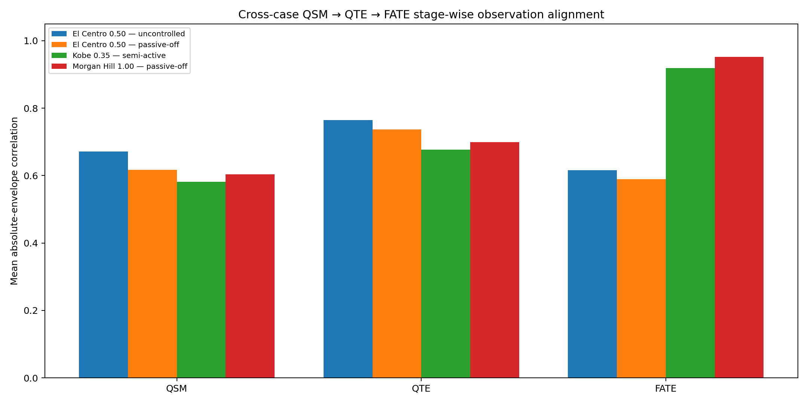
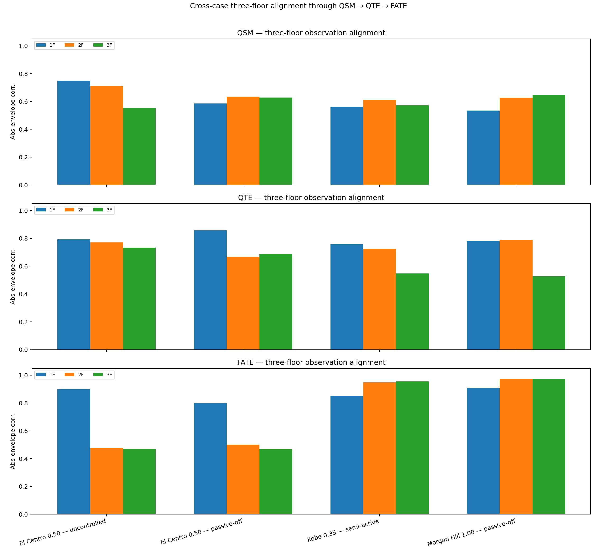
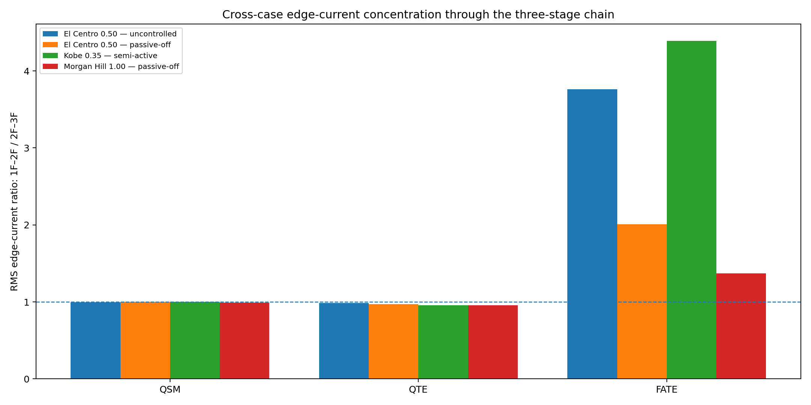
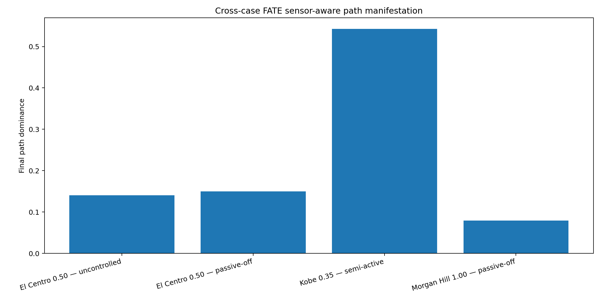
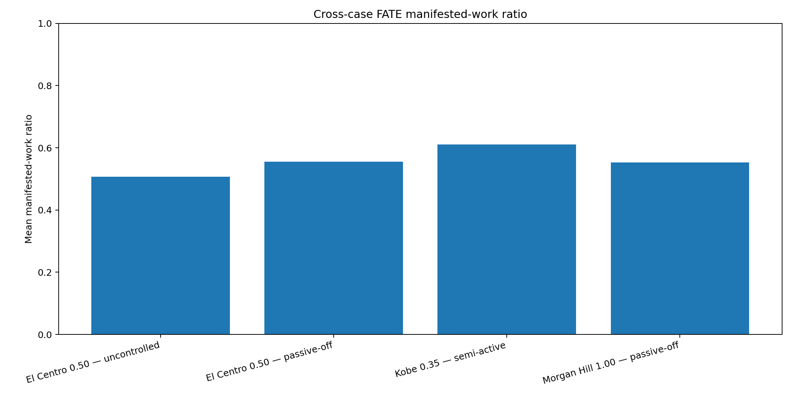

# QSM–QTE–FATE Integrated Seismic Field Observation

## NEES-2011-1076 — Formal Release V12.2

[繁體中文](README_ZH-TW.md)

**Author and theory developer:** Dr. Han-Jung (Alaric) Kuo  
**Organization:** A&J Management Consulting Limited Company  
**Numerical engine:** V12.2  
**Documentation revision:** V12.2

> **One sequential theory chain, three executable observation stages, and a complete physical evidence record.**

```text
RPG → QSM → QTE → FATE
```

This repository applies Quantum Structural Mechanics (QSM), Quantum Topology Express (QTE), and the first operational layer of Fractal Alive Topology Evolution (FATE) to four archived records from the NEES-2011-1076 three-story steel-frame experiment.

The engineering question is direct:

> **When earthquake motion enters a structure, how does the Power state evolve through structural relations, how does the spatial topology organize that evolution, and what becomes visible after measured structural states continuously return to the field?**

V12.2 presents the computation in the intended order:

```text
QSM → QTE → FATE
```

The former five-probe public presentation is no longer used. Edge current, path dominance, target-state hit, work-compatible quantities, acceleration–displacement work-loop proxies, and downstream response remain in the release because they are distinct physical observations. They are not extra algorithms and they are not sensitivity groups.

---

# 1. Start here: what this study observes

The archived NEES records provide floor displacement, velocity, and acceleration histories. Conventional analysis often reads these as separate response quantities. This release reads them together as a time-evolving structural Power state and follows the chain from incoming excitation, through relational and spatial evolution, to sensor-aware target hit, path concentration, work-compatible manifestation, and downstream displacement response.

The observation can be summarized as:

```text
earthquake input
→ QSM relational Power-state evolution
→ QTE spatial topology-path evolution
→ FATE sensor-aware Aware_power
→ path, target hit, work proxy, and response evidence
```

## 1.1 What changed in V12.2

V12.2 replaces the former parallel-probe presentation with three successive methods that receive different information:

| Stage | Operator and information state | Present engineering role |
|---|---|---|
| **QSM** | Zero-diagonal Hamiltonian, $H_{\mathrm{QSM}}=-W$; fixed relational channels; boundary input; no continuous floor-state assimilation | Establishes the input-driven relational Power-state baseline |
| **QTE** | Laplacian Hamiltonian, $H_{\mathrm{QTE}}=L(W)$; dynamic path; boundary input; no continuous response feedback | Restores spatial topology and observes path-weight and edge-current evolution |
| **FATE** | Laplacian dynamic path with continuous three-floor state assimilation and response feedback | Forms sensor-aware `Aware_power`, including target hit, residual, path, edge current, work-compatible manifestation, and response |

The three stages are sequential. Their correlations are therefore not a leaderboard between three competing prediction models. Each stage reveals what becomes observable when a new layer of structural information enters the evolution.

## 1.2 What the four records show

Four recurring observations appear under one unchanged numerical configuration.

First, QTE raises the absolute-envelope alignment above QSM in all four records. The Laplacian spatial organization therefore preserves more of the event envelope than the zero-diagonal relational baseline before continuous sensing is introduced.

Second, the direct-channel Kobe 0.35 semi-active and Morgan Hill 1.00 passive-off records show strong FATE one-step alignment. Their mean signed correlations are $0.656$ and $0.753$, and their mean absolute-envelope correlations are $0.918$ and $0.952$.

Third, all four FATE cases develop a positive `1F–2F` path indication, while QSM and QTE remain near equal under boundary-driven observation. The sensor-aware histories are not identical: Kobe remains strongly concentrated, Morgan Hill concentrates and then redistributes, El Centro uncontrolled sustains concentration before a partial return, and El Centro passive-off shows a sharper mid-record transition.

Fourth, the two El Centro records preserve their mixed signal semantics: 1F displacement is relative, 2F and 3F displacement are absolute, and velocity is numerically differentiated from displacement while acceleration is directly measured. The weakened upper-floor FATE alignment is retained as evidence about the data-production chain rather than filtered away.

## 1.3 What RPG, QSM, QTE, and FATE each contribute

| Layer | Scientific role | V12.2 executable position |
|---|---|---|
| **RPG** | Supplies $a\cdot v$ as the direct calculable unit-Power expression and the mass-boundary language | Forms the signed, mass-normalized, work-compatible Power-state input from measured motion |
| **QSM** | Evolves the structural Power state through non-diagonal Hamiltonian relations | Executes the zero-diagonal boundary-input stage with $H=-W$ |
| **QTE** | Compiles viewpoint, topology, channel, evolution, manifestation, and action | Executes the floor-domain Laplacian stage with dynamic path and edge-current observation |
| **FATE** | Extends the field into `Aware_power → Alert_control → Alive_evolve` | Reaches sensor-aware `Aware_power`; alert, intervention, and post-intervention re-evolution remain open |

**Theoretical order:** RPG → QSM → QTE → FATE

**Executable order:** measured floor motion → QSM → QTE → FATE

## 1.4 How to read the repository

For the research question and principal findings, read Chapters 1, 2, and 11.

For the theoretical and mathematical architecture, read Chapters 3 through 7.

For the exact executable interpretation, read Chapters 4.5 through 6.3 and Chapters 8 through 10.

For the complete case evidence, use the maintained READMEs in [`cases/`](cases/). For four-case synthesis, use [`cross_case/README.md`](cross_case/README.md).

For reproduction, quality assurance, and version continuity, read Chapters 13 through 16 together with [`QA_REGRESSION.md`](QA_REGRESSION.md), [`CHANGELOG.md`](CHANGELOG.md), and [`SHA256SUMS.txt`](SHA256SUMS.txt).

---

# 2. Theory hierarchy and implementation scope

The current observation space contains three floor nodes and two inter-floor paths:

```text
[1F] —— w12 —— [2F] —— w23 —— [3F]
```

The weighted adjacency matrix is:

$$
W= \begin{bmatrix} 0 & w_{12} & 0 \\ w_{12} & 0 & w_{23} \\ 0 & w_{23} & 0 \end{bmatrix}
$$

The path weights satisfy:

$$
w_{12}(t)+w_{23}(t)=2
$$

This is the observational resolution supported by the archived floor records. Member-, joint-, device-, and boundary-level topology requires a corresponding BIM/IFC or verified as-built graph.

| Layer | Theoretical role | V12.2 implementation | Current boundary |
|---|---|---|---|
| **RPG** | Unit-Power and mass-boundary language | Uses measured acceleration and velocity to form $a\cdot v$ | Physical floor masses are unavailable, so absolute watts are not claimed |
| **QSM** | Non-diagonal Hamiltonian Power-state evolution | Zero-diagonal $H=-W$, fixed paths, boundary input | No continuous floor-state assimilation in this stage |
| **QTE** | Spatial topology and field manifestation | Laplacian $H=L(W)$, dynamic paths, edge currents | No hard structural-parameter field diagonal is inserted in the current NEES execution |
| **FATE** | Living sensing, governance, intervention, and re-evolution | Sensor-aware Laplacian evolution at `Aware_power` | `Alert_control` and `Alive_evolve` are not yet executed |

The intended complete QTE field-driven Hamiltonian is:

$$
H_{\mathrm{field}}= \kappa L_{\mathrm{geo}}(W) + \alpha_v\,\mathrm{diag}\!\left(V_{\mathrm{bg}}\right)
$$

V12.2 executes the first term at floor-domain resolution. The background field $V_{\mathrm{bg}}$ has not yet been constructed from physical mass, stiffness, damping, material capacity, joints, devices, damage state, and verified boundaries.

---

# 3. Resonance Power Gradient input language

The theoretical lineage begins with the RPG mass generation–dissolution equation:

$$
\frac{1}{m}\frac{dm}{dt} = \frac{a\cdot v}{c^2}
$$

The local unit-Power expression is:

$$
P_u(t)=a(t)\cdot v(t)
$$

At engineering scale:

$$
\frac{P}{m}=a\cdot v
$$

The NEES records do not provide the physical floor masses required to convert every floor channel into absolute watts. V12.2 therefore uses $a\cdot v$ directly as a mass-normalized Power-state quantity and retains its work-compatible relation:

$$
\frac{dW}{m} \approx a\cdot du = a\cdot v\,dt
$$

The code preserves the signed $a\cdot v$ history, its absolute envelope, signed and absolute cumulative work-compatible quantities, and the phase-sensitive comparison between evolved and measured states.

This use of $a\cdot v$ is not an arbitrary engineering entry point. It is the directly calculable expression of the RPG Power relation under the available measurement boundary.

The conventional structural-dynamics bridge begins from:

$$
m\ddot{x}+c\dot{x}+kx=f(t)
$$

Multiplying by velocity gives:

$$
m\ddot{x}\dot{x} + c\dot{x}^{2} + kx\dot{x} = f(t)\dot{x}
$$

This is the instantaneous balance among kinetic change, damping dissipation, elastic storage, and external input Power. Every case retains `17_force_displacement_work_loop_proxy.png` as the conventional structural-mechanics entrance into the wider Power-state interpretation.

---

# 4. Quantum Structural Mechanics

## 4.1 From stiffness assets to Power channels

Classical structural mechanics writes:

$$
F=Kx
$$

QSM rereads the stiffness matrix as both a resistance asset and a map of structural coupling. Removing the diagonal self-wells exposes the non-diagonal transmission relations:

```text
stiffness/coupling matrix
→ remove diagonal self-wells
→ preserve non-diagonal relations
→ form Hamiltonian Power channels
→ load the external Power state
→ evolve the structural wavefunction
```

A channel coefficient $\gamma_{ij}$ represents the ability of Power to pass between nodes $i$ and $j$. Channel narrowing, damage, obstruction, or device action changes $\gamma_{ij}$ and redirects the evolving state.

## 4.2 Hamiltonian Power operator

QSM begins from the Hamiltonian evolution equation:

$$
i\hbar\frac{d}{dt}\lvert\Psi(t)\rangle = \hat{H}\lvert\Psi(t)\rangle
$$

QSM defines the Hamiltonian Power operator:

$$
\hat{H}_{p} = -i\left(\frac{\hat{H}}{\hbar}\right)
$$

The structural Power state therefore satisfies:

$$
\frac{d}{dt}\lvert\Psi(t)\rangle = \hat{H}_{p}\lvert\Psi(t)\rangle
$$

Its formal evolution is:

$$
\lvert\Psi(t)\rangle = e^{\hat{H}_{p}t}\lvert\Psi(0)\rangle
$$

The objects remain distinct:

| Object | Meaning |
|---|---|
| $\hat{H}$ | Hamiltonian description of the structural channel law |
| $\hat{H}_{p}$ | Hamiltonian Power transformation operator |
| $\lvert\Psi(t)\rangle$ | Evolving structural Power state |
| $e^{\hat{H}_{p}t}$ | State-evolution operator |

## 4.3 QSM Power manifestation

The QSM Power manifestation equation is:

$$
P(t) = (a\cdot v)\,\hat{H}_{p}\lvert\Psi(t)\rangle
$$

For a spatial state:

$$
P(x,t) = (a\cdot v)\,\hat{H}_{p}\lvert\Psi(x,t)\rangle
$$

The three factors have different roles:

| QSM object | Role |
|---|---|
| $a\cdot v$ | Direct dynamic Power input per unit mass |
| $\hat{H}_{p}$ | Transformation through structural channels |
| $\lvert\Psi(t)\rangle$ | Evolving structural Power state |

For experimental application:

$$
P(t) \sim P_{\mathrm{input}}(t)\,\hat{H}_{p}\lvert\Psi(t)\rangle
$$

The measured $a(t)\cdot v(t)$ record provides the direct first-order basis for $P_{\mathrm{input}}(t)$ in this release.

## 4.4 Fidelity as target-state hit ratio

QSM observes where the evolving state hits through fidelity:

$$
\mathrm{Fid}(t) = \left\lvert \langle\Psi_{\mathrm{target}}\vert\Psi(t)\rangle \right\rvert^2
$$

For a target reduced to node $n$:

$$
\mathrm{Fid}^{(n)}(t) = \lvert\Psi_n(t)\rvert^2
$$

The target-hit Power is represented as:

$$
P_{\mathrm{real}}^{\mathrm{target}}(t) \sim P_{\mathrm{input}}(t)\, \mathrm{Fid}^{\mathrm{target}}(t)
$$

The accumulated effective target-hit work is:

$$
W_{\mathrm{hit}}^{\mathrm{target}}(T) = \int_0^T P_{\mathrm{input}}(t)\, \mathrm{Fid}^{\mathrm{target}}(t) \,dt
$$

These equations separate input scale, state evolution, and target hit.

## 4.5 Exact correspondence between QSM theory and V12.2 code

The code constructs the zero-diagonal QSM matrix as:

```python
H = -W
```

For the real symmetric $3\times3$ operator, the numerical evolution is:

```python
evals, evecs = np.linalg.eigh(H)
U = (evecs * np.exp(-1j * evals * dt)) @ evecs.conj().T
```

This is:

$$
U(\Delta t)=e^{-iH\Delta t}
$$

Under normalized units $\hbar=1$:

$$
e^{\hat{H}_{p}\Delta t} = e^{-iH\Delta t}
$$

The correspondence is:

| Representation level | Object |
|---|---|
| Theoretical Hamiltonian channel law | $\hat{H}$ |
| QSM Hamiltonian Power operator | $\hat{H}_{p}=-i(\hat{H}/\hbar)$ |
| Code-level effective relational matrix | `H = -W` |
| Code-level one-step propagator | `U = exp(-iHΔt)` |

V12.2 deliberately keeps QSM free of continuous floor-state assimilation and adaptive path rewriting. It answers a bounded question:

> What can the boundary excitation carry through the non-diagonal relational channel structure before spatial topology and live sensing are added?

## 4.6 Measurement-driven state construction

The archived records provide $u$, $v$, and $a$, not a directly measured complex wavefunction. V12.2 compiles the measured floor signals into a normalized complex state:

```python
energy = (
    v_norm**2
    + (omega_norm * u_norm)**2
    + 0.25 * a_norm**2
    + 1e-12
)
amp = np.sqrt(energy / np.sum(energy, axis=1, keepdims=True))
phase = np.arctan2(omega_norm * u_norm, v_norm)
psi = amp * np.exp(1j * phase)
```

This is the measurement encoding used to enter the QSM–QTE–FATE state space. It does not redefine the canonical meaning of $\lvert\Psi(t)\rangle$.

## 4.7 One-step evolution and target-hit reconstruction

For each step, V12.2 evolves the current state:

```python
psi_prior = normalize_complex(U @ (psi + source_gain * dt * source))
```

It then computes full-state fidelity and nodal fidelity:

```python
state_fidelity = abs(np.vdot(psi_meas[k + 1], psi_prior)) ** 2
fid = np.abs(psi_prior) ** 2
```

The next signed floor-wise $a\cdot v$ manifestation is reconstructed as:

```python
evolved_av_next[k + 1] = p_total * fid * evolved_sign
```

The evolved state at $k+1\vert k$ is compared with the measured $a\cdot v$ at $k+1$. This is a one-step evolutionary-field check. It is not a long-horizon free forecast.

In QSM and QTE, the state remains boundary-input driven. Continuous measurement correction is reserved for FATE.

## 4.8 QSM implementation status

| QSM element | V12.2 status | Current implementation |
|---|---|---|
| Stiffness-to-channel ontology | Implemented at floor-domain relation level | Three nodes and two non-diagonal relations |
| Zero-diagonal channel condition | Implemented | $H=-W$ |
| Hamiltonian state evolution | Implemented numerically | $U=e^{-iH\Delta t}$ |
| Complex structural state | Implemented as measurement encoding | Compiled from measured or derived $u$, $v$, and measured $a$ |
| Target-state fidelity | Implemented | Full-state overlap and nodal modulus square |
| Signed target-hit manifestation | Implemented as work-compatible reconstruction | Fidelity-weighted $a\cdot v$ manifestation |
| Absolute watts and joules | Open calibration task | Requires physical floor masses and channel calibration |
| Long-horizon autonomous evolution | Open validation task | Current comparison is one step followed by the next observation layer |
| Member-level target states | Open model-resolution task | Current targets are floor nodes |

---

# 5. Quantum Topology Express

## 5.1 QTE methodological mainline

The QTE methodological mainline is:

```text
Viewpoint → Topology → Channel → Evolution → Manifestation → Action
```

The intended computational dataflow is:

$$
R \rightarrow A \rightarrow W \rightarrow L_{\mathrm{geo}} \rightarrow V_{\mathrm{bg}} \rightarrow H \rightarrow \psi(0) \rightarrow \psi(t) \rightarrow \rho(t) \rightarrow \Delta V_{\mathrm{resp}}(t) \rightarrow J(t) \rightarrow \Gamma(t) \rightarrow m(t) \rightarrow M(t)
$$

| Symbol | QTE meaning |
|---|---|
| $R$ | Node set |
| $A$ | Adjacency matrix |
| $W$ | Geometric or channel weights |
| $L_{\mathrm{geo}}$ | Geometric Laplacian |
| $V_{\mathrm{bg}}$ | Background Power field |
| $H$ | Complete field-driven Hamiltonian |
| $\psi(t)$ | Evolving topology-field state |
| $\rho(t)$ | Power density |
| $\Delta V_{\mathrm{resp}}(t)$ | Dynamic Power difference |
| $J(t)$ | Edge current |
| $\Gamma(t)$ | Manifestation rate |
| $m(t)$ | Cumulative manifestation quantity |
| $M(t)$ | Manifestation score |

## 5.2 Bridge from QSM to QTE

For the current floor-domain topology:

$$
D_{ii}=\sum_j W_{ij}
$$

$$
L_{\mathrm{geo}}=D-W
$$

The V12.2 executable QTE stage uses:

$$
H_{\mathrm{QTE}}=L(W)
$$

The intended complete field-driven Hamiltonian is:

$$
H = \kappa L_{\mathrm{geo}} + \alpha_v\,\mathrm{diag}\!\left(V_{\mathrm{bg}}\right)
$$

The distinction is critical:

- QSM exposes non-diagonal relational channels.
- QTE restores the spatial diagonal through the Laplacian.
- A complete as-built QTE model must also insert the physical background field.

The current NEES execution reaches the pure-topology condition. It does not claim that material capacity, mass, damping, damage, joints, and device states have already been encoded into $V_{\mathrm{bg}}$.

## 5.3 QTE observables

Power density is:

$$
\rho_i(t)=\lvert\psi_i(t)\rvert^2
$$

The canonical dynamic Power difference is:

$$
\Delta V_{\mathrm{resp}}(t) = -L_{\mathrm{geo}}\rho(t)
$$

Edge current is:

$$
J_{ij}(t) = 2\,\mathrm{Im}\!\left( \psi_i^*(t)H_{ij}\psi_j(t) \right)
$$

The local velocity field can be written as:

$$
v_i(t) = \frac{\sum_j J_{ij}(t)u_{ij}} {\rho_i(t)+\epsilon}
$$

The local acceleration is:

$$
a_i(t) \approx \frac{v_i(t+\Delta t)-v_i(t)}{\Delta t}
$$

The local manifestation rate is:

$$
\Gamma_i(t) = \frac{a_i(t)\cdot v_i(t)}{c^2} = \frac{1}{m_i}\frac{dm_i}{dt}
$$

The cumulative manifestation quantity is:

$$
m_i(t) = m_i(0) \exp\!\left( \int_0^t \Gamma_i(\tau)\,d\tau \right)
$$

A complete manifestation score may be written as:

$$
M_i(t) = \lambda_1\left\lvert\Delta V_{\mathrm{resp},i}(t)\right\rvert + \lambda_2\max\!\left(\Gamma_i(t),0\right) + \lambda_3\max\!\left(\Delta V_{\mathrm{bg},i},0\right) + \lambda_4\log m_i(t)
$$

V12.2 does not claim that the full $\Gamma$–$m$–$M$ governance chain is complete. It preserves the executable observables that are currently grounded in the three-floor records.

## 5.4 Floor-domain QTE implemented in V12.2

The executable path is:

```text
R
→ A
→ W(t)
→ L(W(t))
→ H_QTE(t)
→ ψ(t)
→ ρ(t)
→ J12(t), J23(t)
→ w12(t), w23(t)
→ path dominance Dp(t)
```

The QTE stage is boundary-input driven. It activates dynamic path updating but does not continuously assimilate the upper-floor measured state. This separates spatial-topology organization from the later FATE sensing layer.

## 5.5 Edge current and path observation

V12.2 computes:

$$
J_{12}(t) = 2\,\mathrm{Im}\!\left( \psi_1^*(t)H_{12}\psi_2(t) \right)
$$

$$
J_{23}(t) = 2\,\mathrm{Im}\!\left( \psi_2^*(t)H_{23}\psi_3(t) \right)
$$

The path-dominance indicator is:

$$
D_p(t) = \frac{w_{12}(t)-w_{23}(t)} {w_{12}(t)+w_{23}(t)}
$$

| Indicator | Floor-domain reading |
|---|---|
| $D_p>0$ | Greater `1F–2F` path manifestation |
| $D_p<0$ | Greater `2F–3F` path manifestation |
| $\lvert D_p\rvert\le 0.02$ | Near-equal path state |

Path weight and edge current are separate observables:

- path weight records the evolving relative channel state;
- edge current records phase-sensitive field flow through that channel.

V12.2 retains both histories and their final and RMS summaries.

## 5.6 QTE implementation status

| QTE element | V12.2 status |
|---|---|
| Viewpoint | Three-floor observation viewpoint |
| Node set $R$ | Implemented |
| Adjacency $A$ | Implemented |
| Dynamic weights $W(t)$ | Implemented |
| Laplacian $L(W)$ | Implemented |
| Boundary-driven topology evolution | Implemented |
| Complex state evolution | Implemented |
| Density/fidelity $\rho_i=\lvert\psi_i\rvert^2$ | Implemented |
| Edge currents $J_{12}$ and $J_{23}$ | Implemented |
| Path weights and dominance | Implemented |
| Physical background field $V_{\mathrm{bg}}$ | Open |
| Complete as-built field-driven Hamiltonian | Open |
| Canonical $\Delta V_{\mathrm{resp}}$ as a released field | Open |
| Manifestation rate $\Gamma$ | Open |
| Cumulative manifestation $m$ | Open |
| Governance score $M$ | Open |
| BIM/IFC member-level topology | Open |

---

# 6. Fractal Alive Topology Evolution

## 6.1 Core equation

FATE is:

$$
\mathrm{F.A.T.E.} = \mathrm{Aware}_{\mathrm{power}} \cdot \mathrm{Alert}_{\mathrm{control}} \cdot \mathrm{Alive}_{\mathrm{evolve}}
$$

The engineering sequence is:

```text
sense the paths of Power fluctuation
→ alert and control fatal topologies
→ survive through evolution and open dissipation
```

| FATE layer | Engineering role | V12.2 status |
|---|---|---|
| `Aware_power` | Read incoming state, internal field, target hit, path, work-compatible manifestation, residual, response, and provenance | Implemented at floor-domain observation level |
| `Alert_control` | Identify a governance threshold and issue a physical intervention | Open |
| `Alive_evolve` | Rewrite the field/operator, then verify the post-intervention state | Open |

## 6.2 Sensor-aware `Aware_power` in V12.2

FATE continuously returns the measured three-floor state to the evolving field:

```text
measured state at k
→ form or correct Ψ(k)
→ evolve to k+1|k
→ compare with measured state at k+1
→ assimilate the residual
→ update topology-path observables
→ continue
```

The measurement correction is:

```python
residual_full = psi_meas[k + 1] - psi_prior
psi = normalize_complex(
    psi_prior + effective_measurement_gain * residual
)
```

FATE therefore observes seven connected layers:

1. **Input awareness** — the incoming earthquake Power state.
2. **State awareness** — the measured structure-coupled complex state.
3. **Target awareness** — state fidelity and nodal target hit.
4. **Path awareness** — $w_{12}$, $w_{23}$, and $D_p$.
5. **Flow awareness** — $J_{12}$, $J_{23}$, and their RMS ratio.
6. **Work and response awareness** — target-hit work-compatible histories, displacement-side work, hidden-work proxy, and downstream response envelope.
7. **Provenance awareness** — direct versus derived velocity, coordinate definitions, interpolation, differentiation, acquisition, and conversion history.

## 6.3 FATE implementation status

| FATE element | V12.2 status |
|---|---|
| `Aware_power` | Implemented |
| Continuous floor-state assimilation | Implemented |
| One-step prior-to-measurement comparison | Implemented |
| State fidelity and residual norm | Implemented |
| Target-hit Power-state reconstruction | Implemented as a work-compatible quantity |
| Sensor-aware path evolution | Implemented |
| Edge-current evolution | Implemented |
| Work-compatible manifestation | Implemented as normalized case-internal evidence |
| Downstream response manifestation | Implemented |
| Data-semantic awareness | Implemented |
| Fatal-topology threshold | Open |
| `Alert_control` | Open |
| Physical control command | Open |
| Post-intervention operator rewrite | Open |
| `Alive_evolve` verification | Open |
| Cross-scale fractal recursion | Open |

---

# 7. Lifecycle deployment: design, as-built, and operation

QSM, QTE, and FATE form one life-cycle chain. The available evidence changes from design assumptions, to verified physical properties, to live sensing.

| Life-cycle stage | Available evidence | QSM–QTE–FATE role |
|---|---|---|
| **Design** | Geometry, topology, design materials, boundary assumptions, candidate systems, and possible seismic inputs | Compile possible relational and spatial channels; compare concentration, blockage, reflection, weak-plane placement, and dissipation alternatives |
| **As-built / commissioning** | Verified geometry, installed sections, mass, stiffness, damping, joints, devices, tests, and boundaries | Construct $V_{\mathrm{bg}}$ and the field-driven Hamiltonian from the actual building |
| **Operation** | Sensors, device state, strain, drift, displacement, velocity, acceleration, inspection, maintenance, and observed damage | Continuously update $\Psi(t)$, $W(t)$, $V_{\mathrm{bg}}(t)$, and $H(t)$; connect awareness to intervention and re-evolution |

## 7.1 Design-stage topology and Power-input exploration

The design chain is:

```text
candidate input
→ geometry and semantic relations
→ R
→ A
→ W
→ Lgeo
→ candidate Power channels
→ concentration, blockage, reflection, and dissipation
```

QSM exposes relational transmission. QTE manifests how topology changes possible evolution. This can support decisions on structural arrangement, damping placement, isolation strategy, weak-plane governance, and acceptable local dissipation paths.

## 7.2 As-built field-driven channels

After construction, verified physical information can form the background field:

$$
H = \kappa L_{\mathrm{geo}} + \alpha_v\,\mathrm{diag}\!\left(V_{\mathrm{bg}}\right)
$$

The as-built stage joins actual topology with actual material and device condition. It establishes the reference field against which later sensing and degradation can be interpreted.

## 7.3 Operational sensing, correction, and active control

The intended operational chain is:

```text
sensor return
→ state and field correction
→ renewed QSM–QTE evolution
→ FATE awareness
→ governance threshold
→ intervention
→ measured post-intervention re-evolution
```

The present NEES release occupies the retrospective operation-stage observation position. It uses archived sensing to reconstruct floor-domain state and path evolution. Design-stage BIM/IFC compilation, verified as-built field construction, and live closed-loop control remain the next implementation layers.

---

# 8. End-to-end V12.2 computational flow

```text
1. Read the original NEES source files.

2. Select or derive floor displacement u(t), velocity v(t), and acceleration a(t).

3. Form the measured unit-Power history:
   Pu(t) = a(t)·v(t).

4. Compile u, v, and a into a normalized complex measurement state.

5. Execute QSM:
   H = -W
   fixed relational paths
   boundary input only.

6. Execute QTE:
   H = L(W)
   dynamic path
   boundary input only.

7. Execute FATE:
   H = L(W)
   dynamic path
   continuous floor-state assimilation
   response feedback.

8. At every stage, compute the one-step propagator:
   U = exp(-iHΔt).

9. Evolve the current state to k+1|k.

10. Compute full-state fidelity and nodal fidelity.

11. Reconstruct the next signed floor-wise a·v manifestation.

12. Compare the evolved state with measured a·v at k+1.

13. In FATE, assimilate the measured-state residual.

14. Compute edge currents J12 and J23.

15. Update dynamic path weights where enabled.

16. Accumulate target-hit, signed work, displacement-side work,
    hidden-work proxy, and response-envelope evidence.

17. Export canonical summaries, the 149-column inspection history,
    reports, figures, logs, and file manifests.
```

---

# 9. Three executable methods and complete physical outputs

## 9.1 Method definitions

| Method | Matrix | Dynamic path | Response feedback | Information input |
|---|---|---:|---:|---|
| **QSM** | $H=-W$ | No | No | Boundary input only |
| **QTE** | $H=L(W)$ | Yes | No | Boundary input only |
| **FATE** | $H=L(W)$ | Yes | Yes | Continuous floor-state assimilation |

No boundary-only, fixed-path, no-feedback, or five-probe sensitivity groups are generated as separate public methods in V12.2.

## 9.2 Per-case evidence set

Every case uses the same filenames and the same ordering:

```text
01_qsm_qte_fate_method_summary.csv
02_qsm_qte_fate_floor_summary.csv
03_qsm_qte_fate_full_history.csv
04_CASE_REPORT.md
05_release_report.txt
06_qsm_qte_fate_stage_bar.png
07_qsm_three_floor_waveforms.png
08_qte_three_floor_waveforms.png
09_fate_three_floor_waveforms.png
10_qsm_qte_fate_edge_current_ratio.png
11_qte_path_weight_evolution.png
12_fate_sensor_aware_path_evolution.png
13_qte_fate_edge_current_evolution.png
14_qte_fate_path_dominance_evolution.png
15_fate_target_hit_state_awareness.png
16_fate_work_proxy_ratios_by_floor.png
17_force_displacement_work_loop_proxy.png
18_response_manifestation_by_floor.png
19_release_run_log.txt
20_release_file_manifest.json
README.md
```

The waveform figures use one figure per method with all three floors. The other figures remain separate because they describe different physical quantities.

## 9.3 Full-history record

`03_qsm_qte_fate_full_history.csv` contains 149 columns and at most 3,000 rows for inspection. It includes:

- measured $u$, $v$, $a$, and $a\cdot v$;
- QSM, QTE, and FATE evolved states;
- signed and absolute target hit;
- one-step residuals;
- cumulative work-compatible quantities;
- displacement-side work;
- hidden-work proxy;
- $w_{12}$, $w_{23}$, and path dominance;
- $J_{12}$ and $J_{23}$;
- state fidelity and residual norm.

It is an inspection history, not a redistribution of the full original NEES source data.

---

# 10. Dataset and formal cases

**Project:** NEES-2011-1076  
**Title:** *RTHS and Shake Table Comparison for Smart Structural Systems*  
**Dataset DOI:** [10.7277/TPS7-V877](https://doi.org/10.7277/TPS7-V877)  
**NSF award:** CMMI-1011534 (NEESR)

| Case | Source file | Signal condition | Rows loaded after stride | Figure event window |
|---|---|---|---:|---|
| El Centro 0.50 — uncontrolled | `elcentro_0p50_07312012_unc_donghua_converted.csv` | 1F relative displacement; 2F–3F absolute displacement; derived velocity | 203,578 | 51.152400–165.785600 s |
| El Centro 0.50 — passive-off | `elcentro_0p50_07312012_poff_donghua_converted.csv` | Same mixed coordinate structure; derived velocity | 117,271 | 1.609550–115.161450 s |
| Kobe 0.35 — semi-active | `kobe_035_semi_active_avg_converted.csv` | Direct analytical $u$, $v$, and $a$ on all floors | 16,287 | 7.597168–31.025879 s |
| Morgan Hill 1.00 — passive-off | `morgan_1_p_off_avg_converted.csv` | Direct analytical $u$, $v$, and $a$ on all floors | 16,202 | 4.754883–16.700195 s |

The original NEES data and converted source CSV files are not redistributed in this repository. See [`data/README.md`](data/README.md).

---

# 11. Cross-case findings

## 11.1 Stage-wise one-step observation alignment

Values are reported as mean signed correlation / mean absolute-envelope correlation.

| Case | QSM | QTE | FATE | QSM→QTE change in absolute envelope | QTE→FATE change in absolute envelope |
|---|---:|---:|---:|---:|---:|
| El Centro 0.50 — uncontrolled | -0.135 / 0.671 | -0.039 / 0.765 | 0.323 / 0.615 | +0.094 | -0.150 |
| El Centro 0.50 — passive-off | 0.002 / 0.617 | 0.037 / 0.737 | 0.258 / 0.589 | +0.121 | -0.148 |
| Kobe 0.35 — semi-active | 0.065 / 0.582 | -0.016 / 0.677 | **0.656 / 0.918** | +0.095 | +0.242 |
| Morgan Hill 1.00 — passive-off | 0.049 / 0.604 | 0.046 / 0.699 | **0.753 / 0.952** | +0.095 | +0.253 |



QSM→QTE increases the absolute-envelope alignment in every case. The signed correlations remain close to zero, indicating that boundary-driven evolution alone does not reconstruct the internal floor-specific sign and phase.

FATE produces strong signed and envelope alignment in the direct-channel Kobe and Morgan Hill records. The El Centro reduction is not interpreted as a universal failure of sensing. It exposes the consequence of combining direct acceleration with derived velocity and mixed displacement coordinates.

## 11.2 Floor-wise FATE alignment

| Case | 1F signed / absolute | 2F signed / absolute | 3F signed / absolute |
|---|---:|---:|---:|
| El Centro 0.50 — uncontrolled | 0.778 / 0.900 | 0.093 / 0.477 | 0.097 / 0.469 |
| El Centro 0.50 — passive-off | 0.680 / 0.799 | 0.053 / 0.501 | 0.040 / 0.468 |
| Kobe 0.35 — semi-active | 0.567 / 0.851 | 0.709 / 0.949 | 0.693 / 0.955 |
| Morgan Hill 1.00 — passive-off | 0.733 / 0.907 | 0.785 / 0.974 | 0.740 / 0.974 |



The direct-channel cases retain high alignment across all floors. The El Centro cases retain strong 1F alignment but weak upper-floor alignment, consistent with the signal-provenance boundary recorded in the source channels.

## 11.3 Sensor-aware path manifestation

| Case | FATE final $D_p$ | FATE mean $D_p$ | FATE edge-current ratio $J_{12}/J_{23}$ | Mean manifested-work ratio | Maximum response floor |
|---|---:|---:|---:|---:|---|
| El Centro 0.50 — uncontrolled | 0.140 | 0.435 | 3.763 | 0.507 | 3F |
| El Centro 0.50 — passive-off | 0.150 | 0.210 | 2.010 | 0.555 | 1F |
| Kobe 0.35 — semi-active | **0.543** | 0.368 | **4.392** | **0.611** | 3F |
| Morgan Hill 1.00 — passive-off | 0.079 | 0.205 | 1.368 | 0.552 | 2F |





Under QSM and QTE boundary-driven stages, path weights remain near equal. After floor states enter FATE, all four cases develop a positive `1F–2F` indication.

The final value is not the complete path history:

- Kobe retains strong lower-interface concentration.
- Morgan Hill develops stronger intermediate concentration and then returns toward equality.
- El Centro uncontrolled sustains concentration before a partial late redistribution.
- El Centro passive-off shows a sharper mid-record transition and later redistribution.

This is a floor-domain manifestation. It is not yet independent proof of a member-level damage plane.

## 11.4 Edge current as an independent observable

Path dominance and edge current are related but not identical.

- $D_p$ describes the relative path-weight state.
- $J_{12}/J_{23}$ describes phase-sensitive RMS flow concentration over the event.

Morgan Hill illustrates the distinction: its final dominance is modest, while the edge-current ratio remains above one because the lower interface carried more field flow during the event before redistribution.

## 11.5 Work-compatible manifestation



The mean manifested-work ratios are normalized within each case. They support reading the manifested and unmanifested portions of the current work-compatible capacity. They are not physical energy percentages for direct comparison between earthquakes.

The repeated upper bound at 3F in the current normalization is reported as an implementation-bound behavior, not as a calibrated efficiency.

## 11.6 Path manifestation and downstream response are different layers

The dominant path and maximum displacement-response floor do not necessarily coincide:

| Observation | Meaning |
|---|---|
| QTE/FATE path manifestation | Where the evolving Power state concentrates or passes |
| Downstream displacement response | Where motion becomes geometrically visible |

The release retains both. A path can carry and redistribute Power without producing the largest final displacement at the same observation location.

## 11.7 V11 principal-result continuity

The former V11 principal sensor-assimilated Laplacian history maps directly to the V12.2 FATE stage. Across all four cases, the maximum numerical difference is zero for the mapped evolved and measured $a\cdot v$, residuals, target hit, path weights, state fidelity, displacement, signed work, response envelope, and hidden-work fields.

V12.2 changes the method organization and figure presentation. It does not silently replace the retained principal sensor-aware result.

---

# 12. Current evidence and development horizon

| Layer | Evidence established in V12.2 | Development horizon |
|---|---|---|
| **QSM** | Zero-diagonal input-driven Hamiltonian state evolution, nodal fidelity, and target-hit reconstruction | Physical calibration, long-horizon autonomous evolution, and member-level targets |
| **QTE** | Laplacian floor topology, dynamic path, path dominance, and edge current | As-built $V_{\mathrm{bg}}$, complete field-driven Hamiltonian, canonical manifestation fields, and verified component localization |
| **FATE** | Continuous state assimilation, one-step sensor-aware alignment, residual, target hit, path, work proxy, response, and provenance awareness | Governance threshold, `Alert_control`, physical intervention, and `Alive_evolve` |
| **Life cycle** | Retrospective operation-stage observation from archived sensing | Design-stage topology compilation, as-built field construction, and live closed-loop Digital Twin operation |

The release currently supports:

- reproducible execution of QSM → QTE → FATE on four records;
- a repeated QSM→QTE event-envelope organization;
- strong FATE alignment in two direct-channel records;
- explicit visibility of heterogeneous signal semantics in the El Centro records;
- floor-domain path, edge-current, target-hit, work-compatible, and response histories;
- version continuity and file-level provenance.

It does not yet establish:

- absolute watts or joules;
- universal structural validity;
- independently verified member-level damage localization;
- a complete physical background field;
- long-horizon free prediction;
- automated control validity;
- post-intervention closed-loop evolution.

---

# 13. Repository structure

```text
QSM-QTE-FATE-Integrated-Seismic-Field-Observation/
├── .gitignore
├── README.md
├── README_ZH-TW.md
├── CITATION.cff
├── CHANGELOG.md
├── OUTPUT_GUIDE.md
├── QA_REGRESSION.md
├── SHA256SUMS.txt
├── requirements.txt
├── code/
│   └── qsm_qte_fate_nees_multicase_release_v12_2.py
├── scripts/
│   ├── run_all_cases_v12_2.ps1
│   ├── run_smoke_test_morgan_v12_2.ps1
│   └── update_sha256_from_git.ps1
├── data/
│   └── README.md
├── cases/
│   ├── el_centro_050_uncontrolled/
│   ├── el_centro_050_passive_off/
│   ├── kobe_035_semi_active/
│   └── morgan_hill_100_passive_off/
├── cross_case/
└── release_logs/
    └── 00_RELEASE_RUN_LOG.txt
```

The formal engine generates:

```text
4 cases × 20 generated files = 80
10 cross-case generated files = 10
1 release log = 1
Total formal generated artifacts = 91
```

Four case READMEs and one cross-case README are maintained separately for scientific interpretation.

---

# 14. Reproduction

## 14.1 Requirements

- Python 3.10 or later
- NumPy
- pandas
- Matplotlib

```powershell
conda activate ifcman
pip install -r requirements.txt
```

## 14.2 Expected local layout

```text
<base folder>/
├── QSM-QTE-FATE-Integrated-Seismic-Field-Observation/
│   ├── code/
│   ├── scripts/
│   └── ...
└── Data Source/
    ├── elcentro_0p50_07312012_unc_donghua_converted.csv
    ├── elcentro_0p50_07312012_poff_donghua_converted.csv
    ├── kobe_035_semi_active_avg_converted.csv
    └── morgan_1_p_off_avg_converted.csv
```

## 14.3 Scripted execution

```powershell
Set-ExecutionPolicy -Scope Process Bypass
.\scripts\run_all_cases_v12_2.ps1
```

The default output folder is created beside the repository:

```text
outputs_qsm_qte_fate_nees_2011_1076_v12_2
```

## 14.4 Direct Python execution

```powershell
python .\code\qsm_qte_fate_nees_multicase_release_v12_2.py `
    --root "D:\path\to\Data Source" `
    --out "D:\path\to\outputs_qsm_qte_fate_nees_2011_1076_v12_2" `
    --stride 5 `
    --workers 8 `
    --prepare-workers 2 `
    --chunk-rows 200000
```

---

# 15. Formal execution and quality assurance

The formal V12.2 run used:

```text
24 logical processors
2 CSV preparation workers
8 parallel method workers
12 method tasks
```

| Phase | Time |
|---|---:|
| Data preparation | 3.170 s |
| QSM/QTE/FATE method execution | 20.507 s |
| Artifact generation | 19.123 s |
| Total internal elapsed time | 42.881 s |

Quality-assurance checks confirm:

1. The V12.2 Python file compiled successfully.
2. Every case generated the complete 20-file evidence set.
3. The full-history CSV contains 149 columns.
4. V12.1 and V12.2 histories have a maximum numerical difference of zero across all four cases.
5. The retained V11 principal sensor-aware history and V12.2 FATE have a maximum mapped numerical difference of zero.

These checks establish software execution and version continuity. They do not by themselves establish universal physical validity.

---

# 16. Citation

## 16.1 Theoretical works

- Kuo, Han-Jung (Alaric). *Quantum Structural Mechanics: From Stiffness Assets to Value Flow.* ResearchGate preprint.  
  DOI: [10.13140/RG.2.2.27121.13928](https://doi.org/10.13140/RG.2.2.27121.13928)

- Kuo, Han-Jung (Alaric). *Quantum Topology Express Method.* ResearchGate preprint.  
  DOI: [10.13140/RG.2.2.22329.12645](https://doi.org/10.13140/RG.2.2.22329.12645)

- Kuo, Han-Jung (Alaric). *Fractal Alive Topology Evolution.* ResearchGate preprint.  
  DOI: [10.13140/RG.2.2.27969.72806](https://doi.org/10.13140/RG.2.2.27969.72806)

## 16.2 Experimental dataset

Zhang, J., Wu, B., and Dyke, S. *RTHS and Shake Table Comparison for Smart Structural Systems (NEES-2011-1076)* [Data set]. NEES / DesignSafe Data Depot.  
DOI: [10.7277/TPS7-V877](https://doi.org/10.7277/TPS7-V877)

## 16.3 Software

Machine-readable repository citation metadata are provided in [`CITATION.cff`](CITATION.cff).

---

# 17. Research position

V12.2 establishes one reproducible experimental bridge:

```text
RPG direct calculable unit-Power expression
→ QSM relational Hamiltonian evolution
→ QTE spatial topology-path evolution
→ FATE sensor-aware Power awareness
```

The direct-channel Kobe and Morgan Hill records reproduce strong sensor-aware one-step alignment. All four FATE cases produce a positive `1F–2F` floor-domain indication while preserving different histories of formation, concentration, transition, recovery, and redistribution. The El Centro records demonstrate that signal coordinate and derivation history are part of the observed system rather than disposable preprocessing detail.

Across the building life cycle, the same theoretical chain can begin with design-stage topology compilation, develop into an as-built field-driven Hamiltonian, and enter operation as a sensing-corrected Digital Twin connected to control and re-evolution.

The current release reaches a complete floor-domain `Aware_power` observation record. It does not claim that the later control and post-intervention layers are already complete.

---

# 18. Rights and attribution

Copyright © 2026 A&J Management Consulting Limited Company. All rights reserved.

This repository is published for scientific inspection, citation, and reproducibility evaluation. The original NEES experimental data remain with the dataset provider and are subject to the original source terms.

**Theory developer and corresponding author:** Dr. Han-Jung (Alaric) Kuo  
**Organization:** A&J Management Consulting Limited Company  
**Location:** Taiwan
