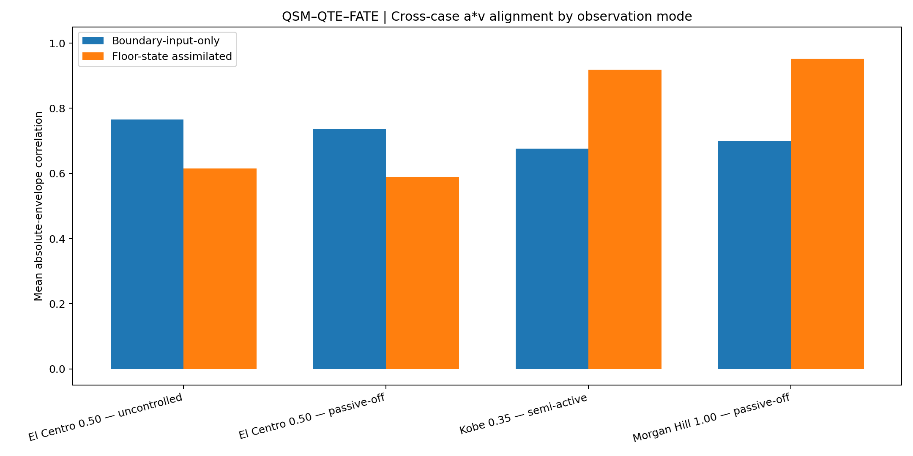
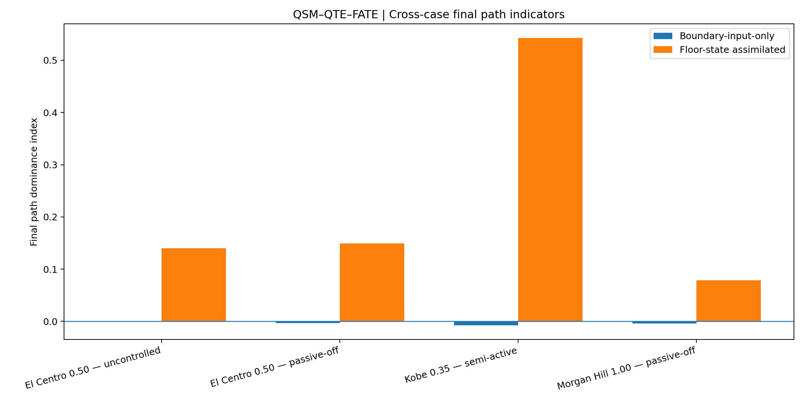
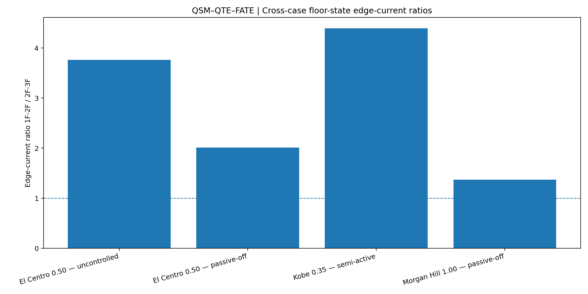

# QSM–QTE–FATE Integrated Seismic Field Observation

## NEES-2011-1076 · Formal Release V11.1

**Theory-disclosure and implementation-mapping release for the integrated computational observation of Quantum Structural Mechanics (QSM), Quantum Topology Express (QTE), and the `Aware_power` layer of Fractal Alive Topology Evolution (FATE).**

**Author and theory developer:** Dr. Han-Jung (Alaric) Kuo  
**Organization:** A&J Management Consulting Limited  
**Formal release:** V11.1  
**Numerical engine:** V11, unchanged  
**Release character:** documentation, theory–code mapping, and scientific-boundary clarification

This repository records a four-case seismic experiment on a three-story steel-frame dataset. It connects three theoretical layers into one reproducible computational chain:

```text
measured structural state
→ QSM empirical wavefunction construction
→ Hamiltonian one-step Power-state evolution
→ QSM fidelity and work-compatible manifestation
→ QTE floor-domain topology-path indication
→ FATE Aware_power observation
```

V11.1 does not change the V11 numerical algorithm or regenerate the formal case artifacts. It makes the theoretical core visible, states exactly how the code operationalizes that core, and separates the implemented layer from the still-open parts of QSM, QTE, and FATE.

The release boundary is:

| Theory layer | Full theoretical role | V11.1 implementation | Current evidence boundary |
|---|---|---|---|
| **QSM** | Hamiltonian evolution of a structural Power state; fidelity as target-state hit ratio; Power manifestation and accumulated hit work | Empirical complex floor-state wavefunction, `U = exp(-iHΔt)`, one-step prior-state evolution, state fidelity, nodal fidelity, work-compatible `a·v` projection, and measurement assimilation | Strongly repeated in two direct-channel records; one-step assimilated observation, not unrestricted long-horizon free evolution |
| **QTE** | Viewpoint → topology → channel → evolution → manifestation → action | Fixed three-floor viewpoint, two-edge graph, Laplacian and zero-diagonal Hamiltonians, edge currents, adaptive path weights, path-dominance history | Floor-domain only; no member-level BIM/IFC graph, no explicit background-potential field, no independently verified physical weak-plane location |
| **FATE** | `Aware_power → Alert_control → Alive_evolve`, with intervention rewriting the topology or Hamiltonian and the field re-evolving | `Aware_power`: incoming-wave awareness, structure-coupled field awareness, path awareness, work/response awareness, ablation awareness, and data-semantic/provenance awareness | No automated alert rule, no control action, no topology/Hamiltonian rewrite, no post-intervention re-evolution, no cross-scale fractal recursion |

The central achievement is a **shared, executable, inspectable, cross-case computational trace** in which the theory, code, measurements, outputs, and limits can be read together.

---

## What V11.1 adds

V11 established the formal four-case computation. V11.1 adds the missing theoretical disclosure:

1. the Schrödinger–Hamiltonian core of QSM;
2. the empirical construction of the measured structural wavefunction;
3. the distinction between canonical QSM and the present experimental operationalization;
4. the QTE Hamiltonian, edge-current, and adaptive path equations;
5. the full FATE operational loop and the exact point reached by the code;
6. a theory-to-code status map distinguishing **implemented**, **partially implemented**, and **not yet implemented** elements;
7. explicit clarification that the numerical engine and reported V11 outputs are unchanged.

---

# 1. Integrated theoretical architecture

The integrated order is:

```text
QSM
defines and evolves the structural Power state

QTE
reads how that state manifests through a topology

FATE
places the observed field inside an operational survival loop
```

The three layers answer different questions:

| Layer | Central question |
|---|---|
| **QSM** | How does the measured structural state become a complex Power state, evolve through a Hamiltonian channel field, and hit structural target states? |
| **QTE** | Through which relational or physicalized paths does that evolving state concentrate, redistribute, or pass? |
| **FATE** | What must the system become aware of, when should it intervene, and how should the topology or Hamiltonian be rewritten so that the field can re-evolve? |

The repository implements these layers in sequence rather than treating them as interchangeable labels.

---

# 2. Quantum Structural Mechanics

## 2.1 Theoretical position

**Quantum Structural Mechanics: From Stiffness Assets to Value Flow**  
ResearchGate preprint  
DOI: [10.13140/RG.2.2.27121.13928](https://doi.org/10.13140/RG.2.2.27121.13928)

Classical structural mechanics describes resistance through mass, damping, stiffness, force, displacement, velocity, and acceleration. QSM retains these measurable quantities and reorganizes their interpretation around the evolution of structural Power through a channel topology.

The theoretical shift is:

```text
stiffness asset
→ transmission channel

response value
→ projection of an evolving state

damage only as asset loss
→ possible blockage, redirection, or concentration of Power flow
```

QSM uses the quantum-mechanical state formalism as the computational mechanics of this evolution. It is not reduced to the scalar product `a·v`.

## 2.2 Canonical QSM state evolution

The evolving structural Power state is written as:

$$ |\Psi(t)\rangle = \begin{bmatrix} \Psi_1(t)\\ \Psi_2(t)\\ \vdots\\ \Psi_n(t) \end{bmatrix}, \qquad \langle\Psi(t)|\Psi(t)\rangle=1 $$

Its Hamiltonian evolution is:

$$ i\hbar\frac{\partial}{\partial t}|\Psi(t)\rangle = \hat H_p(t)|\Psi(t)\rangle $$

For one discrete time step:

$$ |\Psi(t+\Delta t)\rangle = \exp\!\left( -\frac{i}{\hbar}\hat H_p(t)\Delta t \right) |\Psi(t)\rangle $$

The V11 numerical engine uses normalized units with:

$$ \hbar=1 $$

so that:

$$ U(t,\Delta t)=e^{-iH(t)\Delta t} $$

## 2.3 QSM Power manifestation

The canonical Power manifestation equation is:

$$ \mathbf P(t) = \bigl(a(t)\cdot v(t)\bigr) \hat H_p(t)|\Psi(t)\rangle $$

This expression separates three roles:

| Object | QSM role |
|---|---|
| $a(t)\cdot v(t)$ | real dynamic, work-compatible input scale |
| $\hat H_p(t)$ | structural channel transformation |
| $|\Psi(t)\rangle$ | evolving structural Power state |

At a local floor or node:

$$ p_i(t)=a_i(t)v_i(t) $$

Because the experimental release does not introduce the physical mass of each floor, `a·v` is treated as a **mass-normalized, work-compatible Power-state proxy**:

$$ \frac{dW}{m} \approx a\,du = a\,v\,dt $$

The current outputs therefore do not claim absolute watts or joules.

## 2.4 Fidelity as target-state hit ratio

For a selected target state:

$$ F_{\mathrm{id}}^{\mathrm{target}}(t) = \left| \langle\Psi_{\mathrm{target}}|\Psi(t)\rangle \right|^2 $$

When the target is simplified as node or floor $i$:

$$ F_{\mathrm{id},i}(t)=|\Psi_i(t)|^2 $$

Fidelity is a normalized hit ratio. It is not total structural energy and it is not, by itself, the complete Power manifestation.

The target-hit Power is interpreted as:

$$ P_{\mathrm{real}}^{\mathrm{target}}(t) \sim P_{\mathrm{input}}(t) F_{\mathrm{id}}^{\mathrm{target}}(t) $$

and the accumulated target-hit work-compatible quantity is:

$$ W_{\mathrm{hit}}^{\mathrm{target}}(T) = \int_0^T P_{\mathrm{input}}(t) F_{\mathrm{id}}^{\mathrm{target}}(t)\,dt $$

## 2.5 Empirical wavefunction implemented in V11

The NEES files provide measured or derived floor displacement, velocity, and acceleration. V11 compiles them into an empirical complex state.

For each floor $i$, the code first constructs robustly normalized signals:

$$ \tilde u_i(t),\qquad \tilde v_i(t),\qquad \tilde a_i(t) $$

and estimates a dominant angular frequency $\omega_i$ from displacement. With a reference frequency $\omega_{\mathrm{ref}}$:

$$ \bar\omega_i=\frac{\omega_i}{\omega_{\mathrm{ref}}} $$

The implemented empirical state-intensity measure is:

$$ E_i(t) = \tilde v_i^2(t) + \bigl(\bar\omega_i\tilde u_i(t)\bigr)^2 + 0.25\,\tilde a_i^2(t) + \varepsilon $$

The normalized amplitude is:

$$ A_i(t) = \sqrt{ \frac{E_i(t)} {\sum_j E_j(t)} } $$

The phase is:

$$ \theta_i(t) = \operatorname{atan2} \left( \bar\omega_i\tilde u_i(t), \tilde v_i(t) \right) $$

The measured empirical wavefunction is then:

$$ \Psi_i^{\mathrm{meas}}(t) = A_i(t)e^{i\theta_i(t)} $$

followed by complex-vector normalization.

This construction is the present experimental bridge from measured structural motion into the QSM state space. It is an operational choice of V11, not the only possible empirical wavefunction for future QSM studies.

## 2.6 One-step Hamiltonian prior implemented in V11

At time step $k$, V11 builds the current Hamiltonian and unitary operator:

$$ U_k=e^{-iH_k\Delta t} $$

A measured Power-state source is constructed from the sign, magnitude, and phase of the local `a·v` field. In schematic form:

$$ s_{i,k} = \sqrt{|\tilde p_{i,k}|} \exp\!\left[ i\left( \theta_{i,k} + \pi\,\mathbf 1_{p_{i,k}<0} \right) \right] $$

The one-step prior is:

$$ |\Psi^-_{k+1}\rangle = \mathcal N \left[ U_k \left( |\Psi_k\rangle + g_s\Delta t\,|s_k\rangle \right) \right] $$

where $\mathcal N$ denotes normalization and $g_s$ is the source gain.

The unchanged numerical gains are:

| Quantity | Value | Role |
|---|---:|---|
| $g_s$ | 0.08 | measured Power-state source injection |
| $g_m$ | 0.20 | post-comparison measurement assimilation |

This prior is compared with the next measured empirical state before assimilation:

$$ F_{\mathrm{state},k+1} = \left| \left\langle \Psi^{\mathrm{meas}}_{k+1} \middle| \Psi^-_{k+1} \right\rangle \right|^2 $$

The nodal fidelity used for floor-wise manifestation is:

$$ F_{i,k+1}=|\Psi^-_{i,k+1}|^2 $$

## 2.7 V11 Power-state projection

The canonical equation contains the operator action $\hat H_p|\Psi\rangle$. The V11 experiment operationalizes the observable floor manifestation through the evolved nodal fidelity and the current work-compatible input scale.

For floor-state assimilation:

$$ P_{\mathrm{scale},k} = \sum_i |a_{i,k}v_{i,k}| $$

For the boundary-input-only reference:

$$ P_{\mathrm{scale},k}^{\mathrm{boundary}} = |a_{1,k}v_{1,k}| $$

The implemented one-step floor manifestation is:

$$ \widehat p_{i,k+1|k} = P_{\mathrm{scale},k} F_{i,k+1} s_{i,k+1}^{\mathrm{phase}} $$

where the directional sign is derived from the evolved complex phase:

$$ s_{i,k+1}^{\mathrm{phase}} = \operatorname{sign} \left[ -\sin\!\left(2\arg\Psi^-_{i,k+1}\right) \right] $$

The code then compares:

$$ \widehat p_{i,k+1|k} \quad\text{with}\quad p_{i,k+1}^{\mathrm{meas}} = a_{i,k+1}v_{i,k+1} $$

This is the formal one-step QSM evidence reported by V11.

## 2.8 Measurement assimilation

After the one-step comparison, the measurement residual is:

$$ r_{k+1} = |\Psi^{\mathrm{meas}}_{k+1}\rangle - |\Psi^-_{k+1}\rangle $$

The next assimilated state is:

$$ |\Psi_{k+1}\rangle = \mathcal N \left[ |\Psi^-_{k+1}\rangle + g_m r_{k+1} \right] $$

The release therefore performs a sequence of:

```text
measured state at k
→ Hamiltonian prior for k+1
→ comparison with measured state at k+1
→ residual assimilation
→ next one-step evolution
```

This is an assimilated one-step field observation. It is not an unrestricted autonomous prediction over the full earthquake record.

## 2.9 QSM implementation status

| QSM element | Status in V11.1 | Implementation |
|---|---|---|
| Complex structural state $|\Psi\rangle$ | **Implemented** | Three-floor empirical wavefunction from normalized `u`, `v`, and `a` |
| Hamiltonian time evolution | **Implemented** | Exact eigendecomposition of the real symmetric $3\times3$ Hamiltonian and $U=e^{-iH\Delta t}$ |
| Source-driven Power-state evolution | **Implemented** | Complex source from local `a·v` magnitude, sign, and measured phase |
| State fidelity | **Implemented** | $|\langle\Psi^{meas}_{k+1}|\Psi^-_{k+1}\rangle|^2$ |
| Nodal fidelity | **Implemented** | $|\Psi^-_i|^2$ |
| Work-compatible target manifestation | **Implemented as proxy** | Total `a·v` scale projected through nodal fidelity and evolved phase |
| Accumulated hit work | **Implemented as proxy** | Time integration of absolute evolved floor manifestation |
| Canonical $\mathbf P=(a\cdot v)\hat H_p|\Psi\rangle$ evaluated directly as a physical vector | **Partially implemented** | Hamiltonian evolution and fidelity projection are implemented; absolute physical Power and direct calibrated operator-valued manifestation remain open |
| Long-horizon free Schrödinger evolution | **Not yet established** | Measurement assimilation follows each one-step comparison |
| Physical watts/joules | **Not implemented** | Floor masses and complete physical calibration are absent |
| Member-level target state | **Not implemented** | Current state space contains three floor nodes |

---

# 3. Quantum Topology Express

## 3.1 Theoretical position

**Quantum Topology Express Method**  
ResearchGate preprint  
DOI: [10.13140/RG.2.2.22329.12645](https://doi.org/10.13140/RG.2.2.22329.12645)

QTE treats local values as projections of a deeper topology–field evolution. Its methodological chain is:

```text
viewpoint
→ topology
→ channel
→ evolution
→ manifestation
→ action
```

The viewpoint defines what is being observed. The topology records relationships. The channel matrix expresses possible passage. The Hamiltonian advances the state. Manifestation converts the evolving state into readable paths, currents, gradients, and target concentrations. Action belongs to the subsequent operational layer.

A general QTE Hamiltonian can include both geometric/topological coupling and a background potential:

$$ H = \kappa L_{\mathrm{geo}} + \alpha_V\operatorname{diag}(V_{\mathrm{bg}}) $$

V11 uses a bounded floor-domain form without a separately modelled background-potential vector.

## 3.2 Floor-domain viewpoint implemented in V11

The fixed viewpoint is a three-node graph:

```text
[1F] —— w12 —— [2F] —— w23 —— [3F]
```

with no direct `1F–3F` edge.

The weighted adjacency matrix is:

$$ W= \begin{bmatrix} 0&w_{12}&0\\ w_{12}&0&w_{23}\\ 0&w_{23}&0 \end{bmatrix} $$

The degree matrix and graph Laplacian are:

$$ D=\operatorname{diag}(W\mathbf 1), \qquad L=D-W $$

V11 retains two Hamiltonian forms:

### Laplacian field

$$ H_L=L $$

This includes node–channel balance and represents the physicalized floor topology.

### Zero-diagonal relational field

$$ H_Z=-W $$

This isolates inter-node relational transmission and preserves the earlier QSM channel view.

The two operators are retained as different observation structures. Their convergence on the same lower-interface tendency is treated as supporting evidence, not as proof that the operators are universally interchangeable.

## 3.3 Quantum edge current

For a complex state $\Psi$ and Hamiltonian $H$, V11 computes the two floor-edge currents:

$$ J_{12} = 2\,\operatorname{Im} \left( \Psi_1^*H_{12}\Psi_2 \right) $$

$$ J_{23} = 2\,\operatorname{Im} \left( \Psi_2^*H_{23}\Psi_3 \right) $$

These currents carry phase-sensitive information. They are distinct from the adaptive path weights.

The cross-case indicator is the RMS current ratio:

$$ R_J = \frac{\operatorname{RMS}(|J_{12}|)} {\operatorname{RMS}(|J_{23}|)} $$

A ratio above one indicates stronger field-current concentration on the `1F–2F` edge over the record.

## 3.4 Adaptive path manifestation

The path weights begin from:

$$ w_{12}=w_{23}=1 $$

For each time step, the code combines:

- path-memory decay;
- absolute edge current;
- floor-to-floor Power-state gradient;
- assimilation-residual gradient;
- optional hidden-work/response gradient.

The implemented update is:

$$ \widetilde w_{ij,k+1} = (1-\lambda\Delta t)w_{ij,k} + \alpha_J|J_{ij,k}|\Delta t + \alpha_P\Delta P_{ij,k}\Delta t + \alpha_R\Delta r_{ij,k}\Delta t + \alpha_H\Delta h_{ij,k}\Delta t $$

The two weights are then normalized so that:

$$ w_{12,k+1}+w_{23,k+1}=2 $$

The unchanged V11 numerical coefficients are:

| Coefficient | Value | Role |
|---|---:|---|
| $\lambda$ | 0.02 | path decay |
| $\alpha_J$ | 0.15 | edge-current contribution |
| $\alpha_P$ | 0.30 | Power-gradient contribution |
| $\alpha_R$ | 0.06 | assimilation-residual contribution |
| $\alpha_H$ | 0.05 | hidden-work/response contribution |

No case-specific parameter fitting is applied.

## 3.5 Path-dominance indicator

The normalized path-dominance indicator is:

$$ D_p(t) = \frac{w_{12}(t)-w_{23}(t)} {w_{12}(t)+w_{23}(t)} $$

Interpretation:

| $D_p$ | Floor-domain reading |
|---:|---|
| $D_p>0$ | higher `1F–2F` path weight |
| $D_p<0$ | higher `2F–3F` path weight |
| $|D_p|\le 0.02$ | near-equal / no clear final path indication |

The full history is retained because formation, concentration, transition, recovery, and redistribution may lead to similar final values through different event histories.

## 3.6 QTE implementation status

| QTE element | Status in V11.1 | Implementation |
|---|---|---|
| Viewpoint definition | **Implemented, fixed** | Three-floor observation viewpoint |
| Topology graph | **Implemented** | Three nodes, two adjacent floor edges |
| Weighted adjacency $W$ | **Implemented** | Dynamic `w12`, `w23` |
| Laplacian $L=D-W$ | **Implemented** | Main floor-state field probe |
| Zero-diagonal relational Hamiltonian | **Implemented** | `H=-W` comparison probe |
| Schrödinger topology evolution | **Implemented** | Shared with QSM through $U=e^{-iH\Delta t}$ |
| Quantum edge current | **Implemented** | `J12`, `J23` |
| Adaptive path update | **Implemented** | Current, Power gradient, residual, and optional response term |
| Path dominance | **Implemented** | Full history and final cautious label |
| Explicit background potential $V_{\mathrm{bg}}$ | **Not implemented** | No separate physical potential field in the dataset model |
| Member/connection BIM topology | **Not implemented** | No complete BIM/IFC or as-built member graph |
| Automatic viewpoint compilation | **Not implemented** | Viewpoint is manually fixed to floors |
| Verified component weak-plane localization | **Not established** | Current result is an interface indication at floor-domain resolution |
| Action layer | **Not QTE-complete in this release** | Observation stops before operational intervention |

---

# 4. Fractal Alive Topology Evolution

## 4.1 Theoretical position

**Fractal Alive Topology Evolution**  
ResearchGate preprint  
DOI: [10.13140/RG.2.2.27969.72806](https://doi.org/10.13140/RG.2.2.27969.72806)

FATE extends field observation into an operational survival architecture:

```text
Aware_power
→ Alert_control
→ Alive_evolve
```

Its concern is the continued viability of an open, changing system. Awareness identifies the incoming Power, formed field, active paths, blocked or concentrated regions, downstream response, and uncertainty of the observation itself. Alert/control determines whether intervention is required. Alive/evolve rewrites the system condition and observes how the field develops after that intervention.

The operational loop can be expressed schematically as:

$$ \mathcal F_t \xrightarrow{\mathrm{Aware\_power}} \mathcal O_t \xrightarrow{\mathrm{Alert\_control}} (\mathcal T_t,H_t) \rightarrow (\mathcal T_{t+1},H_{t+1}) \xrightarrow{\mathrm{Alive\_evolve}} \mathcal F_{t+1} $$

where $\mathcal F$ is the evolving field, $\mathcal O$ is the awareness state, $\mathcal T$ is topology, and $H$ is the Hamiltonian.

## 4.2 `Aware_power` implemented in V11

The present code reaches awareness through six observable layers:

### 1. Incoming-wave awareness

The boundary-input-only probe asks what can be inferred from the incoming floor-boundary signal without upper-floor assimilation.

### 2. Structure-coupled field awareness

The floor-state-assimilated probes reveal what appears after measured internal structural states enter the complex field representation.

### 3. Topology-path awareness

Dynamic `w12`, `w23`, $D_p$, $J_{12}$, and $J_{23}$ retain the location and history of floor-domain concentration and redistribution.

### 4. Power/work awareness

The code records:

$$ \widehat p_{i,k+1|k}, \qquad |\widehat p_{i,k+1|k}|, \qquad W_{\mathrm{hit},i}(t) $$

as work-compatible manifestation proxies.

### 5. Response awareness

Displacement is retained as downstream response evidence through a causal displacement envelope. It is not used as the sole definition of the internal field.

The current hidden-work proxy is:

$$ h_i(t) = \widetilde W_{\mathrm{hit},i}(t) - \widetilde u_{\mathrm{env},i}(t) $$

This is a comparative proxy between normalized accumulated manifestation and normalized displacement response. It is not a physical unmeasured-energy quantity.

### 6. Data-semantic and provenance awareness

The El Centro cases preserve irregularities associated with mixed displacement coordinates, numerically differentiated velocity, direct acceleration, sensing, acquisition, conversion, processing, and possible experimental intervention. The method does not silently smooth these traces into a cleaner narrative.

This extends `Aware_power` from signal detection to awareness of whether the observation field itself is physically coherent and semantically trustworthy.

## 4.3 Ablation awareness

The five probes act as controlled observational removals:

| Probe | Removed or constrained element |
|---|---|
| Laplacian floor-state field | Full present observation chain |
| Zero-diagonal floor-state field | Laplacian diagonal balance removed |
| Boundary-input-only | Upper-floor state assimilation removed |
| Dynamic path without response feedback | Hidden-work/response term removed |
| Fixed-path reference | Adaptive QTE path rewrite removed |

The ablations help determine which evidence belongs primarily to QSM, which belongs to QTE, and why the current FATE result remains at awareness.

## 4.4 FATE implementation status

| FATE element | Status in V11.1 | Implementation |
|---|---|---|
| Incoming Power awareness | **Implemented** | Boundary-input-only reference |
| Internal field awareness | **Implemented** | Floor-state-assimilated QSM evolution |
| Path awareness | **Implemented** | Dynamic weights, dominance, currents |
| Work-compatible manifestation awareness | **Implemented as proxy** | Evolved `a·v`, hit work, positive/negative accumulation |
| Downstream response awareness | **Implemented** | Causal displacement envelope |
| Hidden manifestation–response comparison | **Implemented as proxy** | Normalized hit-work minus normalized displacement envelope |
| Data-semantic/provenance awareness | **Implemented** | Signal map and explicit El Centro interpretation boundary |
| Alert threshold or hazard-state classifier | **Not implemented** | No formal alert decision |
| Control policy | **Not implemented** | No command selection or actuator logic |
| Hamiltonian/topology rewrite by action | **Not implemented** | Observed path adaptation is diagnostic, not a physical intervention |
| Post-control re-evolution | **Not implemented** | No counterfactual or closed-loop action case |
| Fractal cross-scale recursion | **Not implemented** | Current domain is one three-floor graph |
| Verified survival improvement | **Not established** | Requires intervention and outcome comparison |

---

# 5. End-to-end algorithm implemented by the numerical engine

For every case and every observation probe, the code performs:

```text
1. Read the original NEES source file directly.

2. Identify floor displacement, velocity, and acceleration channels,
   preserving their recorded/derived provenance.

3. Build the measured empirical complex state:
   Ψmeas = amplitude(u,v,a) × exp[i phase(u,v)].

4. Compute the local work-compatible field:
   p_i = a_i v_i.

5. Build the current floor Hamiltonian:
   H = L
   or
   H = -W.

6. Evolve one Hamiltonian prior:
   Ψ⁻(k+1) = N{exp[-iHΔt] [Ψ(k) + source]}.

7. Compare with the next measured state:
   state fidelity, nodal fidelity,
   evolved a·v manifestation, and residual.

8. Assimilate the measurement and update the QTE path:
   edge current + Power gradient + residual gradient
   + optional response gradient.

9. Record FATE Aware_power evidence:
   field, path, work-compatible manifestation,
   displacement response, ablation difference,
   and data-semantic condition.
```

---

# 6. Theory-to-code map

The main implementation is in:

[`code/qsm_qte_fate_nees_multicase_release_v11.py`](code/qsm_qte_fate_nees_multicase_release_v11.py)

| Theory object | Code object/function | Role |
|---|---|---|
| Empirical $|\Psi^{meas}\rangle$ | `build_empirical_wavefunction(...)` | Converts floor `u`, `v`, `a` into normalized complex amplitude and phase |
| $W$, $D$, $L$, $H$ | `build_path_operator(...)` | Builds adjacency, degree, Laplacian, and selected Hamiltonian |
| $U=e^{-iH\Delta t}$ | `build_path_operator_and_unitary(...)` | Eigendecomposes $H$ and constructs exact one-step unitary evolution |
| $J_{12}$, $J_{23}$ | `edge_currents(...)` | Computes phase-sensitive topology currents |
| One-step QSM evolution | `run_probe(...)` | Source injection, unitary prior, fidelity, manifestation, residual assimilation |
| Nodal fidelity | `fid = np.abs(psi_prior) ** 2` | Floor target-state hit ratios |
| State fidelity | `abs(np.vdot(psi_meas[k+1], psi_prior)) ** 2` | Prior-to-next-measurement state overlap |
| Work-compatible manifestation | `evolved_av_next` | Projects current `a·v` scale through nodal fidelity and evolved phase |
| Hit work | `w_hit`, `pos_hit_work`, `neg_hit_work` | Time accumulation of manifestation proxies |
| QTE path state | `w12_hist`, `w23_hist`, `path_dominance` | Dynamic floor-interface history |
| FATE response awareness | `disp_env`, `hidden_work_proxy` | Downstream displacement and comparative hidden manifestation proxy |
| FATE semantic awareness | `signal_map`, provenance manifests | Records coordinate and derivation conditions |
| Observation ablations | `PROBE_DEFS` | Separates operator, input, feedback, and path-adaptation effects |

A fuller implementation map is provided in [`THEORY_IMPLEMENTATION_MAP_V11_1.md`](THEORY_IMPLEMENTATION_MAP_V11_1.md).

---

# 7. BIM-enabled life-cycle interpretation

The three methods also correspond to different information conditions across a BIM-enabled life cycle.

| Life-cycle condition | Available information | Methodological viewpoint |
|---|---|---|
| Early design | Proposed nodes and relationships; incomplete physical parameters | **QSM zero-diagonal relational transmission** |
| As-built / commissioning | Physicalized nodes, channels, boundaries, and tested system conditions | **QTE Laplacian topology field** |
| Operation / seismic event | Incoming excitation, measured state, intervention, and re-evolution | **FATE operational evolution** |

The zero-diagonal and Laplacian operators are therefore not treated as two arbitrary algorithms competing for the best score.

- The **zero-diagonal operator** isolates inter-node relational transmission.
- The **Laplacian operator** includes node–channel balance in a physicalized topology.
- **FATE** places the observed topology inside an operational loop in which action may later rewrite the field.

In the unchanged V11 numerical engine retained by V11.1, both zero-diagonal and Laplacian floor-state probes are retained to examine whether the same floor-domain tendency remains visible under different operator structures.

---

# 8. Research questions

The formal release asks five narrow questions:

1. Can the current measured floor state evolve into a one-step `a·v` field that aligns with the next measured state?
2. Does floor-state assimilation reveal information that is absent from boundary-input-only evolution?
3. Can the evolving field indicate a persistent or temporary internal floor-domain path?
4. Do path location and maximum downstream displacement describe different observational layers?
5. Can the method reveal when data coordinates, derivation methods, or measurement provenance weaken the physical coherence of the field?

---

# 9. Experimental dataset

All four records come from:

**Zhang, J., Wu, B., and Dyke, S.**  
*RTHS and Shake Table Comparison for Smart Structural Systems (NEES-2011-1076)* [Data set].  
NEES / DesignSafe Data Depot.  
DOI: [10.7277/TPS7-V877](https://doi.org/10.7277/TPS7-V877)

The source records used by the V11 numerical engine were taken directly from the files provided in the original NEES-2011-1076 dataset package. No additional author-side signal conversion, filtering, smoothing, denoising, coordinate harmonization, or manual preprocessing was applied before the formal analysis.

The source records are **not redistributed** in this repository. See [`data/README.md`](data/README.md) for the exact filenames and local data placement.

## 9.1 Four formal cases

| Case | Earthquake | Scale | Control condition | Evidence role |
|---|---|---:|---|---|
| [El Centro 0.50 — uncontrolled](cases/el_centro_050_uncontrolled/) | El Centro | 0.50 | Uncontrolled | Data-semantic stress test; sustained lower-interface tendency |
| [El Centro 0.50 — passive-off](cases/el_centro_050_passive_off/) | El Centro | 0.50 | Passive-off | Data-semantic stress test; abrupt mid-record transition |
| [Kobe 0.35 — semi-active](cases/kobe_035_semi_active/) | Kobe | 0.35 | Semi-active | Initial integrated QSM–QTE–FATE observation record |
| [Morgan Hill 1.00 — passive-off](cases/morgan_hill_100_passive_off/) | Morgan Hill | 1.00 | Passive-off | Cross-scenario replication with a distinct redistribution history |

The four cases form a **partial cross-wave and cross-control robustness matrix**, not a balanced factorial experiment. Only the two El Centro cases hold the earthquake and scale approximately fixed while changing the control condition.

---

# 10. Five observation probes

Every case is processed with the same five probes.

| Probe | Purpose |
|---|---|
| **Laplacian floor-state field probe** | Main integrated QSM–QTE–FATE observation |
| **Zero-diagonal floor-state field probe** | Pure relational-transmission comparison inherited from early QSM |
| **Boundary-input-only diagnostic reference** | Tests what can be observed from the incoming wave without internal floor-state assimilation |
| **Floor-state dynamic path without response feedback** | Tests sensitivity to the current downstream response-feedback term |
| **Fixed-path reference** | Separates QSM one-step field alignment from QTE path adaptation |

These are five computational observation settings, not five physical paths. The present floor graph contains only:

```text
1F–2F
2F–3F
```

All four cases use the same numerical settings and the same initial condition:


$$ w_{12}=w_{23}=1 $$


No case-specific optimizer, grid search, or target-driven parameter fitting is used.

---

# 11. Cross-case findings

A detailed scientific synthesis is available in:

**[Four-Case Scientific Synthesis](cross_case/README.md)**

## 11.1 QSM repeats strongly in two direct-channel records

Kobe and Morgan Hill use direct analytical displacement, velocity, and acceleration channels on all three floors.

| Case | Boundary-only mean absolute-envelope correlation | Floor-state-assimilated correlation |
|---|---:|---:|
| Kobe 0.35 — semi-active | 0.677 | **0.918** |
| Morgan Hill 1.00 — passive-off | 0.699 | **0.952** |

Under one unchanged V11 numerical configuration, both cases reproduce strong one-step structure-coupled power-state alignment.



This is the strongest current evidence that QSM has moved beyond a single-case computational result. It remains a one-step evolved-field test and should not be described as unrestricted multi-step prediction.

## 11.2 Boundary input and internal structural field are distinguishable

Across all four records, boundary-input-only evolution ends near equal path weighting. It does not produce a clear internal final path indication.

After floor-state assimilation, every case ends with a positive `1F–2F` floor-domain indication.



The cross-case result supports the distinction:

```text
incoming seismic wave
≠
field formed after wave–structure coupling
```

## 11.3 A common interface does not erase event-specific evolution

All four cases indicate the `1F–2F` floor interface, but their histories differ.

```text
El Centro uncontrolled:
early concentration → sustained separation → partial redistribution

El Centro passive-off:
weak separation → abrupt mid-record transition → gradual redistribution

Kobe:
strong and comparatively persistent concentration

Morgan Hill:
strong intermediate concentration → substantial return toward equality
```

The method therefore retains formation, concentration, transition, recovery, and redistribution rather than reducing each event to one final label.

## 11.4 Edge current provides a second path indicator

The main floor-state edge-current ratio is above one in all four cases:

| Case | RMS edge-current ratio `1F–2F / 2F–3F` |
|---|---:|
| El Centro 0.50 — uncontrolled | 3.763 |
| El Centro 0.50 — passive-off | 2.010 |
| Kobe 0.35 — semi-active | 4.392 |
| Morgan Hill 1.00 — passive-off | 1.368 |



Path weights and edge current are distinct metrics. Their agreement on the lower interface provides mutually supporting floor-domain QTE evidence.

## 11.5 El Centro exposes the semantic boundary of `a·v`

The El Centro records combine:

```text
1F:
relative displacement

2F and 3F:
absolute displacement

velocity:
numerically differentiated from displacement

acceleration:
directly measured
```

Their Figure 17 work-loop proxies retain a broad restoring-response orientation but contain multiple branches, crossings, and long excursions. These irregularities are not silently removed.

The method preserves possible traces of:

- physical response;
- coordinate choice;
- numerical differentiation;
- sensor and acquisition behavior;
- conversion and processing;
- experimental operation and human intervention.

This does not turn every irregularity into a structural conclusion. It makes the origin and trustworthiness of the observed field part of FATE awareness.

## 11.6 QSM, QTE, and FATE require separate evidence

The fixed-path and dynamic-path probes produce almost identical one-step absolute-envelope correlations. Therefore:

```text
one-step a·v alignment
→ primarily QSM evidence

path-weight evolution and edge-current concentration
→ QTE evidence
```

Removing response feedback changes the current path indication only slightly. The V11/V11.1 release has therefore not yet demonstrated a strong feedback-driven topology rewrite, which is consistent with FATE remaining at `Aware_power`.

---

# 12. Evidence status

## 12.1 Currently supported

- Repeatable one-step QSM power-state alignment in two direct-channel records.
- Empirical distinction between boundary-input information and a structure-coupled floor-state field.
- Repeated `1F–2F` floor-domain path indication across four records.
- Independent lower-interface tendency in both path weight and edge current.
- Convergence of zero-diagonal and Laplacian probes on the same floor-domain tendency.
- Separation between internal path indication and maximum downstream displacement response.
- Detection of data-semantic inconsistency without automatically discarding irregular traces.
- First integrated computational chain from QSM through QTE to FATE `Aware_power`.

## 12.2 Not yet established

- Member-, joint-, or component-level topology localization.
- A complete BIM/IFC or as-built structural field.
- Absolute physical power in watts or absolute energy dissipation percentages.
- Damage probability or verified weak-plane identification.
- Multi-step free evolution without intermediate assimilation.
- Causal separation of earthquake-wave and control-mode effects across all four cases.
- FATE `Alert_control`.
- FATE `Alive_evolve` after a topology or Hamiltonian rewrite.
- Universal validity across structural systems.

---

# 13. Repository structure

```text
QSM-QTE-FATE-Integrated-Seismic-Field-Observation/
├── README.md
├── CITATION.cff
├── V11_CHANGELOG.md
├── V11_1_CHANGELOG.md
├── THEORY_IMPLEMENTATION_MAP_V11_1.md
├── RELEASE_NOTES_V11_1.md
├── QA_REGRESSION.md
├── requirements.txt
├── code/
│   └── qsm_qte_fate_nees_multicase_release_v11.py
├── scripts/
│   ├── run_all_cases_v11_ascii_path.ps1
│   └── run_smoke_test_morgan_v11_ascii_path.ps1
├── data/
│   └── README.md
├── cases/
│   ├── el_centro_050_uncontrolled/
│   ├── el_centro_050_passive_off/
│   ├── kobe_035_semi_active/
│   └── morgan_hill_100_passive_off/
├── cross_case/
│   ├── README.md
│   └── 11 formal cross-case artifacts
└── release_logs/
    └── 00_RELEASE_RUN_LOG.txt
```

Each case folder contains 20 formal artifacts:

```text
4 CSV evidence tables / histories
2 generated text reports
12 PNG figures
1 execution log
1 JSON provenance manifest
```

The full formal release contains:

```text
80 case artifacts
11 cross-case artifacts
1 root execution log
= 92 generated files
```

---

# 14. Reproducing V11.1

V11.1 retains the V11 numerical engine and the existing formal outputs. The executable filename remains `qsm_qte_fate_nees_multicase_release_v11.py` so that the documentation release does not imply an unperformed numerical change.

## 14.1 Requirements

- Python 3.10 or later
- NumPy
- pandas
- Matplotlib

Install dependencies:

```powershell
python -m pip install -r requirements.txt
```

The original formal run used a Conda environment named `ifcman`.

## 14.2 Expected source files

Place the following source files from the original dataset package in a local data directory:

```text
elcentro_0p50_07312012_unc_donghua_converted.csv
elcentro_0p50_07312012_poff_donghua_converted.csv
kobe_035_semi_active_avg_converted.csv
morgan_1_p_off_avg_converted.csv
```

> **Source-file provenance note**  
> The filenames contain terms such as `converted` or `avg` because those are the filenames supplied in the original dataset package used for this release. This repository does not claim that these files were converted or averaged by the author. V11 reads the files directly as supplied.


## 14.3 Direct execution

```powershell
python .\code\qsm_qte_fate_nees_multicase_release_v11.py `
    --root "D:\path\to\Data Source" `
    --out ".\outputs_qsm_qte_fate_nees_2011_1076_v11" `
    --stride 5 `
    --workers 8 `
    --prepare-workers 2 `
    --chunk-rows 200000
```

## 14.4 Windows paths containing Chinese characters

The formal run used temporary drive mappings so that Conda received ASCII-only paths:

```powershell
$RepoRoot = (Get-Location).Path
$DataRoot = "D:\path\to\Data Source"
$Conda = "D:\Application\miniconda3\Scripts\conda.exe"

cmd /c "subst Q: /d" 2>$null | Out-Null
cmd /c "subst S: /d" 2>$null | Out-Null

try {
    cmd /c "subst Q: `"$RepoRoot`""
    cmd /c "subst S: `"$DataRoot`""

    & $Conda run -n ifcman python `
        "Q:\code\qsm_qte_fate_nees_multicase_release_v11.py" `
        --root "S:\" `
        --out "Q:\outputs_qsm_qte_fate_nees_2011_1076_v11" `
        --stride 5 `
        --workers 8 `
        --prepare-workers 2 `
        --chunk-rows 200000
}
finally {
    cmd /c "subst Q: /d" 2>$null | Out-Null
    cmd /c "subst S: /d" 2>$null | Out-Null
}
```

---

# 15. Formal execution record

The formal V11 four-case release used:

```text
24 logical processors
2 CSV preparation workers
8 parallel probe workers
20 probe tasks
```

Recorded timing:

| Phase | Time |
|---|---:|
| Data reading and case-field preparation | 3.2 s |
| Parallel QSM–QTE–FATE probes | 19.9 s |
| Case and cross-case artifact generation | 13.6 s |
| Internal V11 wall-clock time | 36.8 s |
| End-to-end PowerShell time | 39.17 s |

Probe-worker times are recorded separately in every case log. Because probes run concurrently, their sum is a computational-load indicator rather than wall-clock time.

V11 retains the V10 numerical evolution settings. Regression checks on Kobe and Morgan Hill found only floating-point-scale numerical differences:

```text
Kobe:        4.18 × 10⁻14
Morgan Hill: 1.53 × 10⁻13
```

---

# 16. How to cite

## 16.1 Theoretical preprints

Kuo, Han-Jung (Alaric).  
*Quantum Structural Mechanics: From Stiffness Assets to Value Flow.*  
ResearchGate preprint.  
DOI: [10.13140/RG.2.2.27121.13928](https://doi.org/10.13140/RG.2.2.27121.13928)

Kuo, Han-Jung (Alaric).  
*Quantum Topology Express Method.*  
ResearchGate preprint.  
DOI: [10.13140/RG.2.2.22329.12645](https://doi.org/10.13140/RG.2.2.22329.12645)

Kuo, Han-Jung (Alaric).  
*Fractal Alive Topology Evolution.*  
ResearchGate preprint.  
DOI: [10.13140/RG.2.2.27969.72806](https://doi.org/10.13140/RG.2.2.27969.72806)

## 16.2 Experimental dataset

Zhang, J., Wu, B., and Dyke, S.  
*RTHS and Shake Table Comparison for Smart Structural Systems (NEES-2011-1076)* [Data set].  
NEES / DesignSafe Data Depot.  
DOI: [10.7277/TPS7-V877](https://doi.org/10.7277/TPS7-V877)

## 16.3 Software release

Use the repository's [`CITATION.cff`](CITATION.cff) for the formal software citation.

---

# 17. Bounded scientific statement

> Under one unchanged V11 computational configuration, two direct-channel earthquake records reproduce strong one-step QSM power-state alignment, while all four records distinguish boundary input from a floor-state-assimilated internal path indication. The four cases repeatedly indicate the `1F–2F` floor interface, but preserve different concentration and redistribution histories. The El Centro records further show that signal provenance and coordinate semantics materially affect `a·v` coherence. Together, the results provide preliminary cross-case evidence for QSM field evolution, floor-domain QTE path manifestation, and the `Aware_power` layer of FATE, while leaving member-level topology validation and closed-loop FATE intervention unresolved.

---

# 18. License status

Copyright © 2026 A&J Management Consulting Limited. All rights reserved.

The repository is currently published for scientific inspection, citation, and reproducibility evaluation. A formal software and research-content license will be specified in a subsequent release.

The original NEES experimental data are not redistributed and remain subject to their original source terms.

---

# 19. Release attribution

**Formal Release V11.1**

This repository records the first integrated public computational implementation of:

```text
QSM
→ QTE
→ FATE Aware_power
```

The present release documents the method, source records, computation, outputs, limits, and current evidence status for independent scientific review.

**Dr. Han-Jung (Alaric) Kuo**  
Theory developer and corresponding author  
A&J Management Consulting Limited  
2026
