# El Centro 0.50 — Uncontrolled  
## QSM–QTE–FATE Data-Semantic Observation Record — Formal Release V11

> **Recommended location**  
> `cases/el_centro_050_uncontrolled/README.md`
>
> **Repository**  
> `QSM-QTE-FATE-Integrated-Seismic-Field-Observation`

---

## 1. Why this case is retained

The uncontrolled El Centro record provides the longer and more strongly separated of the two El Centro floor-domain path histories. At the same time, Figure 17 and the upper-floor `a*v` comparisons show that the signal representation is not homogeneous enough to be treated as primary QSM power-state validation.

This case is not removed from the release merely because its work-loop proxy and upper-floor `a*v` alignment are less coherent than the Kobe and Morgan Hill records.

The V11 method preserves the supplied measurement and conversion history so that the following layers remain distinguishable:

```text
structural response
measurement coordinate choice
numerical differentiation
instrument and acquisition behavior
conversion and processing history
possible operational or human-intervention traces
```

Preserving these traces does not mean that every irregularity is interpreted as physical structure. It means that irregularities are not silently filtered away before their influence on the field representation can be observed.

The scientific role of this case is therefore:

```text
QSM power-state sensitivity
→ QTE floor-domain trend observation
→ FATE Aware_power data-quality awareness
```

---

## 2. Method scope

### QSM

QSM is examined through the one-step field sequence:

```text
measurements through k
→ evolve the field to k+1|k
→ compare evolved a*v with measured a*v at k+1
→ assimilate the new measurement
```

### QTE

QTE is examined at the available floor-domain resolution:

```text
1F node ↔ 2F node ↔ 3F node
```

with two inter-floor paths:

```text
1F–2F
2F–3F
```

No member-level BIM/IFC or complete as-built structural graph is available in this record.

### FATE

FATE is represented at the `Aware_power` layer. In this case, awareness includes not only field and path indicators, but also awareness that the measurement representation itself is heterogeneous.

---

## 3. Experimental source

| Item | Value |
|---|---|
| Project | NEES-2011-1076 |
| Project title | RTHS and Shake Table Comparison for Smart Structural Systems |
| Source file | `elcentro_0p50_07312012_unc_donghua_converted.csv` |
| Earthquake input | El Centro |
| Input scale | 0.50 |
| Control state | uncontrolled |
| Acquisition context | Dong-Hua shake-table record |
| Source rows detected | 1,017,888 |
| Rows loaded after stride | 203,578 |
| Read stride | 5 |
| Figure event window | 51.152400–165.785600 s |
| Dataset DOI | 10.7277/TPS7-V877 |

The full time history is retained in:

```text
04_qsm_qte_fate_core_history.csv
```

---

## 4. Signal provenance and the central data issue

| Floor | Displacement `u` | Velocity `v` | Acceleration `a` |
|---|---|---|---|
| 1F | `First Floor Relative Displacement Sensor` | derived from `d(displacement)/dt` | `First Floor Acceleration Sensor` |
| 2F | `Second Floor Absolute Displacement Sensor` | derived from `d(displacement)/dt` | `Second Floor Acceleration Sensor` |
| 3F | `Third Floor Absolute Displacement Sensor` | derived from `d(displacement)/dt` | `Third Floor Acceleration Sensor` |

The three floors do not share one fully homogeneous displacement coordinate definition:

```text
1F:
relative displacement

2F and 3F:
absolute displacement
```

Velocity is not a direct channel. It is reconstructed by differentiating the selected displacement signal, while acceleration remains directly measured.

Therefore:

\[
a(t)v(t)
\]

combines a direct acceleration signal with a velocity derived from displacement channels that do not all use the same coordinate semantics.

This does not make the record useless. It changes what can be claimed from it.

The record is retained as a **data-semantic stress test** rather than treated as equal-strength primary evidence for absolute power-state coherence.

---

## 5. V11 execution record

| Execution item | Recorded time |
|---|---:|
| Data preparation | 2.567 s |
| Laplacian floor-state probe | 17.350 s |
| Zero-diagonal floor-state probe | 17.662 s |
| Boundary-input-only reference | 12.309 s |
| Dynamic path without response feedback | 17.443 s |
| Fixed-path reference | 11.945 s |
| Sum of probe-worker elapsed time | 76.709 s |
| Longest probe-worker elapsed time | 17.662 s |
| Case finalization | 3.785 s |
| Accounted case task time | 83.061 s |

Probe-worker times ran in parallel and should not be added as wall-clock time.

---

## 6. Five observation probes

| Probe | Observation role |
|---|---|
| Laplacian floor-state field probe | Main integrated QSM–QTE–FATE observation |
| Zero-diagonal floor-state field probe | Pure relational-transmission comparison |
| Boundary-input-only diagnostic reference | Incoming-wave reference without floor-state assimilation |
| Floor-state dynamic path without response feedback | Response-feedback sensitivity check |
| Fixed-path reference | Separates QSM field alignment from QTE path adaptation |

The five probes do not represent five physical paths. The floor-domain model contains only `1F–2F` and `2F–3F`.

---

## 7. Final path indicators

| Probe | Final `w12` | Final `w23` | Final dominance | Edge-current ratio |
|---|---:|---:|---:|---:|
| Laplacian floor-state | 1.140 | 0.860 | 0.140 | 3.763 |
| Zero-diagonal floor-state | 1.139 | 0.861 | 0.139 | 3.740 |
| Dynamic path without response feedback | 1.139 | 0.861 | 0.139 | 3.732 |
| Boundary-input-only | 1.000 | 1.000 | -0.000 | 0.983 |
| Fixed-path reference | 1.000 | 1.000 | 0.000 | 1.954 |

The three floor-state dynamic probes produce the same higher-weight final path indication:

```text
1F–2F lower-interface indication
```

Support count:

```text
3 / 3
```

The boundary-input-only reference remains:

```text
near-equal / no clear final path indication
```

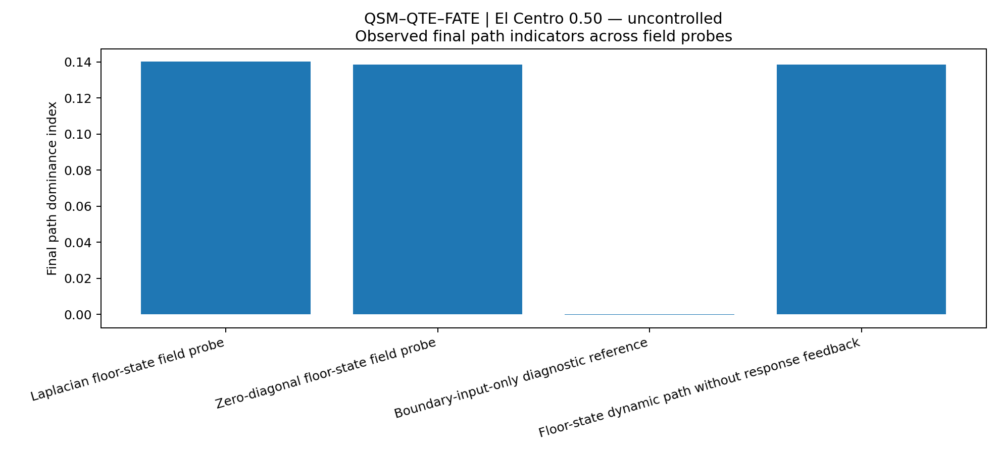

---

## 8. What the path history shows

The uncontrolled path history develops a large and sustained separation. The `1F–2F` weight rises above `1.4`, later reaches approximately `1.7`, and then partially returns. The `2F–3F` weight follows the complementary decline and recovery.

Although the final dominance is only about `0.140`, the mean dominance is approximately `0.435`, and the mean floor-state edge-current ratio is about `3.745`.

The main trend is therefore:

```text
early lower-interface concentration
→ sustained separation
→ late partial redistribution
```

The final value alone does not represent the strength or duration of the intermediate concentration.

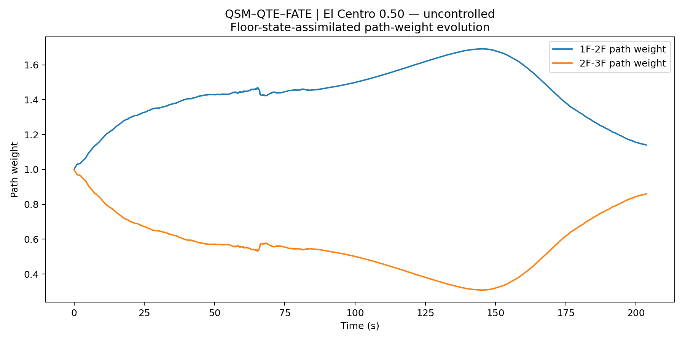

The boundary-input-only history continues to oscillate around equal weighting and does not form a comparable persistent internal path history.

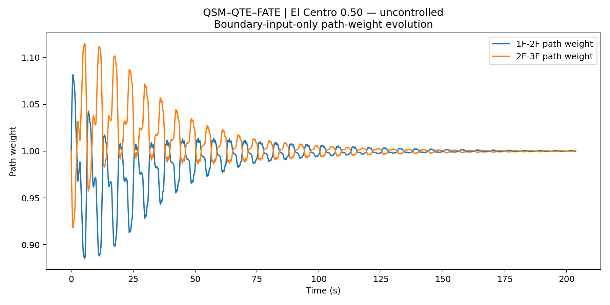

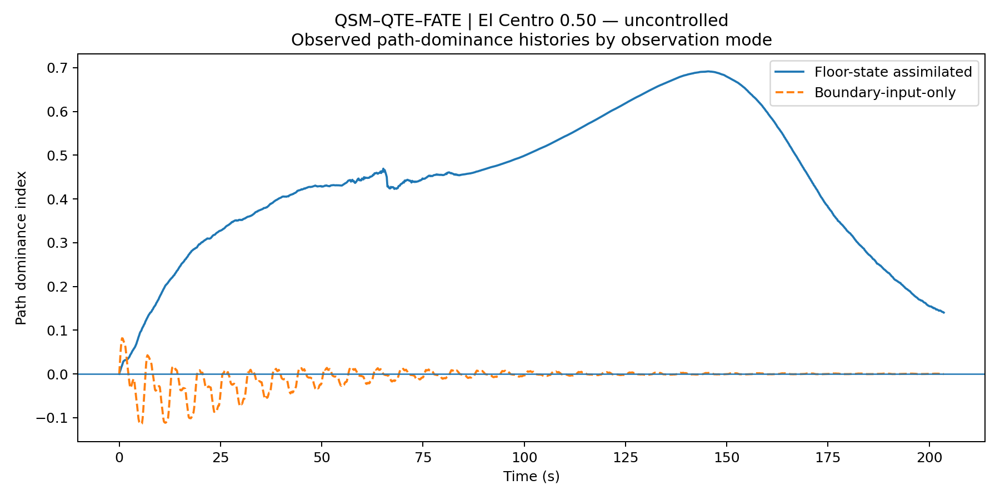

The path history is therefore retained as a QTE trend indicator even though the power-state signal provenance is heterogeneous.

---

## 9. Edge-current trend

The mean edge-current ratio across the three floor-state dynamic probes is:

\[
3.745
\]

The main Laplacian ratio is:

\[
3.763
\]

The boundary-only ratio is:

\[
0.983
\]

This difference indicates that the lower-interface tendency appears primarily after floor-state information enters the field representation.

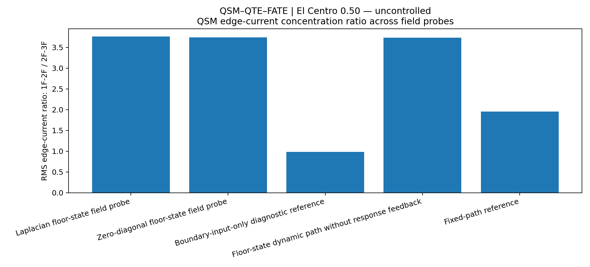

---

## 10. One-step `a*v` comparison

| Floor | Floor-state signed corr | Floor-state abs corr | Boundary signed corr | Boundary abs corr |
|---|---:|---:|---:|---:|
| 1F | 0.778 | 0.900 | -0.058 | 0.792 |
| 2F | 0.093 | 0.477 | 0.003 | 0.770 |
| 3F | 0.097 | 0.469 | -0.060 | 0.733 |

The floor-state mean absolute-envelope correlation is `0.615`. The boundary-only value is `0.765`.

The 1F result remains materially more coherent than the upper-floor results. The 2F and 3F field-state comparisons are weaker, consistent with the mixed relative/absolute displacement coordinates and the use of differentiated velocity.

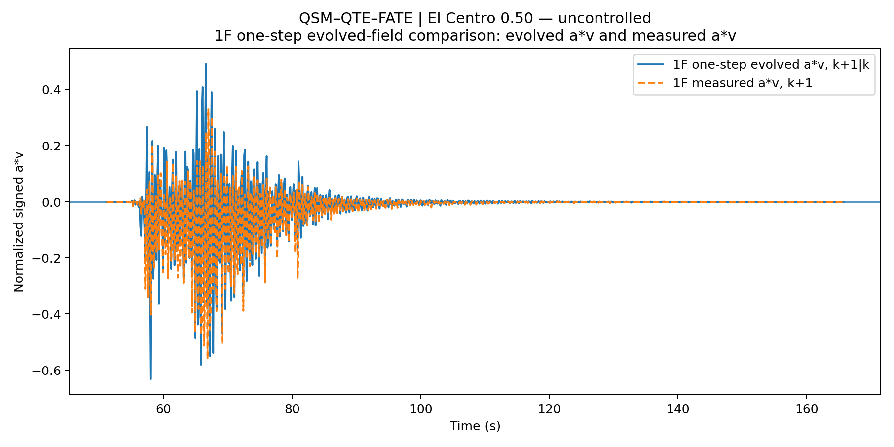

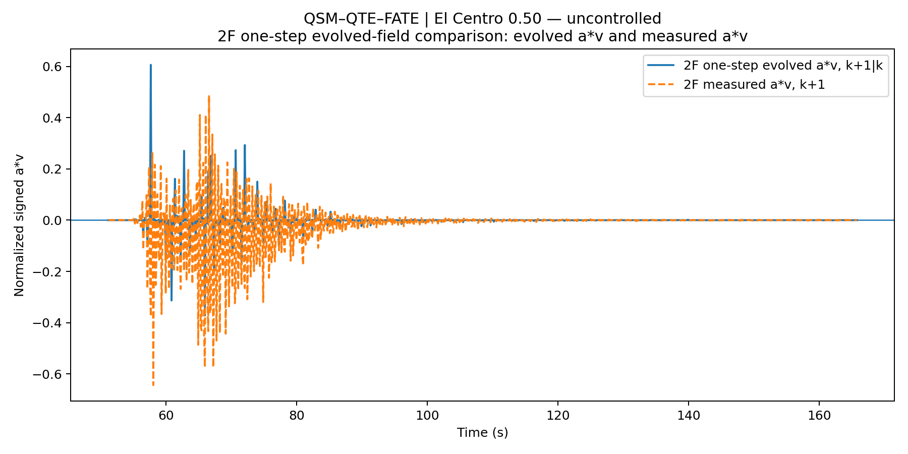

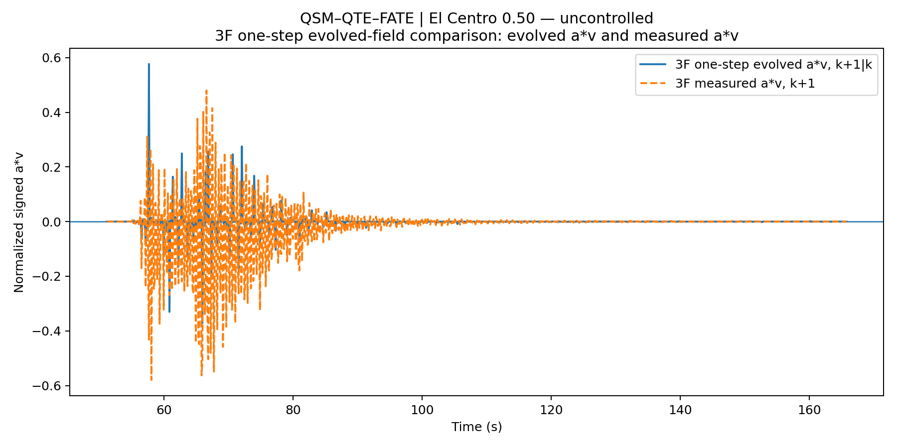

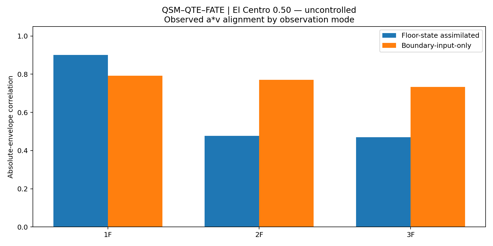

A higher boundary-only envelope correlation at some floors should not be interpreted as proof that internal floor states are physically unnecessary. In this record, it indicates that the common incoming-wave envelope is more coherent than the heterogeneous floor-state representation used to build `a*v`.

---

## 11. Figure 17: what the irregular work-loop proxy reveals

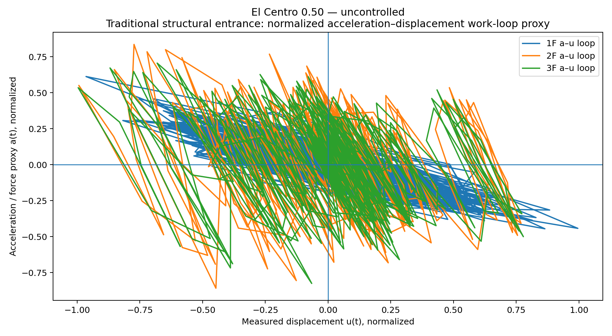

Figure 17 does not form a clean hysteresis loop. It forms a broad, multi-branch descending cloud with many crossings and long excursions. The 2F and 3F traces spread widely, while the 1F trace retains a somewhat denser central band.

The visible trend is not “random in every direction.” A broad restoring orientation remains, but it is overlaid by fragmented branches and floor-dependent scatter.

This pattern is consistent with a structural tendency being present inside a heterogeneous measurement representation.

The figure should not be cleaned into a smooth loop merely to resemble a conventional hysteresis diagram.

Its irregularity is itself an observation of the data-production chain.

A cautious reading separates three levels:

### 11.1 Persistent physical tendency

Across the cloud, acceleration generally trends opposite to displacement. The dominant orientation is a descending diagonal, consistent with a restoring-response tendency at the broadest level.

### 11.2 Loss of a single-valued loop geometry

At the same normalized displacement, acceleration occupies multiple branches. The record does not form a stable closed loop that can be assigned one unambiguous physical area.

This is consistent with:

- mixed displacement coordinates;
- numerically differentiated velocity;
- multiple frequency components;
- acquisition and conversion effects;
- possible experimental-operation traces.

### 11.3 Preserved human and measurement history

The method does not assume that everything outside a smooth structural loop is disposable noise.

Possible traces of sensor choice, coordinate definition, conversion, experimental handling, and human intervention remain visible as part of the observed system history.

This is useful for FATE `Aware_power`: awareness must include the reliability and origin of the field being observed, not only the field value itself.

---

## 12. Work-compatible proxy distribution

| Floor | Manifested ratio | Unmanifested margin | Maximum downstream response |
|---|---:|---:|---:|
| 1F | 0.008 | 0.992 | 2.357 |
| 2F | 0.560 | 0.440 | 3.573 |
| 3F | 0.952 | 0.048 | 3.659 |

The mean manifested work ratio is `0.507`.

Because the underlying displacement and derived velocity channels are heterogeneous, these values are retained as **case-internal diagnostic proxies**. They are not interpreted as absolute energy fractions.

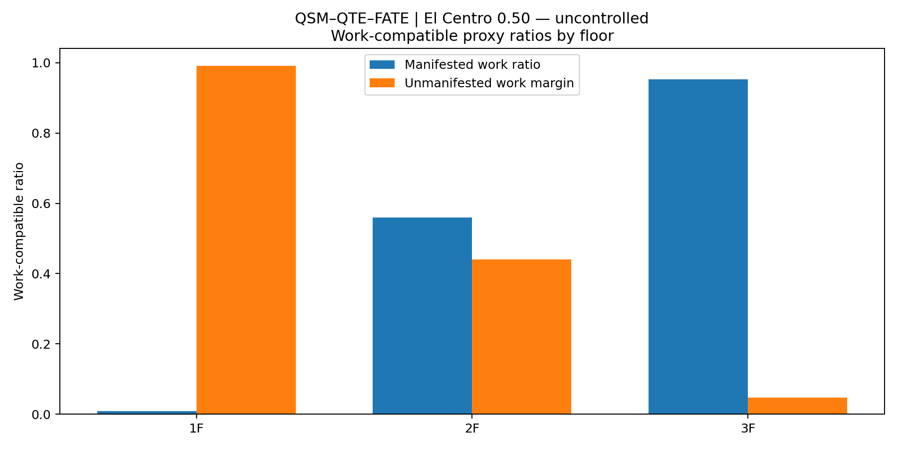

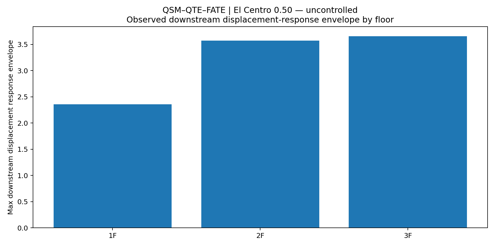

---

## 13. What this method can still see without removing the irregularities

The El Centro record demonstrates that the method can separate several trends even when the work-loop proxy is not clean:

1. **Input and internal field are distinguishable.**  
   Boundary-only path weights remain near equal, while floor-state probes develop a consistent lower-interface tendency.

2. **Path tendency can be more stable than power-state amplitude agreement.**  
   QTE produces 3/3 floor-state path support even when upper-floor QSM correlations are weak.

3. **The temporal history contains more information than the final bar.**  
   Concentration, transition, recovery, and redistribution remain visible in the path-weight history.

4. **Data semantics become observable.**  
   The method reveals that relative displacement, absolute displacement, derived velocity, and direct acceleration do not behave as one homogeneous state description.

5. **Noise is not automatically discarded.**  
   Irregular branches remain available for later attribution to structure, sensors, processing, operation, or human intervention.

6. **FATE awareness includes epistemic condition.**  
   A living control framework must know not only where a path appears, but also how trustworthy and semantically coherent the observed field is.

---

## 14. What this case currently indicates

### QSM

This case indicates that:

- one-step field alignment remains meaningful at 1F;
- upper-floor `a*v` coherence is sensitive to coordinate and provenance mismatch;
- a weak result can reveal the boundary conditions of the observation method.

### QTE

This case indicates that:

- the three floor-state dynamic probes retain a common `1F–2F` path tendency;
- boundary input alone does not produce the same internal path history;
- path history remains interpretable even when amplitude-level power-state coherence is degraded.

### FATE

This case extends `Aware_power` into:

```text
field awareness
+
path awareness
+
data-semantic awareness
```

It does not yet provide `Alert_control` or `Alive_evolve`.

---

## 15. Relationship to the direct-channel cases

Kobe and Morgan Hill use direct analytical `u`, `v`, and `a` channels and therefore provide stronger primary QSM power-state evidence.

El Centro uses mixed displacement coordinates and differentiated velocity. It should not be forced into the same evidential category.

Its value is different:

```text
Kobe and Morgan Hill:
power-state replication evidence

El Centro:
data-semantic boundary and trace-preservation evidence
```

Compared with the passive-off El Centro record, the uncontrolled case carries a stronger average lower-interface concentration and a higher edge-current ratio, even though both end with similar modest positive final dominance.

---

## 16. Reproducibility files

The case folder contains the 20 formal V11 outputs:

```text
01_qsm_qte_fate_mode_comparison.csv
02_qsm_qte_fate_manifestation_summary.csv
03_qsm_qte_fate_floor_target_summary.csv
04_qsm_qte_fate_core_history.csv
05_CASE_REPORT.md
06_release_report.txt
07_energy_path_manifestation_consensus.png
08_floor_assimilated_path_evolution.png
09_boundary_input_only_path_evolution.png
10_edge_current_concentration.png
11_1f_evolved_av_next_vs_measured_av.png
12_2f_evolved_av_next_vs_measured_av.png
13_3f_evolved_av_next_vs_measured_av.png
14_boundary_vs_assimilated_av_alignment.png
15_boundary_vs_assimilated_path_dominance.png
16_work_capacity_summary_by_floor.png
17_force_displacement_work_loop_proxy.png
18_response_manifestation_by_floor.png
19_release_run_log.txt
20_release_file_manifest.json
```

---

## 17. Data citation

Zhang, J., Wu, B., and Dyke, S.  
*RTHS and Shake Table Comparison for Smart Structural Systems (NEES-2011-1076)* [Data set].  
NEES / DesignSafe Data Depot.  
DOI: `10.7277/TPS7-V877`

---

## 18. Case record

This case is retained because a scientific method should not only display the records that look clean.

It should also preserve the records that reveal:

```text
where the field remains visible
where the representation loses coherence
and where the history of measurement and human effort enters the observation
```

The irregularity is not promoted into a physical conclusion.

It is kept observable.
