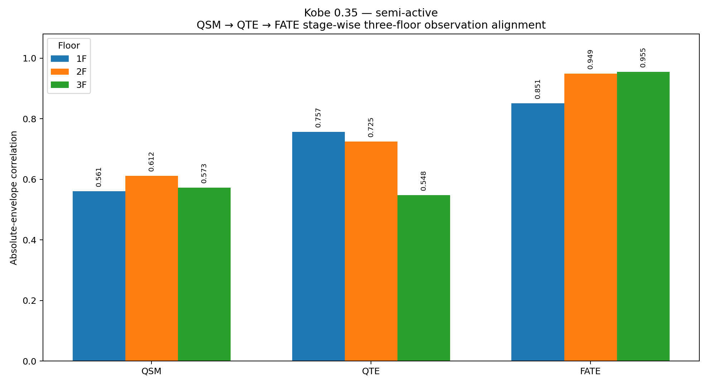
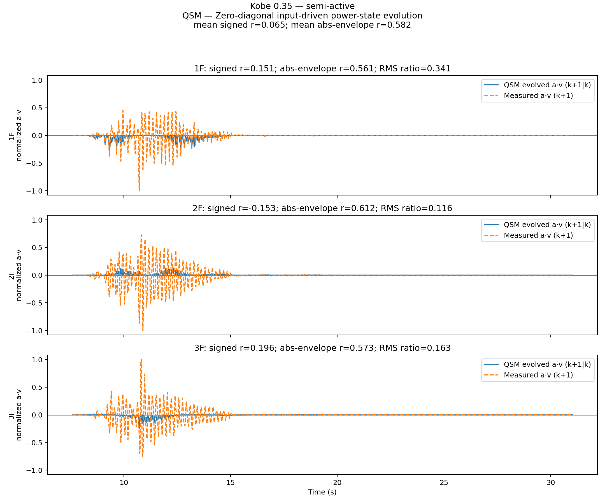
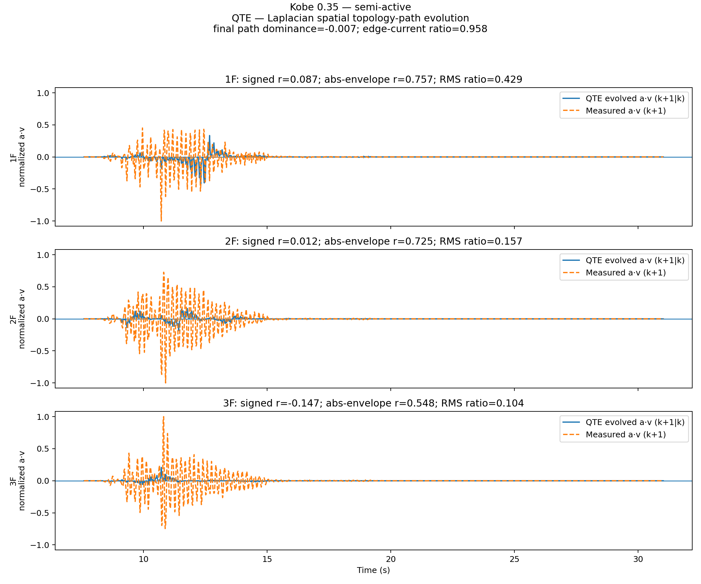
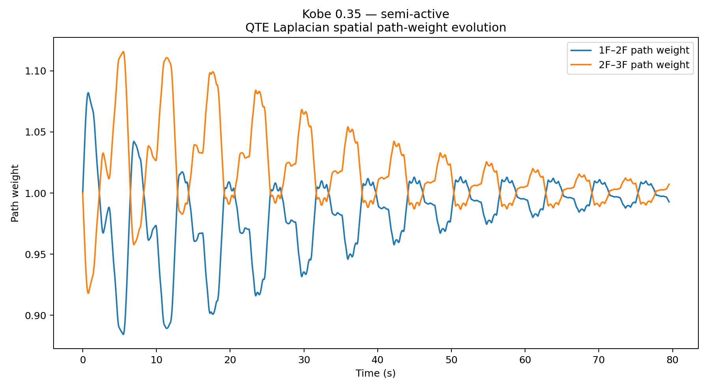
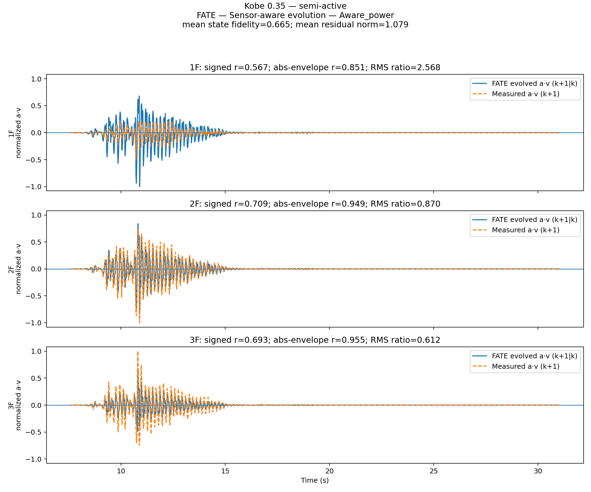
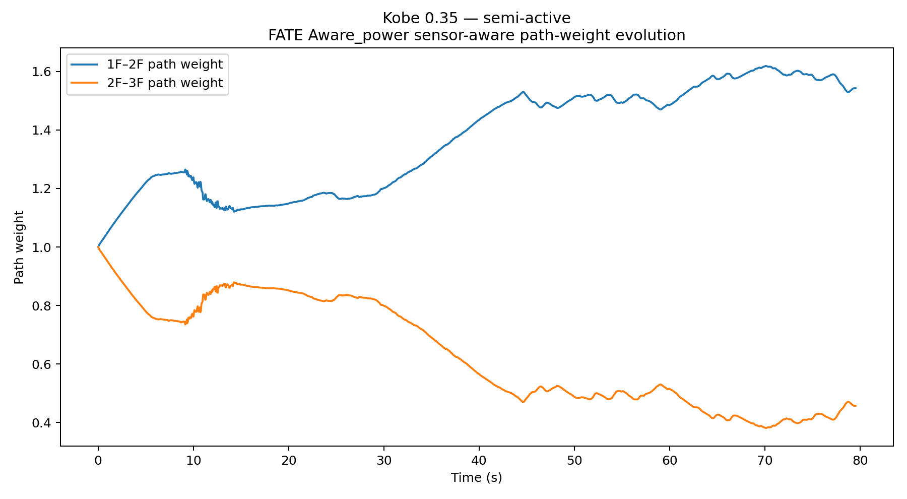
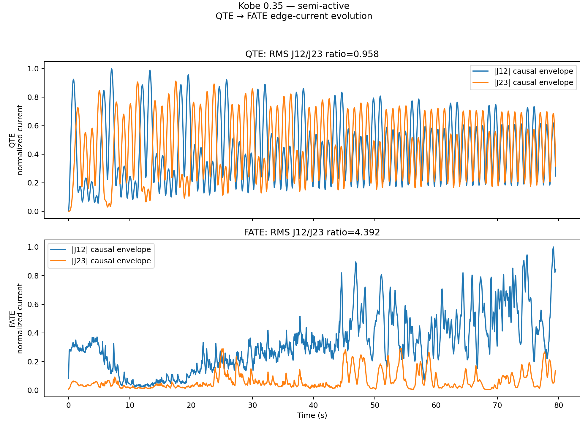
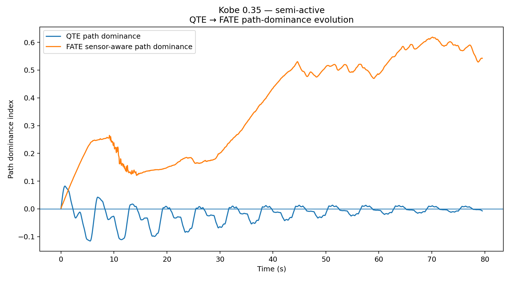
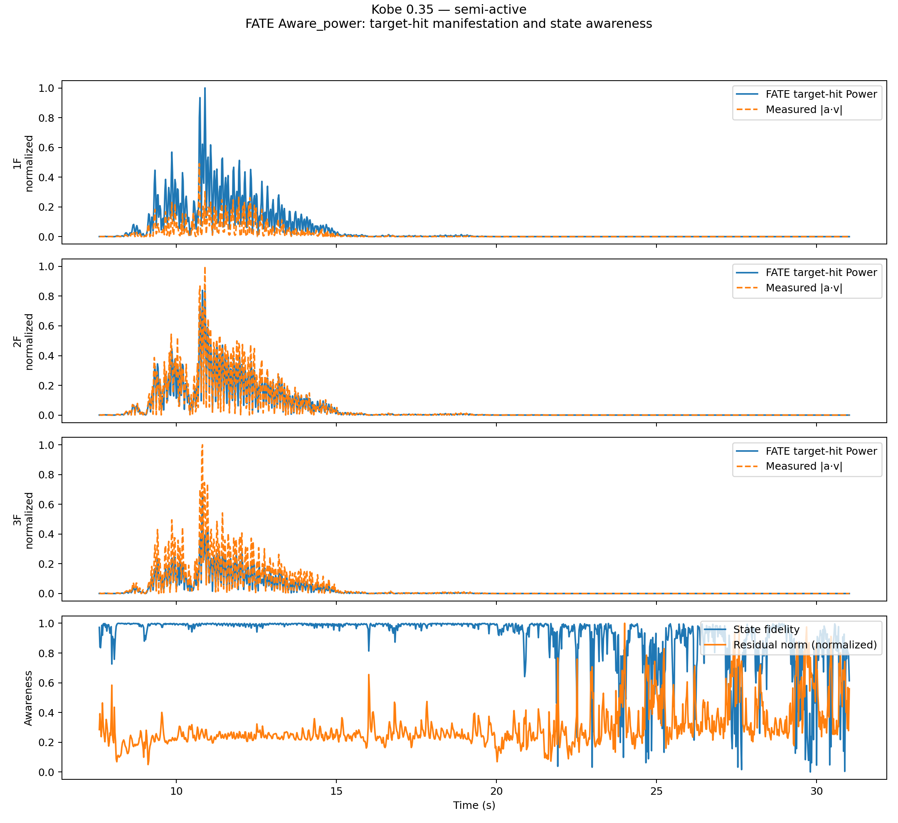
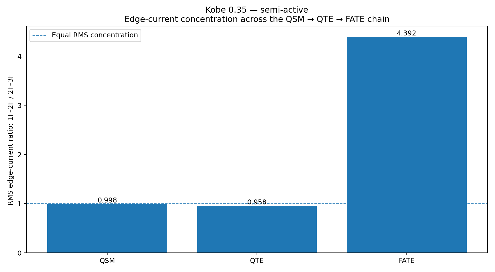

# Kobe 0.35 — semi-active
## QSM–QTE–FATE Three-Stage Observation Record — Formal Release V12.2

> **Recommended location**  
> `cases/kobe_035_semi_active/README.md`
>
> This README is the narrative interpretation layer for the V12.2 outputs in this folder. The CSV, JSON, log, and figure files remain the canonical machine-readable evidence.

---

## 1. Role of this case

This case is retained as a **primary direct-channel case and the strongest final sensor-aware floor-path concentration in the release**.

Its current evidence role is: **primary evidence for the complete V12.2 QSM → QTE → FATE observation chain using direct analytical displacement, velocity, and acceleration channels**.

The V12.2 method is presented as one sequential chain:

```text
QSM — zero-diagonal input-driven Power-state evolution
  ↓
QTE — Laplacian spatial topology-path evolution
  ↓
FATE — sensor-aware evolution at the Aware_power layer
```

QSM, QTE, and FATE are successive observation layers. The stage-wise correlations are therefore not a leaderboard between three competing models. Each later stage receives a richer structural description.



---

## 2. What V12.2 changes from V11

V12.2 removes the former five-probe presentation and retains only the intended methodological sequence:

| Stage | Operator and state update | Current role |
|---|---|---|
| QSM | `H = -W`; zero diagonal; fixed relational channels; boundary input | Evolves the input-driven Power state |
| QTE | `H = L(W)`; dynamic path; boundary input | Adds spatial topology and path evolution |
| FATE | QTE evolution + floor-state assimilation + response feedback | Forms `Aware_power` from continuously updated sensor content |

The restored figures `10`–`18` are independent physical observation dimensions—edge current, path history, target hit, work proxies, structural work-loop proxy, and response manifestation. They are not additional methods or sensitivity groups.

> **Current QTE boundary**  
> This NEES execution uses the Laplacian topology term `H = L(W)`. It does not claim that a hard as-built structural-parameter field diagonal—mass, stiffness, damping, member capacity, joints, and device states—has already been inserted.

---

## 3. Experimental source and execution record

| Item | Value |
|---|---|
| Project | NEES-2011-1076 |
| Project title | RTHS and Shake Table Comparison for Smart Structural Systems |
| Earthquake input | Kobe |
| Input scale | 0.35 |
| Control state | semi-active |
| Acquisition context | averaged converted record |
| Source file | `kobe_035_semi_active_avg_converted.csv` |
| Source rows detected | 81,431 |
| Rows loaded after stride | 16,287 |
| Read stride | 5 |
| Columns loaded | 10 |
| Event window used in waveform figures | 7.597168–31.025879 s |
| Full processed history | 0.000000–79.521484 s, 3,000 exported rows |
| Dataset DOI | 10.7277/TPS7-V877 |

### Execution timing

| Execution item | Recorded time |
|---|---|
| Data preparation | 0.226 s |
| QSM worker | 0.486 s |
| QTE worker | 0.723 s |
| FATE worker | 0.852 s |
| Artifact generation | 4.233 s |
| Parallel method workers configured | 8 |

Worker elapsed times are computational records. Because the method workers may execute concurrently, their sum is not the case wall-clock time.

---

## 4. Signal provenance and evidential strength

| Floor | Displacement `u` | Velocity `v` | Acceleration `a` |
|---|---|---|---|
| 1F | `direct:First Floor Displacement - Analytical` | `direct:First Floor Velocity Sensor - Analytical` | `direct:First Floor Acceleration - Analytical` |
| 2F | `direct:Second Floor Displacement - Analytical` | `direct:Second Floor Velocity Sensor - Analytical` | `direct:Second Floor Acceleration - Analytical` |
| 3F | `direct:Third Floor Displacement - Analytical` | `direct:Third Floor Velocity Sensor - Analytical` | `direct:Third Floor Acceleration - Analytical` |

All three floors use direct analytical displacement, velocity, and acceleration channels. This gives a synchronized basis for the phase-sensitive quantity:

```text
p_i(t) = a_i(t) · v_i(t)
```

Because floor mass is not supplied in the NEES record, `a·v` is reported as a mass-normalized work-compatible Power-state quantity, not as absolute power in watts.

---

## 5. Canonical three-stage result summary

| Stage | Mean signed corr | Mean abs-envelope corr | Residual RMSE | Final `D` | Mean `D` | `J12/J23` | Mean manifested ratio | Max-response floor |
|---|---|---|---|---|---|---|---|---|
| QSM | 0.065 | 0.582 | 0.071163 | 0.000 | 0.000 | 0.998 | 0.677 | 3F |
| QTE | -0.016 | 0.677 | 0.072748 | -0.007 | -0.017 | 0.958 | 0.549 | 3F |
| FATE | 0.656 | 0.918 | 0.064996 | 0.543 | 0.368 | 4.392 | 0.611 | 3F |

Definitions:

- **Signed correlation** retains Power direction and phase tendency.
- **Absolute-envelope correlation** compares the strength envelope of `|a·v|`.
- **Path dominance** is `D = (w12 - w23) / (w12 + w23)`; positive values indicate greater manifestation on `1F–2F`.
- **Edge-current ratio** is the RMS ratio `J12/J23`; values above `1` indicate greater current concentration on `1F–2F`.
- **Manifested-work ratio** is a case-internal normalized proxy. It is not an absolute cross-case physical energy percentage.

### Stage transition

- QSM → QTE changes mean absolute-envelope alignment from **0.582** to **0.677** (`Δ = +0.095`).
- QTE → FATE changes mean absolute-envelope alignment from **0.677** to **0.918** (`Δ = +0.242`).
- Signed alignment progresses **0.065 → -0.016 → 0.656**.

The transition must be read with the signal provenance above. FATE introduces measured floor states; improvement in the direct-channel cases and degradation at the heterogeneous El Centro upper floors describe different data conditions rather than one universal expected direction.

---

## 6. Floor-by-floor comparison in one fixed format

| Stage | Floor | Signed corr | Abs-envelope corr | Residual RMSE | RMS amplitude ratio | Peak offset (s) | Manifested ratio | Response envelope |
|---|---|---|---|---|---|---|---|---|
| QSM | 1F | 0.151 | 0.561 | 0.028035 | 0.343 | -1.387 | 0.270 | 3.649907 |
| QSM | 2F | -0.153 | 0.612 | 0.074537 | 0.115 | 1.421 | 0.952 | 3.802144 |
| QSM | 3F | 0.196 | 0.573 | 0.110916 | 0.160 | -0.083008 | 0.808 | 4.173876 |
| QTE | 1F | 0.087 | 0.757 | 0.029341 | 0.422 | 1.592 | 0.195 | 3.649907 |
| QTE | 2F | 0.012 | 0.725 | 0.073517 | 0.159 | 0.532227 | 0.500 | 3.802144 |
| QTE | 3F | -0.147 | 0.548 | 0.115384 | 0.101 | -0.083008 | 0.952 | 4.173876 |
| FATE | 1F | 0.567 | 0.851 | 0.060318 | 2.612 | 0.175781 | 0.208 | 3.649907 |
| FATE | 2F | 0.709 | 0.949 | 0.052671 | 0.871 | -0.073242 | 0.672 | 3.802144 |
| FATE | 3F | 0.693 | 0.955 | 0.082000 | 0.606 | 0.004883 | 0.952 | 4.173876 |

The RMS amplitude ratio is recomputed from `03_qsm_qte_fate_full_history.csv` over the declared event window using `RMS(evolved a·v) / RMS(measured a·v)`. It complements correlation: two signals may have similar shape while retaining different amplitudes.

Residual RMSE carries the numerical scale of each source record. It is useful within a case and floor; it should not be compared across source datasets without normalization.

---

## 7. QSM — zero-diagonal input-driven Power-state evolution

QSM uses:

```text
H_QSM = -W
```

The diagonal is cleared. The fixed relational channels transmit the boundary input, and the current V12.2 QSM stage does not assimilate the three measured floor states.

For this case, QSM gives mean signed/absolute-envelope alignment of **0.065/0.582**. Its fixed path remains `w12 = w23 = 1`, so `D = 0`; the edge-current ratio is **0.998**, close to an equal-current state.

QSM therefore provides the baseline answer to:

> How much of the next-step Power-state history can be evolved from the incoming excitation through the zero-diagonal relational operator before spatial path adaptation and sensor-aware correction are added?



---

## 8. QTE — Laplacian spatial topology-path evolution

QTE uses the present topology Hamiltonian:

```text
H_QTE = L(W)
```

The Laplacian restores the topology diagonal and allows the path weights to evolve. This stage still uses the boundary input without continuous floor-state assimilation.

For this case, QTE mean signed/absolute-envelope alignment is **-0.016/0.677**. The final path dominance is **-0.007**, the full-history mean is **-0.017**, and the edge-current ratio is **0.958**.

The full QTE history ranges from `D = -0.116` at `5.513 s` to `D = 0.082` at `0.742 s`. The final state remains near equal, showing that the boundary-driven Laplacian topology alone does not establish the sensor-aware internal path seen in FATE.





Current interpretation:

- QTE improves or reorganizes the input-driven envelope without yet receiving the complete as-built parameter field.
- Near-equal final weights are a result, not a failed plot. They mark the limit of a topology-only, boundary-driven execution.
- The later FATE path should not be retroactively attributed to QTE alone.

---

## 9. FATE — sensor-aware evolution at `Aware_power`

FATE retains the Laplacian path evolution and adds continuous floor-state assimilation plus response feedback:

```text
sensor state at t
→ update Ψ(t)
→ evolve the topology path
→ observe target hit, edge current, work proxy, and response
→ assimilate the next measured state
```

FATE produces mean signed/absolute-envelope alignment of **0.656/0.918**. Its final path state is `w12 = 1.543`, `w23 = 0.457`, with `D = 0.543` and edge-current ratio **4.392**.

FATE produces substantial three-floor one-step alignment, especially in absolute envelope. The common-scale waveforms also show that alignment and amplitude agreement are different questions: 1F is over-amplified, 2F is close in RMS scale, and 3F is under-amplified.

QTE alone remains near equal, while FATE progressively separates the two inter-floor paths and finishes with a strong 1F–2F indication. The path does not appear as a static label; it accumulates, partially relaxes, and strengthens again across the full record.

### Full-history FATE path audit

| Audit quantity | Value |
|---|---|
| Final `D` | 0.543 |
| Mean `D` | 0.368 |
| Maximum `D` | 0.619 at 70.132 s |
| Minimum `D` | 0.000 at 0.000 s |
| Fraction of history with `D > 0` | 100.0% |
| Fraction of history with `D > 0.1` | 97.4% |
| Fraction of history with `D > 0.2` | 70.3% |











The implemented FATE scope is `Aware_power`. `Alert_control` and `Alive_evolve` remain subsequent stages; no closed-loop structural control result is claimed here.

---

## 10. Edge current, work manifestation, and downstream response

### 10.1 Edge-current concentration across the three stages

| Stage | RMS `J12` | RMS `J23` | `J12/J23` |
|---|---|---|---|
| QSM | 0.559 | 0.560 | 0.998 |
| QTE | 0.471 | 0.491 | 0.958 |
| FATE | 0.530 | 0.121 | 4.392 |



### 10.2 FATE work-compatible manifestation by floor

| Floor | Hit-work capacity | Displacement-side work | Manifested ratio | Unmanifested margin | Measured abs work | Max response | Peak time (s) |
|---|---|---|---|---|---|---|---|
| 1F | 2.032803 | 0.422656 | 0.208 | 0.792 | 0.422656 | 3.649907 | 10.932617 |
| 2F | 1.829316 | 1.229572 | 0.672 | 0.328 | 1.229572 | 3.802144 | 10.776367 |
| 3F | 1.962548 | 1.869094 | 0.952 | 0.048 | 1.869094 | 4.173876 | 10.781250 |


These work-compatible ratios are normalized within the case. They describe how the current observation chain partitions manifested and unmanifested proxy capacity; they are not physical energy percentages that can be compared directly across earthquakes.

---

## 11. Traditional structural entrance: acceleration–displacement work-loop proxy

The acceleration–displacement plot forms a coherent descending family across all three floors. It gives the clearest bridge in this release from the Power-state formulation back to a traditional restoring-response view.

The event-window acceleration–displacement correlations recomputed from the full-history CSV are:

| Floor | Corr(`u`,`a`) over figure event window |
|---|---|
| 1F | -0.867 |
| 2F | -0.976 |
| 3F | -0.979 |

A negative correlation is consistent with a broad restoring orientation. It does not turn the normalized proxy plot into a directly calibrated force–displacement hysteresis loop; floor mass, restoring force calibration, and coordinate consistency remain outside the current record.


---

## 12. What this case currently supports

- QSM provides a clean zero-diagonal input-driven baseline.
- QTE adds spatial topology organization but remains near equal without the as-built field diagonal or sensor-state assimilation.
- FATE reproduces strong three-floor one-step Power-state alignment with direct `u`, `v`, and `a` channels.
- Sensor-aware path and edge-current histories identify a case-specific 1F–2F concentration history.
- The traditional acceleration–displacement entrance is coherent enough to connect the Power-state observation back to a familiar structural restoring tendency.

## 13. What this case does not establish

- It does not establish long-horizon free prediction; the comparison is one-step and measurement-updated.
- It does not locate a member-level failure plane; the topology contains only three floor nodes and two inter-floor paths.
- It does not insert a complete as-built mass–stiffness–damping–capacity field into the QTE diagonal.
- It does not prove that path dominance equals physical damage.
- It does not implement `Alert_control` or `Alive_evolve`.
- It does not convert the work-compatible proxies into absolute joules or watts.

---

## 14. Figure and evidence guide

| File | Primary question |
|---|---|
| `06_qsm_qte_fate_stage_bar.png` | Three-stage, three-floor signed and absolute-envelope alignment |
| `07_qsm_three_floor_waveforms.png` | QSM zero-diagonal input-driven histories |
| `08_qte_three_floor_waveforms.png` | QTE Laplacian topology histories |
| `09_fate_three_floor_waveforms.png` | FATE sensor-aware histories |
| `10_qsm_qte_fate_edge_current_ratio.png` | Edge-current concentration through QSM → QTE → FATE |
| `11_qte_path_weight_evolution.png` | QTE path-weight history |
| `12_fate_sensor_aware_path_evolution.png` | FATE sensor-aware path history |
| `13_qte_fate_edge_current_evolution.png` | QTE and FATE edge-current time histories |
| `14_qte_fate_path_dominance_evolution.png` | QTE and FATE dominance histories |
| `15_fate_target_hit_state_awareness.png` | Target hit, measured `|a·v|`, fidelity, and residual |
| `16_fate_work_proxy_ratios_by_floor.png` | Manifested and unmanifested work-compatible ratios |
| `17_force_displacement_work_loop_proxy.png` | Traditional acceleration/force–displacement entrance |
| `18_response_manifestation_by_floor.png` | Measured downstream response by floor |

---

## 15. Reproducibility files

| File | Role |
|---|---|
| `01_qsm_qte_fate_method_summary.csv` | Canonical method-level values in QSM → QTE → FATE order |
| `02_qsm_qte_fate_floor_summary.csv` | Canonical method × floor comparison |
| `03_qsm_qte_fate_full_history.csv` | 149-column complete time-history evidence |
| `04_CASE_REPORT.md` | Machine-generated compact case report |
| `05_release_report.txt` | Plain-text summary |
| `19_release_run_log.txt` | Execution and timing record |
| `20_release_file_manifest.json` | Source metadata, provenance, method definitions, and file inventory |

The canonical numerical claims in this README are traceable to the two summary CSVs, the full-history CSV, and the release manifest.

---

## 16. Lifecycle interpretation

The present NEES execution is an operational retrospective observation using archived sensing data. The intended lifecycle sequence is:

```text
Design
  BIM/IFC topology → zero-diagonal relational channels and topology alternatives

Construction / as-built
  verified mass, stiffness, damping, joints, devices, and boundaries
  → field-driven Hamiltonian

Operation
  Digital Twin sensing
  → FATE Aware_power
  → future Alert_control
  → future Alive_evolve
```

V12.2 validates the executable observation chain only at the level represented by the available NEES floor-domain data.

---

## 17. Data citation

Zhang, J., Wu, B., & Dyke, S. *RTHS and Shake Table Comparison for Smart Structural Systems (NEES-2011-1076)* [Data set]. DOI: `10.7277/TPS7-V877`.

## 18. Release statement

Kobe 0.35 — semi-active is retained as part of the four-case V12.2 evidence matrix. Its strongest contribution is not a single score; it is the way the same QSM → QTE → FATE chain reveals the relation among input-driven state evolution, spatial path formation, sensor-aware manifestation, work-compatible proxies, and measured structural response.