# Kobe 0.35 Semi-Active  
## Integrated QSM–QTE–FATE Observation Record — Formal Release V11

> **Repository position**  
> Recommended repository name:  
> `QSM-QTE-FATE-Integrated-Seismic-Field-Observation`
>
> Recommended location of this document:  
> `cases/kobe_035_semi_active/README.md`

---

## 1. Why this case matters

This Kobe 0.35 semi-active case provides an initial integrated computational record in which **Quantum Structural Mechanics (QSM)**, **Quantum Topology Express (QTE)**, and the first operational layer of **Fractal Alive Topology Evolution (FATE)** are connected in one continuous observation chain.

The significance of this result does not come from claiming that all three theories are now completely validated. The significance is that they are no longer isolated conceptual layers:

```text
measured structural state
→ QSM power-state evolution
→ QTE topology-path manifestation
→ FATE Aware_power observation
```

For the first time, the same experimental record is used to observe how a seismic input enters a structure, how the internal power-state field evolves, how a dominant topology path becomes manifested, and how that path differs from the final displacement response.

This document records the present integrated result and its current evidential limits.

---

## 2. Scientific status of this validation

This case provides three different levels of preliminary computational evidence.

### 2.1 QSM: examined at the one-step field-evolution level

QSM is tested by using measurements available through time step `k` to evolve a structure-coupled power-state field to `k+1|k`, and then comparing the evolved `a*v` state with the measured `a*v` at `k+1`.

The process is:

```text
measurements through k
→ construct the current field
→ evolve the field to k+1|k
→ read the evolved a*v state
→ compare with measured a*v at k+1
→ assimilate the new measurement
→ continue to the next step
```

This is an **evolutionary-field check**, not a long-horizon forecast and not a control-style prediction task.

### 2.2 QTE: examined at the floor-domain topology level

QTE is examined only at a partial floor-domain resolution in this case.

The available experiment provides a three-floor measurement structure, but it does not provide a complete BIM/IFC or as-built structural graph containing every beam, column, joint, stiffness, mass, damper connection, and boundary condition required for a full component-level topology field.

The topology used here is therefore a **floor-domain topology mapped from the experiment and its measurement channels**:

```text
1F node ↔ 2F node ↔ 3F node
```

with two observable inter-floor paths:

```text
1F–2F
2F–3F
```

There is no direct `1F–3F` edge in this floor-level model.

Accordingly, the present result provides initial evidence of **floor-scale topology-path manifestation**, but it does not yet establish component-scale weak-plane localization or a complete BIM-enabled structural topology field.

### 2.3 FATE: the Aware_power layer is represented

This case reaches the first layer of FATE:

```text
Aware_power
```

The system observes:

- the incoming seismic state;
- the structure-coupled power-state field;
- the manifested inter-floor topology path;
- the work-compatible manifestation by floor;
- the downstream displacement response.

It does not yet complete:

```text
Alert_control
→ identify and issue a topology-changing control action

Alive_evolve
→ rewrite the field/operator and verify a safer evolved state
```

The present contribution is that the QSM–QTE–FATE chain is represented in one continuous computational workflow.

---

## 3. Experimental source

| Item | Value |
|---|---|
| Project | NEES-2011-1076 |
| Project title | RTHS and Shake Table Comparison for Smart Structural Systems |
| Earthquake record | Kobe |
| Input scale | 0.35 |
| Control condition | Semi-active |
| Source file | `kobe_035_semi_active_avg_converted.csv` |
| Acquisition context | Averaged converted record |
| Source rows detected | 81,431 |
| Rows loaded after stride | 16,287 |
| Read stride | 5 |
| Selected response columns | 10 |
| Figure event window | 7.597–31.026 s |
| Dataset DOI | 10.7277/TPS7-V877 |

The event window was selected from cumulative acceleration-state activity. The full evolution history remains available in `04_qsm_qte_fate_core_history.csv`.

---


## 4. V11 execution record

The formal V11 four-case release was executed on a workstation with 24 logical processors, using two CSV preparation workers and eight parallel probe workers.

| Execution item | Recorded time |
|---|---:|
| Phase 1 — data reading and case-field preparation | 3.2 s |
| Phase 2 — 20 parallel QSM–QTE–FATE field probes | 19.9 s |
| Phase 3 — case and cross-case release generation | 13.6 s |
| V11 internal wall-clock time | 36.8 s |
| End-to-end PowerShell time | 39.17 s |

For the Kobe case, the five probe-worker elapsed times recorded during the formal run were:

| Kobe probe | Worker elapsed time |
|---|---:|
| Laplacian floor-state field probe | 2.7 s |
| Zero-diagonal floor-state field probe | 2.6 s |
| Boundary-input-only diagnostic reference | 2.2 s |
| Fixed-path reference | 1.8 s |
| Floor-state dynamic path without response feedback | 2.7 s |

Because these probes ran concurrently, their sum is a computational-load indicator and is not the wall-clock time of the Kobe case.

The machine-readable release timing is retained in:

```text
../../release_logs/00_RELEASE_RUN_LOG.txt
19_release_run_log.txt
20_release_file_manifest.json
```

---

## 5. Signal provenance


This case is suitable for the primary power-state comparison because displacement, velocity, and acceleration are all taken from direct analytical channels for every floor.

| Floor | Displacement `u` | Velocity `v` | Acceleration `a` |
|---|---|---|---|
| 1F | `First Floor Displacement - Analytical` | `First Floor Velocity Sensor - Analytical` | `First Floor Acceleration - Analytical` |
| 2F | `Second Floor Displacement - Analytical` | `Second Floor Velocity Sensor - Analytical` | `Second Floor Acceleration - Analytical` |
| 3F | `Third Floor Displacement - Analytical` | `Third Floor Velocity Sensor - Analytical` | `Third Floor Acceleration - Analytical` |

This matters because the work-compatible power-state proxy


$$
p_i(t)=a_i(t)v_i(t)
$$


is phase-sensitive. Direct and synchronized `a` and `v` channels provide a more coherent basis than mixing direct acceleration with velocity reconstructed from a different displacement coordinate system.

The present study treats `a*v` as a **work-compatible power-state proxy**. Because floor mass is not explicitly inserted here, it should not be interpreted as absolute physical power in watts.

---

## 6. Floor-domain topology used in this case

The first integrated model contains three floor nodes and two inter-floor paths:

```text
[1F] —— w12 —— [2F] —— w23 —— [3F]
```

The path weights begin from an unbiased state:


$$
w_{12}=1,\qquad w_{23}=1
$$


and are normalized so that:


$$
w_{12}+w_{23}=2
$$


The path-dominance index is:


$$
D=\frac{w_{12}-w_{23}}{w_{12}+w_{23}}
$$


Its interpretation is:

- `D > 0`: the `1F–2F` path is more manifested;
- `D < 0`: the `2F–3F` path is more manifested;
- `D ≈ 0`: no stable path dominance is established.

This floor graph is an experimental observation scaffold. A later BIM-enabled QTE implementation must replace or expand it with a detailed structural graph.

---

## 7. Five field probes and their roles

The five probes are not five physical paths. They are five computational observation settings applied to the same two-path floor topology.

| Probe | Operator / condition | Purpose |
|---|---|---|
| Laplacian floor-state field probe | Laplacian, floor-state assimilation, dynamic path, response feedback | Main integrated QSM–QTE observation |
| Zero-diagonal floor-state field probe | Strict zero-diagonal operator, floor-state assimilation | Tests whether the path also appears in the pure relational-transmission view inherited from early QSM |
| Boundary-input-only diagnostic reference | Laplacian, boundary source only | Tests how much can be observed from incoming-wave information without internal floor-state assimilation |
| Floor-state dynamic path without response feedback | Laplacian, floor-state assimilation, no response feedback | Tests whether the path is being created mainly by the downstream response-feedback term |
| Fixed-path reference | Laplacian, fixed `w12=w23=1` | Separates QSM field alignment from QTE path adaptation |

No case-specific parameter search or target-driven optimization was performed for Kobe. The probes change the **observation structure**, not the parameters in order to force a preferred result.

---

## 8. QSM–QTE–FATE floor-domain probe comparison

The three dynamic probes that assimilate floor states produce the same higher-weight final path indication:

```text
1F–2F lower interface
```

| Probe | Final `w12` | Final `w23` | Final dominance `D` | Edge-current ratio `1F–2F / 2F–3F` |
|---|---:|---:|---:|---:|
| Laplacian floor-state | 1.543 | 0.457 | 0.543 | 4.392 |
| Zero-diagonal floor-state | 1.514 | 0.486 | 0.514 | 4.907 |
| Dynamic path without response feedback | 1.543 | 0.457 | 0.543 | 4.392 |
| Boundary-input-only reference | 0.993 | 1.007 | -0.007 | 0.958 |
| Fixed-path reference | 1.000 | 1.000 | 0.000 | 1.440 |

The principal Laplacian result reaches:


$$
D=0.543
$$


with an edge-current concentration ratio of:


$$
J_{12}/J_{23}=4.392
$$


The mean edge-current ratio across the three supporting floor-state dynamic probes is `4.564`.

The boundary-input-only reference ends at `D = -0.007`. Although the automatically generated release table labels any negative value as the upper interface, the magnitude here is only `0.007`. It is therefore interpreted in this article as:

```text
no stable path dominance
```

rather than as meaningful evidence for a `2F–3F` path.

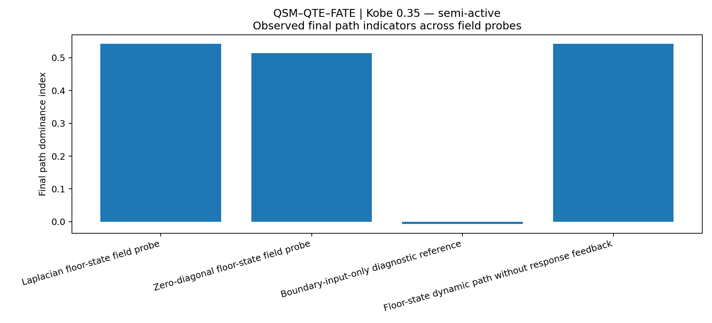

---

## 9. QTE floor-domain path-weight evolution

The floor-state-assimilated evolution begins from equal path weights. The two paths then separate progressively.

The principal Laplacian probe ends at:

```text
w12 = 1.543
w23 = 0.457
```

The `1F–2F` path becomes increasingly manifested, while the `2F–3F` path loses relative weight. The path indication is obtained from the evolving field history rather than assigned as an initial label.

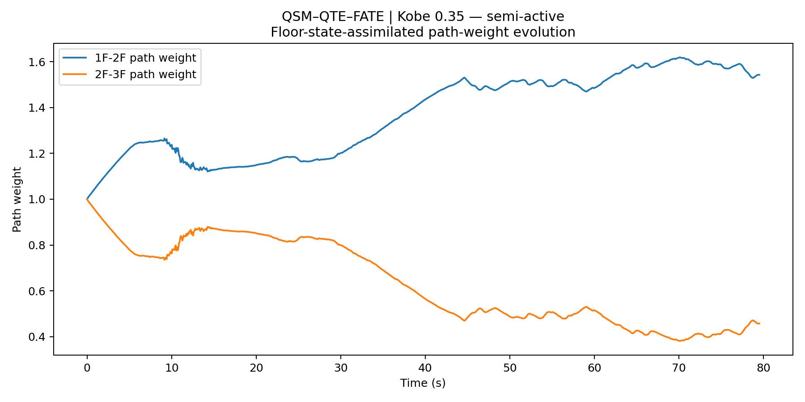

The boundary-input-only evolution behaves differently. Its two path weights oscillate around equality and decay toward an almost balanced state. This means that the incoming seismic wave can excite the topology, but the incoming-wave record alone does not contain enough information to establish the internal structure-coupled path.

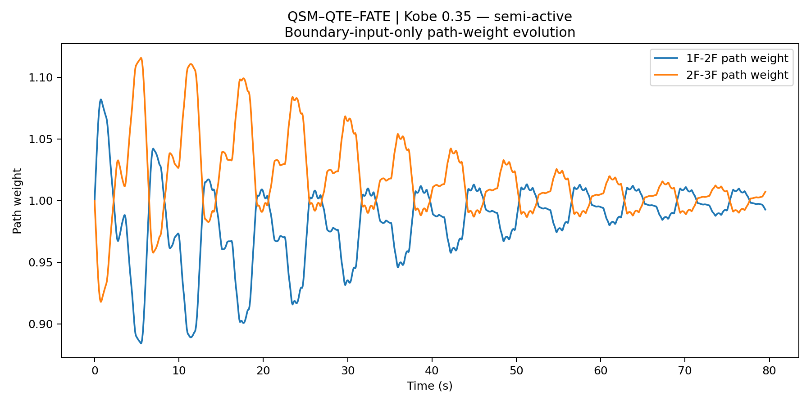

The direct comparison of path dominance makes this distinction visible: the floor-state field develops a sustained positive dominance, while the boundary-only reference continues to fluctuate around zero.

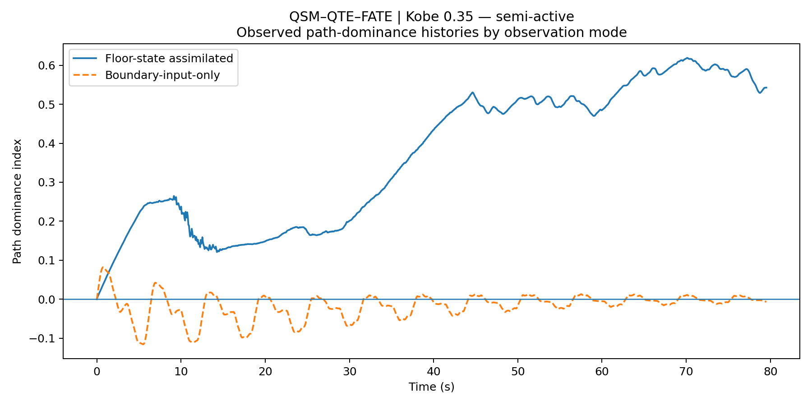

### Interpretation

This comparison indicates:

```text
incoming seismic input
≠
the field formed after the wave couples with the structure
```

The boundary signal initiates the event. The floor-state observations reveal the field that has actually formed inside the structure.

---

## 10. Edge-current distribution as a second field indicator

Path weight is one observation of QTE manifestation. QSM edge current provides a second, field-based observation.

| Probe | RMS edge current `1F–2F` | RMS edge current `2F–3F` | Ratio |
|---|---:|---:|---:|
| Laplacian floor-state | 0.530 | 0.121 | 4.392 |
| Zero-diagonal floor-state | 0.541 | 0.110 | 4.907 |
| Boundary-input-only | 0.471 | 0.491 | 0.958 |
| Dynamic path without feedback | 0.530 | 0.121 | 4.392 |
| Fixed-path reference | 0.324 | 0.225 | 1.440 |

The main Laplacian field contains approximately `4.392` times as much RMS edge current on `1F–2F` as on `2F–3F`. The zero-diagonal probe gives an even stronger ratio of `4.907`.

The two operators produce similar final path indications together with a comparable concentration pattern in the relational field flow.

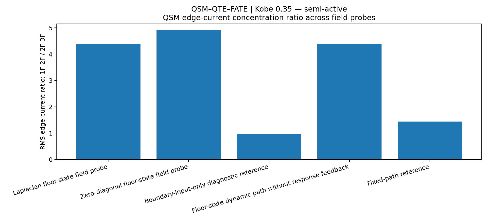

---

## 11. QSM one-step power-state evolution

The principal QSM check compares the one-step evolved `a*v` field at `k+1|k` with the measured `a*v` at `k+1`.

### 11.1 Floor-level results

| Floor | Signed correlation | Absolute-envelope correlation | Residual RMSE | Peak-time offset | Max downstream response envelope |
|---|---:|---:|---:|---:|---:|
| 1F | 0.567 | 0.851 | 0.060 | 0.176 s | 3.650 |
| 2F | 0.709 | 0.949 | 0.053 | -0.073 s | 3.802 |
| 3F | 0.693 | 0.955 | 0.082 | 0.005 s | 4.174 |

The mean signed correlation across the three floors is:


$$
r_{signed}=0.656
$$


The mean absolute-envelope correlation is:


$$
r_{|a v|}=0.918
$$


These values do not mean that the blue and orange traces are identical at every oscillation. They mean that the one-step evolved field retains substantial agreement with the measured sign, phase tendency, event envelope, and decay structure.

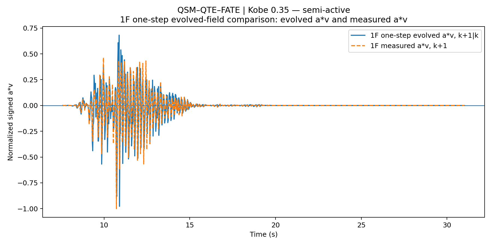

At 1F, the absolute-envelope correlation is `0.851` and the signed correlation is `0.567`. The first floor is closest to the incoming excitation and contains the strongest direct boundary influence.

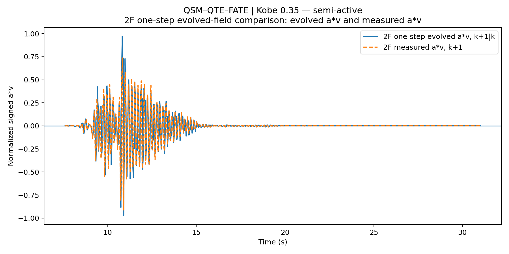

At 2F, the absolute-envelope correlation rises to `0.949` and the signed correlation to `0.709`.

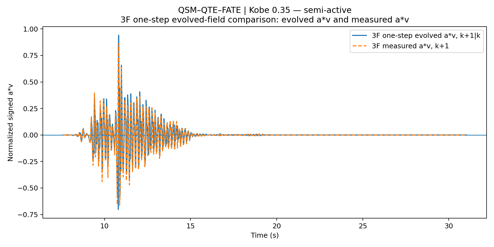

At 3F, the absolute-envelope correlation reaches `0.955` with a signed correlation of `0.693`. The peak-time offset is only `0.004883` s, equal to approximately one retained sample step in this processed record.

---

## 12. Boundary input versus structure-coupled floor-state field

| Floor | Boundary signed corr | Boundary abs corr | Floor-state signed corr | Floor-state abs corr |
|---|---:|---:|---:|---:|
| 1F | 0.087 | 0.757 | 0.567 | 0.851 |
| 2F | 0.012 | 0.725 | 0.709 | 0.949 |
| 3F | -0.147 | 0.548 | 0.693 | 0.955 |

The boundary-input-only mean absolute-envelope alignment is `0.677`. The floor-state-assimilated value is `0.918`.

The difference grows with height. The boundary record still contains useful information near the first floor, but it progressively loses the ability to represent the internal upper-floor state. Floor-state assimilation restores the structure-coupled field.

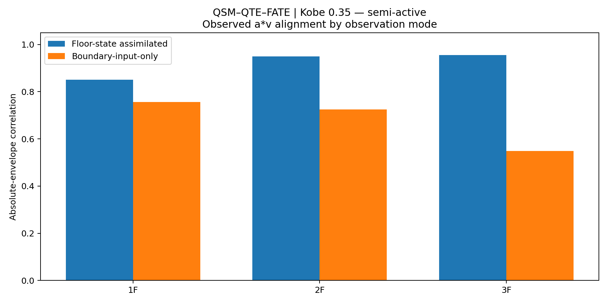

This comparison is consistent with the QSM distinction between:

```text
the wave that enters the boundary
and
the field that exists after wave–structure coupling
```

---

## 13. Why the fixed-path result matters

The fixed-path reference keeps:


$$
w_{12}=w_{23}=1
$$


throughout the entire record. Its mean absolute-envelope correlation is `0.918435`, almost identical to the dynamic Laplacian result of `0.918428`.

This comparison helps separate the evidential roles:

- the one-step `a*v` alignment primarily supports **QSM field evolution**;
- the evolving path weights and edge-current concentration support **QTE path manifestation**.

The correlation should therefore not be used as if it proves both layers by itself.

---

## 14. What the no-feedback probe reveals

The floor-state dynamic probe without response feedback produces:

```text
final dominance = 0.542553
mean abs a*v alignment = 0.918428
```

These are almost identical to the main Laplacian result.

Within the present implementation, the `1F–2F` indication changes very little when the downstream response-feedback term is removed. In the present version, path manifestation is driven mainly by the structure-coupled field, edge current, power-state gradient, and assimilation residual.

It also means that the current experiment has activated FATE's observation layer, but has not yet demonstrated a strong response-feedback-driven topology rewrite.

---

## 15. Work-compatible manifestation by floor

The main Laplacian probe gives the following case-internal work-compatible distribution.

| Floor | Hit-work capacity | Displacement-side work | Manifested ratio | Unmanifested margin |
|---|---:|---:|---:|---:|
| 1F | 2.033 | 0.423 | 0.208 | 0.792 |
| 2F | 1.829 | 1.230 | 0.672 | 0.328 |
| 3F | 1.963 | 1.869 | 0.952 | 0.048 |

The mean manifested work ratio is `0.611`, while the mean unmanifested margin is `0.389`.

These ratios are normalized within the case by a work-capacity scale of `1.654`. They should be read as **case-internal work-compatible manifestation proxies**, not as absolute percentages of physical energy dissipated by the real structure.

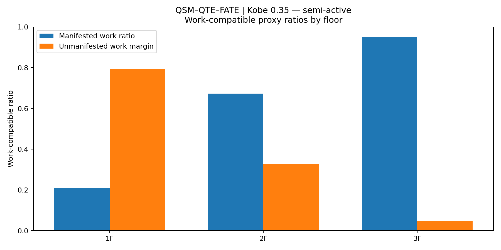

The case-level pattern is:

```text
1F: large unmanifested margin
2F: intermediate manifestation
3F: most of the calibrated work capacity appears in downstream displacement-side work
```

This does not mean that the main path is located at 3F. It means that the field can pass through a lower interface and become more fully manifested as an upper-floor response.

---

## 16. Force–displacement work-loop proxy

The acceleration–displacement loops provide a familiar structural-dynamics bridge to the work interpretation:


$$
\int a\,du
$$


The plotted loops are normalized proxies. They contain the combined effect of multi-frequency excitation, phase difference, floor coupling, and the semi-active experimental condition. They are not direct damper hysteresis loops and should not be interpreted as absolute dissipated energy.

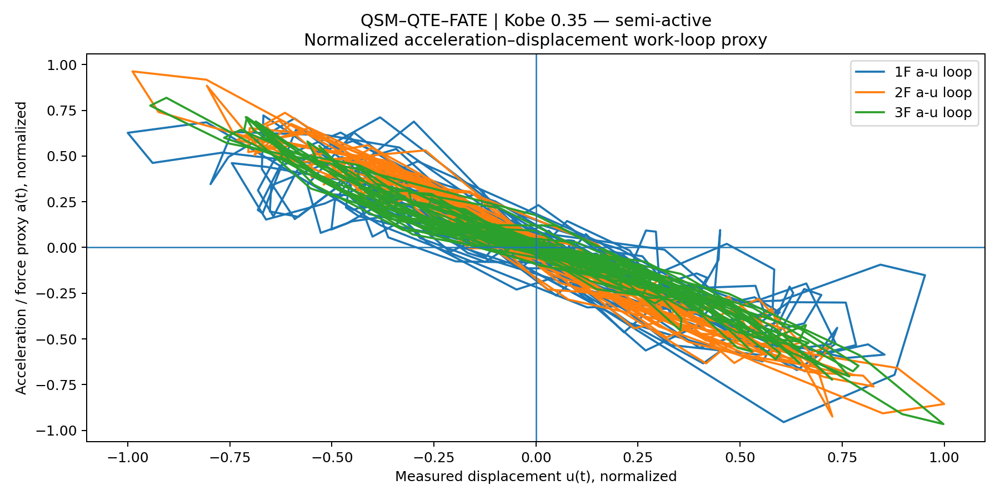

The loop area is consistent with work-like exchange in the measured states, while the QSM evolution reorganizes that exchange as a field rather than treating each floor trace as an isolated signal.

---

## 17. Energy path and displacement response are different observations

The largest downstream displacement response occurs at 3F.

| Floor | Maximum downstream displacement-response envelope |
|---|---:|
| 1F | 3.650 |
| 2F | 3.802 |
| 3F | 4.174 |

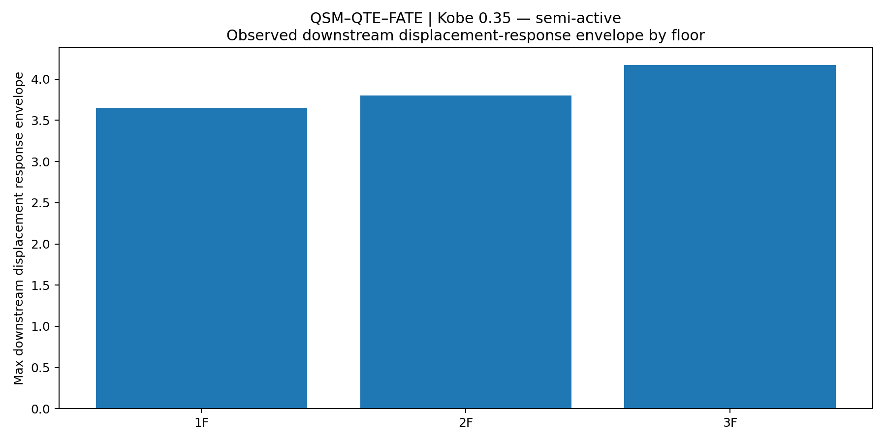

The combined observation is:

```text
dominant energy path:
1F–2F lower interface

largest downstream displacement response:
3F
```

This is a central observation of the case.

The location through which the power-state field becomes concentrated is not necessarily the same location at which the largest final displacement appears. QTE observes the path layer; displacement remains downstream response evidence.

---

## 18. What this case currently indicates

### 18.1 QSM observations

This case provides preliminary support for the following QSM observations:

1. Direct floor-level `u`, `v`, and `a` channels can be represented as a coupled empirical field.
2. The work-compatible state `a*v` can be evolved one step from the current field.
3. The evolved field retains substantial signed and envelope agreement with the next measured state.
4. Floor-state assimilation represents the upper-floor structural state better than boundary-input information alone.
5. Similar alignment under fixed and dynamic paths shows that QSM field evolution can be evaluated separately from QTE path adaptation.
6. The zero-diagonal relational operator remains meaningful as a QSM observation of pure inter-node transmission.

### 18.2 Floor-domain QTE observations

At the current floor-domain resolution, this case provides preliminary support for the following QTE observations:

1. A topology path can be manifested dynamically rather than assigned in advance.
2. Three floor-state dynamic probes independently support the `1F–2F` path.
3. Path dominance and edge-current concentration provide mutually supporting evidence.
4. Boundary input alone does not create a stable internal path.
5. Zero-diagonal and Laplacian observations converge on the same lower-interface manifestation.
6. Path manifestation and maximum displacement response occupy different observational layers.

The QTE result remains partial because:

- the topology is floor-level rather than member-level;
- the structural graph is mapped from experiment and measurement organization;
- no complete BIM/IFC/as-built topology was available;
- member stiffness, mass distribution, joint behavior, dampers, and boundaries were not encoded as a full physical graph;
- the manifested `1F–2F` path has not yet been matched to an independently documented component-level weak plane or damage location.

### 18.3 FATE Aware_power scope

This case represents:

```text
Aware_power
```

because it connects:

```text
input
→ observed field
→ one-step evolution
→ topology-path manifestation
→ work manifestation
→ downstream response
```

It does not yet implement or examine:

```text
Alert_control
Alive_evolve
```

No control command is generated from the manifested path, and no revised operator `H'` is applied to demonstrate a safer evolved state.

---

## 19. What this case does not claim

This first integrated result does not claim that:

- QSM replaces conventional structural dynamics;
- the normalized `a*v` proxy is absolute power;
- the work ratio is an absolute physical energy percentage;
- `1F–2F` is already proven to be the actual damaged or weakest component region;
- the method has been validated for all structures or earthquakes;
- the semi-active controller has been evaluated or optimized by FATE;
- the full FATE survival loop has been completed;
- a detailed BIM-enabled topology field has already been constructed.

A bounded interpretation of the present result is:

> In a public three-floor experimental record with direct displacement, velocity, and acceleration channels, a single integrated QSM–QTE workflow evolved the floor-level power-state field, distinguished boundary input from the structure-coupled state, and manifested a stable `1F–2F` floor-topology path. The same computation activates the `Aware_power` layer of FATE, while detailed component-level QTE and closed-loop FATE remain future work.

---

## 20. Reproducibility files in this folder

The Kobe folder should contain the following 20 generated files together with this `README.md`.

| File | Role |
|---|---|
| `01_qsm_qte_fate_mode_comparison.csv` | Five-probe case-level comparison |
| `02_qsm_qte_fate_manifestation_summary.csv` | Condensed path-manifestation summary |
| `03_qsm_qte_fate_floor_target_summary.csv` | Floor-level correlation, work, and response evidence |
| `04_qsm_qte_fate_core_history.csv` | Full time-history evidence used to generate the figures |
| `05_CASE_REPORT.md` | Automatically generated concise case report |
| `06_release_report.txt` | Plain-text release summary |
| `07_energy_path_manifestation_consensus.png` | Probe consensus |
| `08_floor_assimilated_path_evolution.png` | Dynamic floor-state path evolution |
| `09_boundary_input_only_path_evolution.png` | Boundary-only path reference |
| `10_edge_current_concentration.png` | Edge-current concentration |
| `11_1f_evolved_av_next_vs_measured_av.png` | 1F one-step QSM check |
| `12_2f_evolved_av_next_vs_measured_av.png` | 2F one-step QSM check |
| `13_3f_evolved_av_next_vs_measured_av.png` | 3F one-step QSM check |
| `14_boundary_vs_assimilated_av_alignment.png` | Boundary versus structure-coupled alignment |
| `15_boundary_vs_assimilated_path_dominance.png` | Boundary versus structure-coupled path dominance |
| `16_work_capacity_summary_by_floor.png` | Work-compatible manifestation |
| `17_force_displacement_work_loop_proxy.png` | Work-loop proxy |
| `18_response_manifestation_by_floor.png` | Downstream displacement response |
| `19_release_run_log.txt` | Run metadata and release log |
| `20_release_file_manifest.json` | Machine-readable provenance and file manifest |

The root repository should additionally preserve:

- the V11 analysis script;
- the environment requirements;
- the dataset DOI and source instructions;
- the fixed numerical settings;
- the commands required to reproduce all case outputs.

---

## 21. Repository location

This case is part of the formal repository structure:

```text
cases/
└── kobe_035_semi_active/
    ├── README.md
    └── 20 formal V11 artifacts
```

Related material:

- [Repository overview](../../README.md)
- [Four-case scientific synthesis](../../cross_case/README.md)
- [Data-source instructions](../../data/README.md)
- [Formal release log](../../release_logs/00_RELEASE_RUN_LOG.txt)

---

## 22. Data citation

Zhang, J., Wu, B., and Dyke, S.  
*RTHS and Shake Table Comparison for Smart Structural Systems (NEES-2011-1076)* [Data set].  
NEES / DesignSafe Data Depot.  
DOI: `10.7277/TPS7-V877`

---

## 23. Initial integrated record of the method

This Kobe case is not a final proof of QSM, QTE, or FATE.

It is an initial shared computational trace obtained from a public experimental record.

QSM provides the evolving power-state field. QTE reads a topology path from that field. FATE receives, for the first time, a continuously updated `Aware_power` state that can later become the basis of control and survival-oriented re-evolution.

The detailed structural topology is still incomplete. The control loop is still open. The method has not yet reached the end of its validation path.

Within the stated floor-domain and Aware_power scope, the integrated chain is represented as:

```text
QSM
→ QTE
→ FATE
```

and it has left a reproducible computational record in public experimental data.
