# Morgan Hill 1.00 — Passive-Off  
## Integrated QSM–QTE–FATE Observation Record — Formal Release V11

> **Recommended location**  
> `cases/morgan_hill_100_passive_off/README.md`
>
> **Repository**  
> `QSM-QTE-FATE-Integrated-Seismic-Field-Observation`

---

## 1. Role of the Morgan Hill case

The Morgan Hill 1.00 passive-off record is the second direct-channel case in the formal V11 release. Its main role is to examine whether the integrated observation chain developed in the Kobe case remains visible under a different earthquake record and a different control condition, without case-specific parameter fitting.

The same V11 computational structure is retained:

```text
measured floor state
→ QSM one-step power-state evolution
→ QTE floor-domain path indication
→ FATE Aware_power observation
```

Morgan Hill should therefore be read as a **cross-scenario replication case**, not as a second copy of the Kobe analysis.

The present comparison is intentionally bounded. Both the earthquake input and the control state differ from the Kobe case, so the current record cannot isolate which difference causes each observed change. It can, however, examine whether the same method chain remains computationally coherent and whether the resulting field history retains case-specific behavior.

---

## 2. Scientific position of the result

### 2.1 QSM

QSM is examined through a one-step evolved-field comparison:

```text
measurements through k
→ evolve the structure-coupled field to k+1|k
→ read the evolved a*v state
→ compare with measured a*v at k+1
→ assimilate the new measurement
→ continue
```

The comparison is an evolutionary-field check. It is not a long-horizon forecast.

### 2.2 QTE

QTE is examined at the available **three-floor domain resolution**:

```text
1F node ↔ 2F node ↔ 3F node
```

with two inter-floor paths:

```text
1F–2F
2F–3F
```

The available record does not contain a complete BIM/IFC or as-built structural graph. The result therefore concerns a floor-domain topology-path indication, not member-level localization.

### 2.3 FATE

FATE is represented at:

```text
Aware_power
```

The workflow observes the incoming state, structure-coupled field, path-weight history, edge-current distribution, work-compatible manifestation, and downstream displacement response.

The present case does not yet implement:

```text
Alert_control
Alive_evolve
```

---

## 3. Experimental source

| Item | Value |
|---|---|
| Project | NEES-2011-1076 |
| Project title | RTHS and Shake Table Comparison for Smart Structural Systems |
| Earthquake record | Morgan Hill |
| Input scale | 1.00 |
| Control condition | Passive-off |
| Source file | `morgan_1_p_off_avg_converted.csv` |
| Acquisition context | Averaged converted record |
| Source rows detected | 81,009 |
| Rows loaded after stride | 16,202 |
| Read stride | 5 |
| Columns loaded | 10 |
| Event window used in figures | 4.754883–16.700195 s |
| Dataset DOI | 10.7277/TPS7-V877 |

The full time-history evidence is retained in:

```text
04_qsm_qte_fate_core_history.csv
```

---

## 4. Signal provenance

All three floors use direct analytical displacement, velocity, and acceleration channels.

| Floor | Displacement `u` | Velocity `v` | Acceleration `a` |
|---|---|---|---|
| 1F | `First Floor Displacement - Analytical` | `First Floor Velocity Sensor - Analytical` | `First Floor Acceleration - Analytical` |
| 2F | `Second Floor Displacement - Analytical` | `Second Floor Velocity Sensor - Analytical` | `Second Floor Acceleration - Analytical` |
| 3F | `Third Floor Displacement - Analytical` | `Third Floor Velocity Sensor - Analytical` | `Third Floor Acceleration - Analytical` |

The power-state quantity is represented as:


$$
p_i(t)=a_i(t)v_i(t)
$$


In this release, `a*v` is treated as a **work-compatible power-state proxy**. Floor mass is not inserted explicitly, so the result should not be read as absolute power in watts.

---

## 5. V11 execution record

The formal four-case V11 release used 24 logical processors, two CSV preparation workers, and eight parallel probe workers.

For the Morgan Hill case:

| Execution item | Recorded time |
|---|---:|
| Data preparation | 0.230 s |
| Laplacian floor-state probe | 2.595 s |
| Zero-diagonal floor-state probe | 2.626 s |
| Boundary-input-only reference | 2.183 s |
| Dynamic path without response feedback | 2.537 s |
| Fixed-path reference | 1.699 s |
| Sum of probe-worker elapsed time | 11.639 s |
| Longest probe-worker elapsed time | 2.626 s |
| Case finalization and artifact generation | 2.827 s |
| Accounted case task time | 14.695 s |

Probe-worker times are process elapsed times. Because probes run in parallel, their sum is a computational-load indicator rather than case wall-clock time.

---

## 6. Floor-domain topology and path indicator

The initial path weights are:


$$
w_{12}=1,\qquad w_{23}=1
$$


with:


$$
w_{12}+w_{23}=2
$$


The final path-dominance index is:


$$
D=\frac{w_{12}-w_{23}}{w_{12}+w_{23}}
$$


Interpretation:

- `D > 0`: higher final weight on `1F–2F`;
- `D < 0`: higher final weight on `2F–3F`;
- `D ≈ 0`: near-equal final weights.

The V11 wording deliberately reports a **path indication** rather than treating the index as proof of a physical failure plane.

---

## 7. Five observation probes

| Probe | Operator / condition | Role |
|---|---|---|
| Laplacian floor-state field probe | Laplacian, floor-state assimilation, dynamic path, response feedback | Main integrated observation |
| Zero-diagonal floor-state field probe | Strict zero-diagonal operator, floor-state assimilation | Pure relational-transmission comparison inherited from early QSM |
| Boundary-input-only diagnostic reference | Laplacian, boundary source only | Incoming-wave reference without internal floor-state assimilation |
| Floor-state dynamic path without response feedback | Laplacian, floor-state assimilation, no response feedback | Response-feedback sensitivity check |
| Fixed-path reference | Laplacian, `w12=w23=1` fixed | Separates QSM field alignment from QTE path adaptation |

The five probes are computational observation settings. The physical floor-domain model still contains only two inter-floor paths.

---

## 8. Final path indicators across probes

| Probe | Final `w12` | Final `w23` | Final dominance `D` | Edge-current ratio `1F–2F / 2F–3F` |
|---|---:|---:|---:|---:|
| Laplacian floor-state | 1.079 | 0.921 | 0.079 | 1.368 |
| Zero-diagonal floor-state | 1.077 | 0.923 | 0.077 | 1.224 |
| Dynamic path without response feedback | 1.079 | 0.921 | 0.079 | 1.367 |
| Boundary-input-only reference | 0.996 | 1.004 | -0.004 | 0.958 |
| Fixed-path reference | 1.000 | 1.000 | 0.000 | 0.938 |

The three floor-state dynamic probes all end with a higher `1F–2F` weight. Their support count is:

```text
3 / 3
```

The main final dominance is:


$$
D=0.079
$$


This is a positive but comparatively modest final indication. The boundary-input-only reference ends at:


$$
D=-0.004
$$


and is therefore reported as:

```text
near-equal / no clear final path indication
```

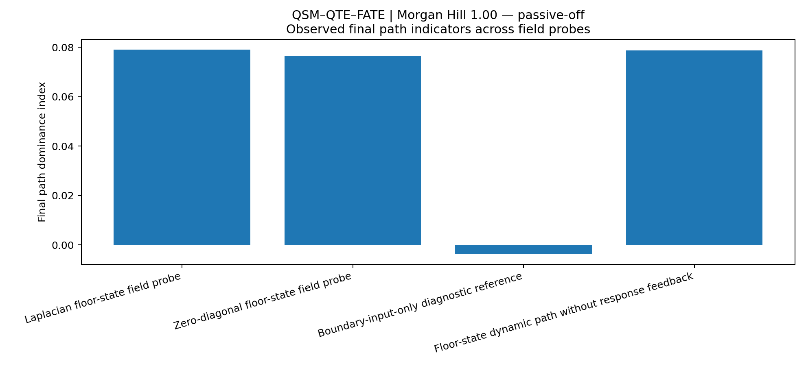

---

## 9. Path-weight history: concentration and partial return

The Morgan Hill floor-state path history does not move monotonically toward a fixed final separation.

The `1F–2F` path weight rises from approximately `1.0` to a maximum near `1.46` around the middle of the record, while the `2F–3F` path falls toward approximately `0.54`. After that period of stronger separation, the weights move back toward one another and finish at:

```text
w12 = 1.079
w23 = 0.921
```

This history indicates a temporary concentration followed by substantial redistribution. The final index alone therefore understates the strength of the intermediate path separation.

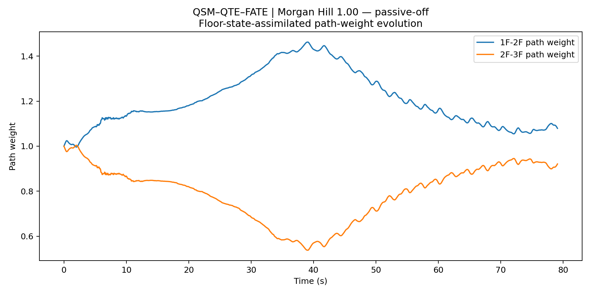

The boundary-input-only history oscillates around equal weighting and gradually decays toward a near-balanced condition.

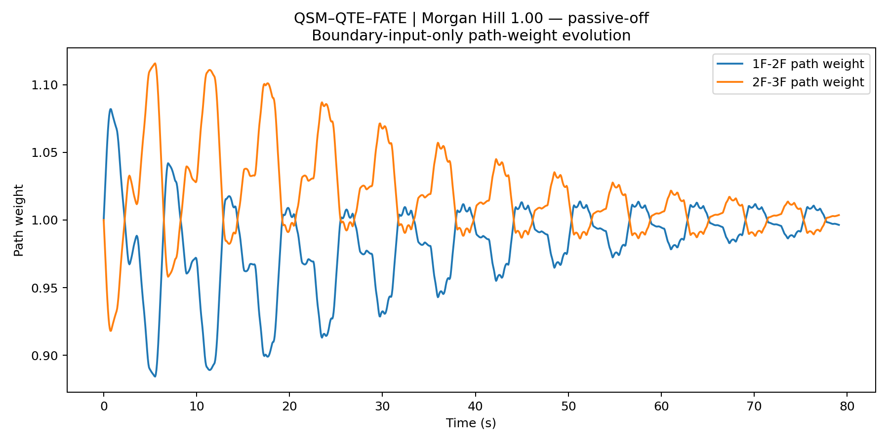

The direct path-dominance comparison makes the difference visible. The floor-state field rises to an intermediate dominance near `0.46`, then declines toward `0.079`. The boundary reference continues to fluctuate around zero.

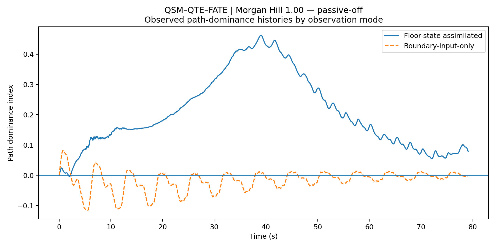

### Interpretation

For Morgan Hill, the floor-state observations indicate:

```text
temporary lower-interface concentration
→ subsequent redistribution
→ weak but still positive final lower-interface indication
```

This is different from treating the case as a static label. QTE is being used to observe an evolving path history.

---

## 10. Edge-current distribution

| Probe | RMS edge current `1F–2F` | RMS edge current `2F–3F` | Ratio |
|---|---:|---:|---:|
| Laplacian floor-state | 0.426 | 0.312 | 1.368 |
| Zero-diagonal floor-state | 0.401 | 0.328 | 1.224 |
| Boundary-input-only | 0.468 | 0.489 | 0.958 |
| Dynamic path without feedback | 0.426 | 0.312 | 1.367 |
| Fixed-path reference | 0.364 | 0.388 | 0.938 |

The principal Laplacian ratio is `1.368`. The mean ratio across the three floor-state dynamic probes is `1.320`.

The ratios are above one, but much closer to one than in a strongly concentrated case. The edge-current result is therefore consistent with a mild lower-interface preference rather than an exclusive path.

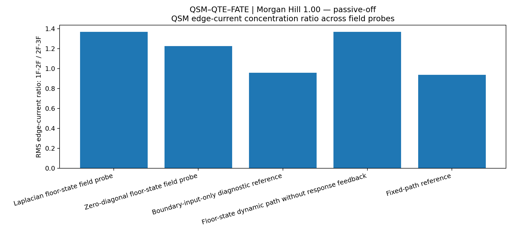

---

## 11. QSM one-step evolved-field results

### 11.1 Floor-level summary

| Floor | Signed correlation | Absolute-envelope correlation | Residual RMSE | Peak-time offset | Max downstream response envelope |
|---|---:|---:|---:|---:|---:|
| 1F | 0.733 | 0.907 | 0.088 | 0.004883 s | 2.774 |
| 2F | 0.785 | 0.974 | 0.070 | 0.000000 s | 2.804 |
| 3F | 0.740 | 0.974 | 0.129 | 0.004883 s | 2.802 |

The main mean signed correlation is:


$$
r_{signed}=0.753
$$


The main mean absolute-envelope correlation is:


$$
r_{|av|}=0.952
$$


These values indicate substantial one-step alignment across all three floors.

### 11.2 First floor

The 1F signed correlation is `0.733`, with an absolute-envelope correlation of `0.907`.

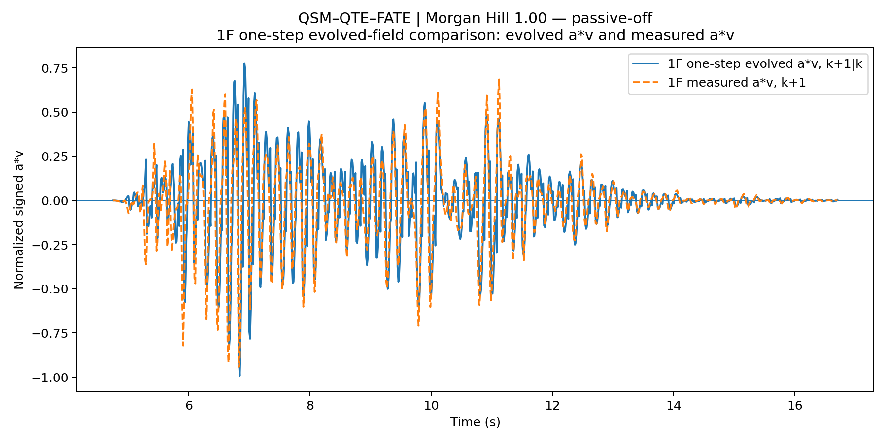

### 11.3 Second floor

The 2F signed correlation is `0.785`, and the absolute-envelope correlation is `0.974`.

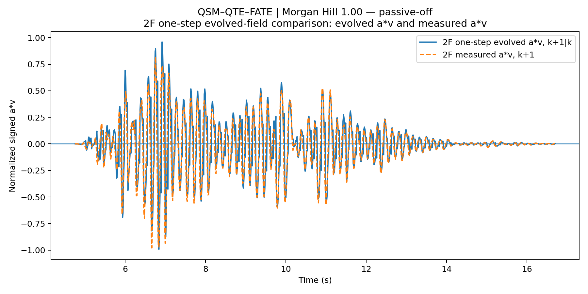

### 11.4 Third floor

The 3F signed correlation is `0.740`, with an absolute-envelope correlation of `0.974`.

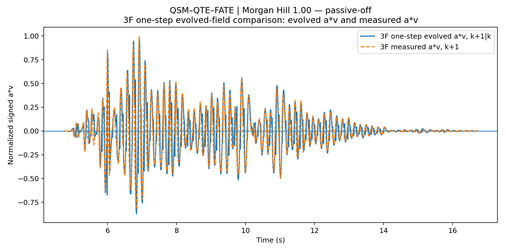

The 2F and 3F absolute-envelope correlations are both approximately `0.974`. The evolved and measured histories remain closely aligned through the main event and subsequent decay.

---

## 12. Boundary input versus floor-state assimilation

| Floor | Boundary signed corr | Boundary abs corr | Floor-state signed corr | Floor-state abs corr |
|---|---:|---:|---:|---:|
| 1F | 0.154 | 0.782 | 0.733 | 0.907 |
| 2F | 0.040 | 0.788 | 0.785 | 0.974 |
| 3F | -0.054 | 0.527 | 0.740 | 0.974 |

The boundary-input-only mean absolute-envelope alignment is `0.699`. The floor-state-assimilated value is `0.952`.

The largest contrast appears at 3F:

```text
boundary-input-only: 0.527
floor-state assimilated: 0.974
```

The boundary record retains part of the event envelope, but the upper-floor structure-coupled state is represented much more closely after floor-state assimilation.

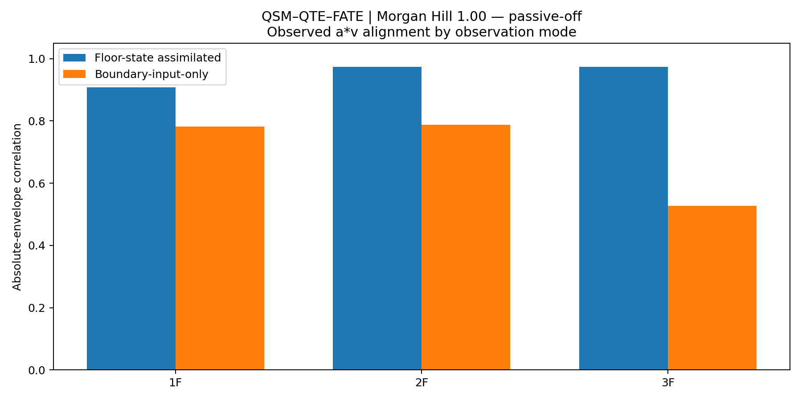

---

## 13. Fixed-path and no-feedback comparisons

The fixed-path reference keeps:


$$
w_{12}=w_{23}=1
$$


Its mean absolute-envelope correlation is `0.951639`, compared with `0.951639` for the dynamic Laplacian probe.

The near-equality of these values indicates that the one-step `a*v` alignment is primarily evidence for QSM field evolution. QTE path adaptation should be assessed through the path-weight history, dominance index, and edge-current distribution.

The no-response-feedback probe ends at:

```text
final dominance = 0.078751
mean abs a*v alignment = 0.951639
```

These values are very close to the main Laplacian result. Within this implementation, removing downstream response feedback does not materially change the Morgan Hill path indication.

---

## 14. Work-compatible manifestation by floor

| Floor | Hit-work capacity | Displacement-side work | Manifested ratio | Unmanifested margin |
|---|---:|---:|---:|---:|
| 1F | 4.155 | 0.688 | 0.166 | 0.834 |
| 2F | 4.010 | 2.162 | 0.539 | 0.461 |
| 3F | 3.944 | 3.756 | 0.952 | 0.048 |

The case-level work-capacity scale is `1.833`. The mean manifested work ratio is `0.552` and the mean unmanifested margin is `0.448`.

These ratios are normalized within the case. They are work-compatible proxies, not absolute physical energy percentages.

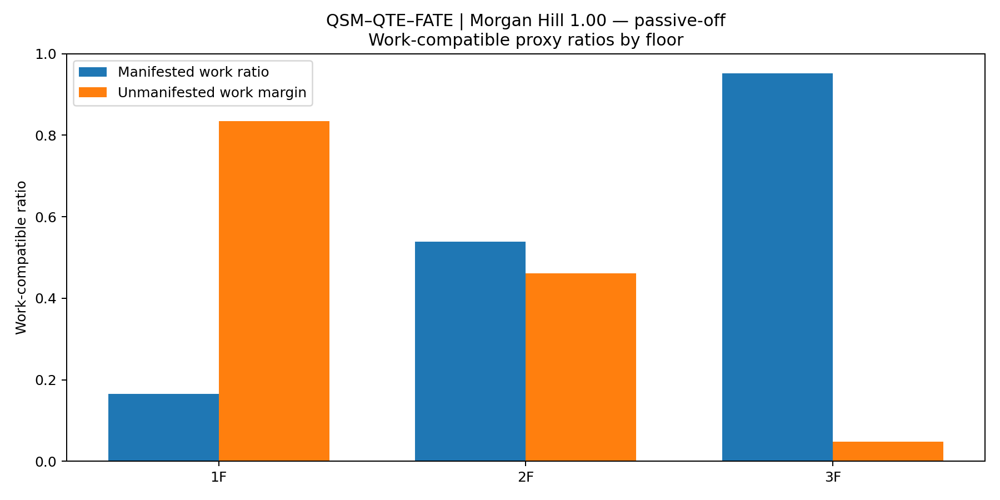

The floor pattern is:

```text
1F: mostly unmanifested margin
2F: intermediate manifestation
3F: high displacement-side manifestation
```

---

## 15. Acceleration–displacement work-loop proxy

The normalized acceleration–displacement histories provide a work-like representation related to:


$$
\int a\,du
$$


The traces are proxies and should not be interpreted as direct damper hysteresis loops or absolute dissipated energy.

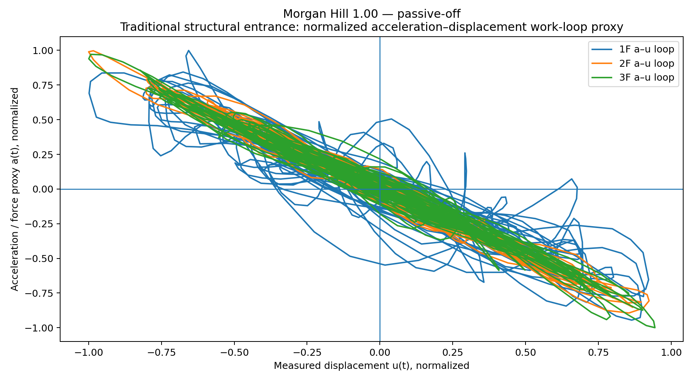

The first-floor loop is visibly broader and less tightly grouped than the upper-floor loops. This is consistent with a stronger mixture of incoming excitation, local response, and inter-floor coupling at the boundary-adjacent floor, but the present figure is descriptive rather than a calibrated damage or dissipation measure.

---

## 16. Downstream displacement response

| Floor | Maximum downstream displacement-response envelope |
|---|---:|
| 1F | 2.774 |
| 2F | 2.804 |
| 3F | 2.802 |

The maximum downstream response is recorded at `2F`, although the 2F and 3F envelopes are nearly equal.

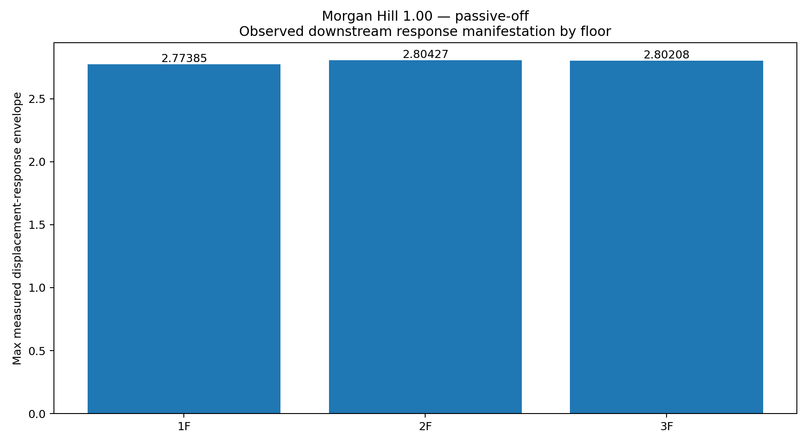

The combined observation is therefore:

```text
higher-weight final path indication:
1F–2F lower interface

largest downstream displacement-response envelope:
2F, with 3F nearly equal
```

Path indication and downstream response remain distinct observational layers.

---

## 17. What Morgan Hill adds to the evidence chain

### 17.1 QSM observations

Morgan Hill provides a second direct-channel record in which:

1. the same V11 field-evolution structure is used without case-specific retuning;
2. one-step signed correlations remain positive and substantial across all floors;
3. absolute-envelope correlations reach approximately `0.907`, `0.974`, and `0.974`;
4. floor-state assimilation improves the representation of the upper-floor state relative to boundary input alone;
5. fixed-path and dynamic-path correlations remain almost identical, helping separate QSM from QTE evidence.

### 17.2 Floor-domain QTE observations

Morgan Hill provides the following floor-domain QTE observations:

1. all three floor-state dynamic probes end with the same `1F–2F` higher-weight indication;
2. the path history contains a strong intermediate separation followed by partial return;
3. the final dominance is modest, showing that the method does not force all events into the same concentration strength;
4. edge-current ratios remain above one but are comparatively mild;
5. the boundary-only reference remains near equal and does not form a persistent internal path indication.

### 17.3 FATE Aware_power scope

Morgan Hill extends the `Aware_power` record to another earthquake and control condition:

```text
input
→ structure-coupled field
→ one-step evolution
→ dynamic path history
→ work-compatible manifestation
→ downstream response
```

The case still does not implement topology-changing control or post-control re-evolution.

---

## 18. Relationship to the Kobe case

Morgan Hill should not be presented as producing the same history as Kobe.

The useful commonality is:

```text
both direct-channel cases
→ strong floor-state one-step alignment
→ 3/3 floor-state path support
→ boundary-only near-equal final path
```

The useful difference is:

```text
Morgan Hill
→ strong intermediate 1F–2F concentration
→ substantial later redistribution
→ modest final dominance
```

This difference strengthens the interpretation of QSM–QTE as an evolutionary observation method. The method retains a common floor-interface tendency while preserving a distinct event history.

Because the earthquake and control conditions both change between the records, this comparison is a robustness observation rather than a controlled causal attribution.

---

## 19. Current limits

This case does not establish that:

- the `1F–2F` indication is a member-level weak plane;
- the final dominance index is a damage probability;
- the work-compatible ratios are absolute energy fractions;
- the passive-off condition causes the observed redistribution;
- Morgan Hill and Kobe differ because of only one experimental variable;
- QTE has been validated at full BIM/as-built resolution;
- FATE `Alert_control` or `Alive_evolve` has been completed.

A bounded interpretation is:

> Using the same formal V11 settings, the Morgan Hill passive-off record produces strong one-step floor-state power-field alignment, a reproducible but modest final `1F–2F` floor-domain indication, and a pronounced intermediate path concentration followed by redistribution. The result extends the integrated QSM–QTE–FATE `Aware_power` observation chain to a second direct-channel scenario without reducing the two events to the same field history.

---

## 20. Reproducibility files

The Morgan Hill case folder contains:

| File | Role |
|---|---|
| `01_qsm_qte_fate_mode_comparison.csv` | Five-probe case-level comparison |
| `02_qsm_qte_fate_manifestation_summary.csv` | Condensed path-indication summary |
| `03_qsm_qte_fate_floor_target_summary.csv` | Floor-level field, work, and response evidence |
| `04_qsm_qte_fate_core_history.csv` | Full time-history evidence |
| `05_CASE_REPORT.md` | Automatically generated concise case report |
| `06_release_report.txt` | Text release summary |
| `07_energy_path_manifestation_consensus.png` | Final path indicators |
| `08_floor_assimilated_path_evolution.png` | Floor-state path history |
| `09_boundary_input_only_path_evolution.png` | Boundary-only path history |
| `10_edge_current_concentration.png` | Edge-current ratios |
| `11_1f_evolved_av_next_vs_measured_av.png` | 1F one-step field comparison |
| `12_2f_evolved_av_next_vs_measured_av.png` | 2F one-step field comparison |
| `13_3f_evolved_av_next_vs_measured_av.png` | 3F one-step field comparison |
| `14_boundary_vs_assimilated_av_alignment.png` | Observation-mode alignment |
| `15_boundary_vs_assimilated_path_dominance.png` | Path-dominance histories |
| `16_work_capacity_summary_by_floor.png` | Work-compatible ratios |
| `17_force_displacement_work_loop_proxy.png` | Work-loop proxy |
| `18_response_manifestation_by_floor.png` | Downstream response envelope |
| `19_release_run_log.txt` | Execution timing |
| `20_release_file_manifest.json` | Machine-readable provenance |

---

## 21. Data citation

Zhang, J., Wu, B., and Dyke, S.  
*RTHS and Shake Table Comparison for Smart Structural Systems (NEES-2011-1076)* [Data set].  
NEES / DesignSafe Data Depot.  
DOI: `10.7277/TPS7-V877`

---

## 22. Morgan Hill record in the integrated method

Morgan Hill is important because it does not merely repeat the Kobe curve.

It retains the same integrated chain:

```text
QSM
→ QTE
→ FATE Aware_power
```

while producing a different path-strength history:

```text
formation
→ concentration
→ redistribution
→ weak positive final indication
```

That difference is part of the result. It shows that the method can retain a common structural observation without erasing the temporal character of a different event.
