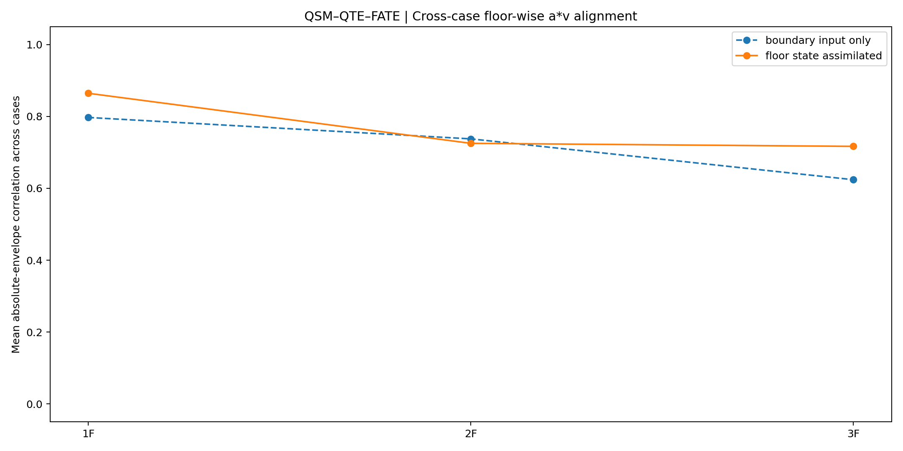
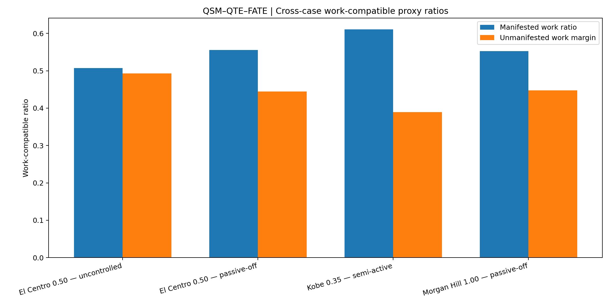

# Four-Case Scientific Synthesis  
## QSM–QTE–FATE Integrated Seismic Field Observation — Formal Release V11

> **Recommended location**  
> `cross_case/README.md`
>
> This document summarizes the scientific findings of the four-case release.  
> The repository-level README separately explains the QSM–QTE–FATE framework, software structure, dataset citation, and reproduction procedure.

---

## 1. Comparison scope

The four records come from the same three-story steel-frame experimental project, but they do not form a balanced factorial experiment.

| Case | Earthquake | Scale | Control condition | Signal condition |
|---|---|---:|---|---|
| El Centro 0.50 — uncontrolled | El Centro | 0.50 | Uncontrolled | Mixed displacement coordinates; velocity derived from displacement |
| El Centro 0.50 — passive-off | El Centro | 0.50 | Passive-off | Mixed displacement coordinates; velocity derived from displacement |
| Kobe 0.35 — semi-active | Kobe | 0.35 | Semi-active | Direct analytical `u`, `v`, and `a` channels |
| Morgan Hill 1.00 — passive-off | Morgan Hill | 1.00 | Passive-off | Direct analytical `u`, `v`, and `a` channels |

Only the two El Centro records hold the earthquake and scale approximately fixed while changing the control condition. The full four-case set is therefore interpreted as:

```text
a partial cross-wave and cross-control robustness matrix
```

rather than a complete causal control experiment.

All four cases use the same formal V11 numerical settings. No case-specific parameter fitting or target-driven optimization was introduced.

---

## 2. Main cross-case result table

| Case | Boundary abs `a*v` corr | Floor-state abs `a*v` corr | Signed corr gain | Final path dominance | Mean path dominance | Edge-current ratio | Mean work-proxy ratio | Max response floor |
|---|---:|---:|---:|---:|---:|---:|---:|---|
| El Centro 0.50 — uncontrolled | 0.765 | 0.615 | 0.361 | 0.140 | 0.435 | 3.763 | 0.507 | 3F |
| El Centro 0.50 — passive-off | 0.737 | 0.589 | 0.221 | 0.150 | 0.210 | 2.010 | 0.555 | 1F |
| Kobe 0.35 — semi-active | 0.677 | 0.918 | 0.672 | 0.543 | 0.368 | 4.392 | 0.611 | 3F |
| Morgan Hill 1.00 — passive-off | 0.699 | 0.952 | 0.706 | 0.079 | 0.205 | 1.368 | 0.552 | 2F |

The table already shows that the evidence does not collapse into one universal pattern:

- Kobe has the strongest final path concentration.
- Morgan Hill has the highest one-step `a*v` alignment but the weakest final path concentration.
- El Centro uncontrolled has a modest final dominance but a much larger mean dominance over the record.
- El Centro passive-off has a similar final dominance to the uncontrolled case but a weaker mean edge-current concentration.

The method therefore preserves differences in event history instead of reducing all records to the same output.

---

## 3. QSM finding: two direct-channel records reproduce strong one-step field alignment


The clearest QSM evidence comes from Kobe and Morgan Hill, where all three floors use direct analytical displacement, velocity, and acceleration channels.

| Direct-channel case | Boundary-only mean abs corr | Floor-state mean abs corr | Gain |
|---|---:|---:|---:|
| Kobe 0.35 — semi-active | 0.677 | 0.918 | 0.242 |
| Morgan Hill 1.00 — passive-off | 0.699 | 0.952 | 0.253 |

The same field-evolution structure produces:

```text
Kobe:
0.677 → 0.918

Morgan Hill:
0.699 → 0.952
```

This is the strongest current evidence that the QSM one-step structure-coupled power-state observation is not limited to one earthquake record.

The result should still be described precisely:

- it is a one-step evolved-field comparison;
- it uses measurement assimilation after the comparison;
- it demonstrates repeatability in two direct-channel records;
- it does not yet demonstrate long-horizon free evolution.

---

## 4. El Centro reveals a different QSM regime rather than a simple failure

In both El Centro records, floor-state assimilation lowers the mean absolute-envelope correlation:

```text
El Centro uncontrolled:
0.765 → 0.615

El Centro passive-off:
0.737 → 0.589
```

At first sight, this appears opposite to Kobe and Morgan Hill. The signed correlations show a more nuanced result.

| El Centro case | Boundary mean signed corr | Floor-state mean signed corr | Signed gain |
|---|---:|---:|---:|
| El Centro 0.50 — uncontrolled | -0.039 | 0.323 | 0.361 |
| El Centro 0.50 — passive-off | 0.037 | 0.258 | 0.221 |

Floor-state assimilation improves the signed relationship in both El Centro records, particularly at 1F, while the absolute envelope becomes less coherent at 2F and 3F.

This combination is consistent with the known signal-provenance problem:

```text
1F displacement:
relative coordinate

2F and 3F displacement:
absolute coordinate

velocity:
numerically differentiated from displacement

acceleration:
directly measured
```

The scientific conclusion is not that El Centro disproves the field method. It shows that:

> A structure-coupled state can retain directional and path information while losing amplitude-envelope coherence when the input channels do not form one homogeneous physical state description.

This distinction is important because it prevents the method from treating every available numerical channel as equivalent evidence.

---

## 5. Floor-wise QSM trend across all four cases



Averaged across all four cases:

| Floor | Boundary signed corr | Floor-state signed corr | Boundary abs corr | Floor-state abs corr |
|---|---:|---:|---:|---:|
| 1F | 0.032 | 0.690 | 0.797 | 0.864 |
| 2F | 0.018 | 0.410 | 0.738 | 0.725 |
| 3F | -0.028 | 0.393 | 0.624 | 0.717 |

The signed correlation increases strongly at every floor after floor-state assimilation.

The absolute-envelope average behaves differently:

- 1F improves;
- 2F is nearly unchanged;
- 3F improves.

The near-neutral 2F result is produced by combining two strong direct-channel cases with two heterogeneous El Centro records. This is another reason that provenance groups should not be merged without qualification.

---

## 6. QTE finding: boundary input does not produce a stable internal path


Across all four cases, the boundary-input-only final dominance remains very close to zero:

| Case | Boundary final dominance | Floor-state final dominance |
|---|---:|---:|
| El Centro 0.50 — uncontrolled | -0.000 | 0.140 |
| El Centro 0.50 — passive-off | -0.003 | 0.150 |
| Kobe 0.35 — semi-active | -0.007 | 0.543 |
| Morgan Hill 1.00 — passive-off | -0.004 | 0.079 |

The boundary-input-only mode is therefore reported as:

```text
near-equal / no clear final path indication
```

In contrast, every floor-state-assimilated case ends with a positive `1F–2F` indication.

This is the strongest current cross-case QTE observation:

> The incoming seismic record does not by itself determine the internal floor-domain path. A path indication emerges after the measured structural state enters the field representation.

The statement remains limited to the current three-floor observation graph. It is not yet a member-level weak-plane localization result.

---

## 7. A common interface does not imply one common evolution history

All four cases produce the same higher-weight final interface:

```text
1F–2F
```

Their histories are nevertheless different:

| Case | Main temporal pattern |
|---|---|
| El Centro uncontrolled | Early lower-interface concentration, sustained separation, late partial redistribution |
| El Centro passive-off | Weak initial separation, abrupt mid-record transition, temporary concentration, gradual redistribution |
| Kobe semi-active | Strong and comparatively persistent lower-interface concentration |
| Morgan Hill passive-off | Strong intermediate concentration followed by substantial return toward equality |

This is scientifically important.

A method that simply forced the same label would tend to erase the temporal differences. V11 retains:

```text
formation
concentration
transition
recovery
redistribution
```

as part of the observation.

The final dominance index is therefore not sufficient by itself. Mean dominance and the full path-weight history must be retained.

---

## 8. Edge current independently supports the lower-interface tendency


The main Laplacian edge-current ratio is above one in every case:

| Case | `1F–2F / 2F–3F` edge-current ratio |
|---|---:|
| El Centro 0.50 — uncontrolled | 3.763 |
| El Centro 0.50 — passive-off | 2.010 |
| Kobe 0.35 — semi-active | 4.392 |
| Morgan Hill 1.00 — passive-off | 1.368 |

The ranking is:

```text
Kobe
> El Centro uncontrolled
> El Centro passive-off
> Morgan Hill
> 1.0 equal-current reference
```

The path-weight result and the edge-current result are not identical metrics:

- path dominance describes the relative path-weight state;
- edge-current ratio describes the field-flow concentration across the record.

Their agreement on the lower interface provides a second form of QTE evidence.

The Morgan Hill case is particularly informative: its final dominance is small, but the edge-current ratio remains above one. This is consistent with a path that was active during the event and later redistributed.

---

## 9. Operator and ablation findings

The V11 probes help separate which parts of the result belong to QSM, QTE, and the current FATE implementation.

### 9.1 Zero-diagonal and Laplacian

For every case, the zero-diagonal and Laplacian floor-state probes produce nearly the same final path indication.

| Case | Laplacian dominance | Zero-diagonal dominance | Difference |
|---|---:|---:|---:|
| El Centro 0.50 — uncontrolled | 0.140 | 0.139 | -0.002 |
| El Centro 0.50 — passive-off | 0.150 | 0.147 | -0.003 |
| Kobe 0.35 — semi-active | 0.543 | 0.514 | -0.029 |
| Morgan Hill 1.00 — passive-off | 0.079 | 0.077 | -0.002 |

This suggests that the `1F–2F` indication is not created solely by the Laplacian diagonal terms. The relational-transmission view inherited from zero-diagonal QSM sees a similar floor-domain tendency.

This does not make the two operators interchangeable. It shows convergence of the present floor-domain observation under two different operator structures.

### 9.2 Fixed path

The fixed-path and dynamic-path probes produce almost identical one-step absolute-envelope correlations in every case.

That result separates the evidence:

```text
QSM evidence:
one-step a*v field alignment

QTE evidence:
path-weight evolution and edge-current concentration
```

High correlation should not be used as if it independently proves the QTE path.

### 9.3 Response feedback

Removing the response-feedback term changes the final dominance only slightly in all four records.

The current path indication therefore arises mainly from:

- the structure-coupled field;
- edge current;
- power-state gradient;
- assimilation residual.

The present release has not yet shown a strong feedback-driven topology rewrite. This is consistent with FATE remaining at `Aware_power`.

---

## 10. Work-compatible proxy ratios are secondary evidence



| Case | Mean manifested ratio | Mean unmanifested margin |
|---|---:|---:|
| El Centro 0.50 — uncontrolled | 0.507 | 0.493 |
| El Centro 0.50 — passive-off | 0.555 | 0.445 |
| Kobe 0.35 — semi-active | 0.611 | 0.389 |
| Morgan Hill 1.00 — passive-off | 0.552 | 0.448 |

The ratios are similar in scale, but they should not be interpreted as direct cross-case physical energy percentages.

Each case uses its own work-capacity normalization. Therefore, the figure is useful for:

- describing internal manifestation patterns;
- comparing manifested and unmanifested portions within a case;
- connecting field observation to downstream displacement evidence.

It is not currently suitable for claiming that one earthquake dissipated a precise percentage more physical energy than another.

The El Centro work proxies require additional caution because their `u`, derived `v`, and direct `a` channels do not share one homogeneous coordinate and provenance structure.

---

## 11. Scientific evidence status

### 11.1 Evidence currently supporting QSM

The four-case release provides the following evidence:

1. Two direct-channel records reproduce strong one-step structure-coupled `a*v` alignment using the same settings.
2. Floor-state assimilation strongly improves signed correlation across the four-case set.
3. Boundary input alone loses upper-floor state information.
4. Fixed-path and dynamic-path comparisons show that the one-step alignment does not depend on adaptive QTE path weights.
5. El Centro exposes the signal-semantic conditions under which amplitude-envelope coherence weakens.

The evidence currently supports a repeatable one-step field observation in direct-channel records. It does not yet establish unrestricted multi-step evolution or universal applicability.

### 11.2 Evidence currently supporting QTE

The four-case release provides the following floor-domain evidence:

1. Boundary-only final path dominance remains near zero in every record.
2. Floor-state assimilation produces the same `1F–2F` higher-weight indication in every record.
3. All three dynamic floor-state probes support that indication in every case.
4. Edge-current concentration independently remains above one in all cases.
5. Zero-diagonal and Laplacian probes converge on the same floor-domain tendency.
6. Different records retain different path-strength histories.

The evidence is currently limited by the absence of a complete member-level BIM/IFC or as-built structural graph and an independently verified physical weak-plane location.

### 11.3 Evidence currently supporting FATE

The integrated workflow reaches:

```text
Aware_power
```

and, through the El Centro records, extends awareness to include:

```text
field awareness
+
path awareness
+
data-semantic awareness
```

The release does not yet implement:

```text
Alert_control
Alive_evolve
```

No control action rewrites the Hamiltonian or topology, and no post-intervention evolution has yet been evaluated.

---

## 12. Main scientific conclusions

### Conclusion 1 — Boundary input and structure-coupled field are empirically distinguishable

Across all four records, boundary-only evolution remains close to path equality, while floor-state assimilation forms a repeatable internal path indication.

### Conclusion 2 — QSM has crossed from a single-case result to direct-channel replication

Kobe and Morgan Hill reproduce strong one-step field alignment with the same V11 settings and no case-specific fitting.

### Conclusion 3 — QTE observes a common floor-domain interface without erasing event-specific evolution

All four cases indicate `1F–2F`, but the concentration, transition, persistence, and redistribution histories differ substantially.

### Conclusion 4 — Data quality is part of the physical observation problem

El Centro shows that mixed coordinates and derived channels can preserve some direction and path information while degrading amplitude-envelope coherence.

### Conclusion 5 — QSM and QTE require separate evidence

The fixed-path result shows that one-step alignment primarily supports QSM. Dynamic path weights and edge current provide the separate evidence for QTE.

### Conclusion 6 — FATE has been integrated at the awareness layer, not completed as a control loop

The current achievement is the continuous observation chain:

```text
power-state field
→ topology-path indication
→ work-compatible manifestation
→ downstream response
→ data-semantic condition
```

The intervention and survival re-evolution layers remain open.

---

## 13. Bounded overall statement

> Under one unchanged V11 computational configuration, two direct-channel earthquake records reproduce strong one-step QSM power-state alignment, while all four records distinguish boundary input from a floor-state-assimilated internal path indication. The four cases repeatedly indicate the `1F–2F` floor interface, but preserve different concentration and redistribution histories. The El Centro records further show that signal provenance and coordinate semantics materially affect `a*v` coherence. Together, the results provide preliminary cross-case evidence for QSM field evolution, floor-domain QTE path manifestation, and the `Aware_power` layer of FATE, while leaving member-level topology validation and closed-loop FATE intervention unresolved.

---

## 14. Cross-case evidence files

```text
01_cross_case_summary.csv
02_cross_case_floor_method_correlation.csv
03_cross_case_probe_comparison.csv
04_case_registry.json
05_cross_case_mean_abs_correlation.png
06_cross_case_floor_abs_correlation.png
07_cross_case_path_dominance.png
08_cross_case_edge_current_ratio.png
09_cross_case_work_manifestation.png
10_CROSS_CASE_REPORT.md
11_cross_case_file_manifest.json
```
